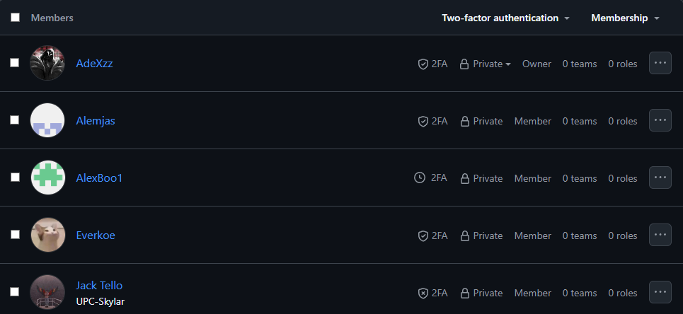
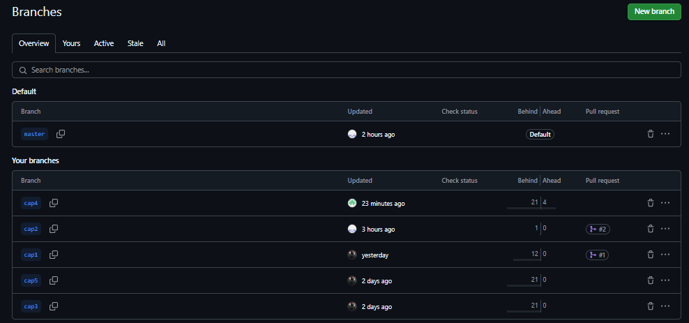

    

<h1 align="center">
Universidad Peruana de Ciencias Aplicadas
        </h1>

<h3 align="center">
Carrera: Ingeniería de Software
           
Curso: 1ASI0730 - Aplicaciones Web
       
Sección: 4328
       
Profesor: Angel Augusto Velasquez Nuñez
       
Ciclo: 2025-01
       
Informe de Trabajo Final
       
Startup: LosRofi
           
Producto: EcoVolt
        </h3>

| 
Alumno
 | 
Código
 |
|:-------------------------------------:|:-------------------------------------:|
|        Aspajo Alvarez, Mathias        |              u202317584               |
|         Alejos Jesus, Anyelo          |              u20231d149               |
|        Mendoza Vergara, Alejandro     |              u202312343               |
|         Roque Tello, Jack             |              u20221C448               |
|        Torres Alva, Alejandro         |              u202022018               |

 Abril 2025 

## Registro de Versiones del Informe

| Versión | Fecha | 
Autor(es) 
 | 
Descripción de la modificación
 |
|:-------:|:-----:|:-----------------------------------------:|-------------------------------------------------------------|
| TB1 | 24/04/2025 | - Aspajo Alvarez, Mathias - Alejos Jesus, Anyelo - Mendoza Vergara, Alejandro - Roque Tello, Jack - Torres Alva, Alejandro | Para esta entrega se han desarrollado los siguientes capítulos:  - Carátula - Registro de Versiones del Informe - Project Report Collaboration Insights - Contenido - Student Outcome - Capítulo I: Introducción - Capítulo II: Requirements Elicitation & Analysis - Capítulo III: Requirements Specification - Capítulo IV: Product Design - Capítulo V: Product Implementation, Validation & Deployment - 5.1. Software Configuration Management - 5.1.1. Software Development Environment Configuration - 5.1.2. Source Code Management - 5.1.3. Source Code Style Guide & Conventions - 5.1.4. Software Deployment Configuration - 5.2. Landing Page, Services & Applications Implementation - 5.2.1. Sprint 1 - 5.2.1.1. Sprint Planning 1 - 5.2.1.2. Aspect Leaders and Collaborators - 5.2.1.3. Sprint Backlog 1 - 5.2.1.4. Development Evidence for Sprint Review - 5.2.1.5. Execution Evidence for Sprint Review - 5.2.1.6. Services Documentation Evidence for Sprint Review - 5.2.1.7. Software Deployment Evidence for Sprint Review - 5.2.1.8. Team Collaboration Insights during Sprint - Avance de Conclusiones, Bibliografía y Anexos |

## Project Report Collaboration Insights

Nuestro Project Report se encuentra en el siguiente repositorio de GitHub:

🔗[https://github.com/G-Aplicaciones-Web/docs](https://github.com/G-Aplicaciones-Web/docs).

- **Flujo de trabajo adoptado**

En nuestro trabajo colaborativo, hemos implementado GitHub Flow como metodología de desarrollo, seleccionada por su sencillez, capacidad de crecimiento y enfoque en la integración continua. Este enfoque nos ha permitido:

- Trabajar en ramas independientes según las tareas asignadas a cada miembro del equipo
- Revisar cambios mediante pull requests antes de fusionarlos con la rama principal - Gestionar feedback a través de comentarios en commits y PRs
- Mantener una integración controlada del contenido, evitando conflictos en el documento final

Además, hemos establecido una estructura de ramas utilizando el siguiente esquema: cap[número del capitulo],  para identificar rápidamente qué sección del proyecto se está modificando en cada rama. Del mismo modo, los mensajes de commit son descriptivos y estructurados, lo que mejora la trazabilidad y comprensión del historial de cambios.

### Colaboración por Entrega

- **TB1:**
  Para la primera entrega del proyecto (TB1), cada miembro del equipo contribuyó activamente en la redacción de las secciones asignadas. La coordinación se llevó a cabo mediante un enfoque flexible que combinó trabajo asíncrono a través de GitHub con reuniones virtuales periódicas para alinear estilos de redacción, criterios de contenido y estructura del documento.

    - Asignación de secciones por miembro:
        - Aspajo Alvarez, Mathias (AdeXzz): Capitulo 2 (repartido), Capitulo 3, Capitulo 4 (repartido)
        - Roque Tello, Jack	(UPC-Skylar): Capitulo 1 (repartido)
        - Alejos Jesus, Anyelo (Everkoe): Capitulo 1, Capitulo 4 (repartido)
        - Mendoza Vergara, Alejandro	(AlexBoo1): Capitulo 2 (repartido)
        - Torres Alva, Alejandro (Alemjas): Capitulo 4 (repartido)
        - Todos: Capitulo 5

        - En las siguientes imágenes se documenta el proceso colaborativo:
        - Miembros del equipo en el repositorio:
        

            
        

        - Creación de ramas por cada capítulo:
        

            
        

        - Commits realizados en las ramas individuales:
        

            
        

        

            
        

        

            
        

        

            
        

        

            
        

        - Pull Requests y merges a la rama principal (master):
        

            
        

        - Analítica del repositorio con participación de todos los miembros:
        

            
        

## Tabla de Contenidos

[Registro de Versiones del Informe](#registro-de-versiones-del-informe)

[Project Report Collaboration Insights](#project-report-collaboration-insights)

[Tabla de Contenidos](#tabla-de-contenidos)

[Student Outcome](#student-outcome)

[Capítulo I: Introducción](#capítulo-i-introducción)
- [1.1. Startup Profile](#11-startup-profile)
- [1.1.1. Descripción de la Startup](#111-descripción-de-la-startup)
- [1.1.2. Perfiles de Integrantes del Equipo](#112-perfiles-de-integrantes-del-equipo)
- [1.2. Solution Profile](#12-solution-profile)
- [1.2.1. Antecedentes y Problemática](#121-antecedentes-y-problemática)
- [1.2.2. Lean UX Process](#122-lean-ux-process)
- [1.2.2.1. Lean UX Problem Statements](#1221-lean-ux-problem-statements)
- [1.2.2.2. Lean UX Assumptions](#1222-lean-ux-assumptions)
- [1.2.2.3. Lean UX Hypothesis Statements](#1223-lean-ux-hypothesis-statements)
- [1.2.2.4. Lean UX Canvas](#1224-lean-ux-canvas)
- [1.3. Segmentos Objetivos](#13-segmentos-objetivos)

[Capítulo II: Requirements Elicitation & Analysis](#capítulo-ii-requirements-elicitation--analysis)
- [2.1. Competidores](#21-competidores)
- [2.1.1. Análisis competitivo](#211-análisis-competitivo)
- [2.1.2. Estrategias y tácticas frente a competidores](#212-estrategias-y-tácticas-frente-a-competidores)
- [2.2. Entrevistas](#22-entrevistas)
- [2.2.1. Diseño de entrevistas](#221-diseño-de-entrevistas)
- [2.2.2. Registro de entrevistas](#222-registro-de-entrevistas)
- [2.2.3. Análisis de entrevistas](#223-análisis-de-entrevistas)
- [2.3. Needfinding](#23-needfinding)
- [2.3.1. User Personas](#231-user-personas)
- [2.3.2. User Task Matrix](#232-user-task-matrix)
- [2.3.3. User Journey Mapping](#233-user-journey-mapping)
- [2.3.4. Empathy Mapping](#234-empathy-mapping)
- [2.3.4.1. Empathy Mapping Turistas nacionales e internacionales](#2341-empathy-mapping-turistas-nacionales-e-internacionales)
- [2.3.4.2. Empathy Mapping Agencias de turismo locales](#2342-empathy-mapping-agencias-de-turismo-locales)
- [2.3.4.3. Empathy Mapping Viajeros por trabajo](#2343-empathy-mapping-viajeros-por-trabajo)
- [2.3.5. As-is Scenario Mapping](#235-as-is-scenario-mapping)
- [2.3.5.1. As-is Scenario Mapping Turistas nacionales e internacionales](#2351-as-is-scenario-mapping-turistas-nacionales-e-internacionales)
- [2.3.5.2. As-is Scenario Mapping Agencias de turismo locales](#2352-as-is-scenario-mapping-agencias-de-turismo-locales) - [2.3.5.3. As-is Scenario Mapping Viajeros por trabajo](#2353-as-is-scenario-mapping-viajeros-por-trabajo)
- [2.4. Ubiquitous Language](#24-ubiquitous-language)

[Capítulo III: Requirements Specification](#capítulo-iii-requirements-specification)
- [3.1. To-Be Scenario Mapping](#31-to-be-scenario-mapping)
- [3.1.1. To-Be Scenario Mapping Turistas nacionales e internacionales](#311-to-Be-scenario-mapping-turistas-nacionales-e-internacionales)
- [3.1.2. To-Be Scenario Mapping Agencias de turismo locales](#312-to-Be-scenario-mapping-agencias-de-turismo-locales)
- [3.1.3. To-Be Scenario Mapping Viajeros por trabajo](#313-to-Be-scenario-mapping-viajeros-por-trabajo)
- [3.2. User Stories](#32-user-stories)
- [3.3. Impact Mapping](#33-impact-mapping)
- [3.4. Product Backlog](#34-product-backlog)

[Capítulo IV: Product Design](#capítulo-iv-product-design)
- [4.1. Style Guidelines](#41-style-guidelines)
- [4.1.1. General Style Guidelines](#411-general-style-guidelines)
- [4.1.2. Web Style Guidelines](#412-web-style-guidelines)
- [4.2. Information Architecture](#42-information-architecture)
- [4.2.1. Organization Systems](#421-organization-systems)
- [4.2.2. Labeling Systems](#422-labeling-systems)
- [4.2.3. SEO Tags and Meta Tags](#423-seo-tags-and-meta-tags)
- [4.2.4. Searching Systems](#424-searching-systems)
- [4.2.5. Navigation Systems](#425-navigation-systems)
- [4.3. Landing Page UI Design](#43-landing-page-ui-design)
- [4.3.1. Landing Page Wireframe](#431-landing-page-wireframe)
- [4.3.2. Landing Page Mock-up](#432-landing-page-mock-up)
- [4.4. Web Applications UX/UI Design](#44-web-applications-uxui-design)
- [4.4.1. Web Applications Wireframes](#441-web-applications-wireframes)
- [4.4.2. Web Applications Wireflow Diagrams](#442-web-applications-wireflow-diagrams)
- [4.4.3. Web Applications Mock-ups](#443-web-applications-mock-ups)
- [4.4.4. Web Applications User Flow Diagrams](#444-web-applications-user-flow-diagrams)
- [4.5. Web Applications Prototyping](#45-web-applications-prototyping)
- [4.6. Domain-Driven Software Architecture](#46-domain-driven-software-architecture)
- [4.6.1. Software Architecture Context Diagrams](#461-software-architecture-context-diagrams)
- [4.6.2. Software Architecture Container Diagrams](#462-software-architecture-container-diagrams)
- [4.6.3. Software Architecture Components Diagrams](#463-software-architecture-components-diagrams)
- [4.7. Software Object-Oriented Design](#47-software-object-oriented-design)
- [4.7.1. Class Diagrams](#471-class-diagrams)
- [4.7.2. Class Dictionary](#472-class-dictionary)
- [4.8. Database Design](#48-database-design)
- [4.8.1. Database Diagram](#481-database-diagram)

[Capítulo V: Product Implementation, Validation & Deployment](#capítulo-v-product-implementation-validation--deployment)
- [5.1. Software Configuration Management](#51-software-configuration-management)
- [5.1.1. Software Development Environment Configuration](#511-software-development-environment-configuration)
- [5.1.2. Source Code Management](#512-source-code-management)
- [5.1.3. Source Code Style Guide & Conventions](#513-source-code-style-guide-conventions)
- [5.1.4. Software Deployment Configuration](#514-software-deployment-configuration)
- [5.2. Landing Page, Services & Applications Implementation](#52-landing-page-services--applications-implementation)
- [5.2.1. Sprint 1](#521-sprint-1)
- [5.2.1.1. Sprint Planning 1](#5211-sprint-planning-1)
- [5.2.1.2. Aspect Leaders and Collaborators](#5212-aspect-leaders-and-collaborators)
- [5.2.1.3. Sprint Backlog 1](#5213-sprint-backlog-1)
- [5.2.1.4. Development Evidence for Sprint Review](#5214-development-evidence-for-sprint-review)
- [5.2.1.5. Execution Evidence for Sprint Review](#5215-execution-evidence-for-sprint-review)
- [5.2.1.6. Services Documentation Evidence for Sprint Review](#5216-services-documentation-evidence-for-sprint-review)
- [5.2.1.7. Software Deployment Evidence for Sprint Review](#5217-software-deployment-evidence-for-sprint-review)
- [5.2.1.8. Team Collaboration Insights during Sprint](#5218-team-collaboration-insights-during-sprint)

[Conclusiones](#conclusiones)

[Bibliografía](#bibliografía)

[Anexos](#anexos)

## Student Outcome

El curso contribuye al cumplimiento del Student Outcome ABET:

**ABET – EAC - Student Outcome 5**

Criterio: Trabaja efectivamente en un equipo cuyos miembros juntos proporcionan liderazgo; crea un entorno colaborativo e inclusivo y establece metas, planifica tareas y cumple objetivos.
En el siguiente cuadro se describe las acciones realizadas y enunciados de conclusiones por parte del grupo,
que permiten sustentar el haber alcanzado el logro del ABET – EAC - Student Outcome 5.

| 
Criterio específico
 | 
Acciones Realizadas
 | 
Conclusiones
 |
|:-------------------:|-------------------|------------|
|Trabaja en equipo para proporcionar liderazgo en forma conjunta| **- Mathias Aspajo**   **TB1:** En esta entrega me encargué de comunicarle a mi equipo cuál sería la metodología de trabajo. Además, participé activamente en la revisión retroactiva de los avances de mis compañeros. También apoyé en la preparación del material de presentación para nuestras reuniones internas.  **TP:**   **TB2:**   **TF:**     **- Anyelo  Alejos**   **TB1:**   **TP:**   **TB2:**   **TF:**     **- Alejandro Mendoza**   **TB1:** En esta entrega me encargué del diseño que tendría nuestra aplicación web, por lo que tuve que trabajar en equipo para poder avanzar de manera satisfactoria y que haya liderazgo de forma conjunta  **TP:**   **TB2:**   **TF:**     **- Jack Roque**   **TB1:**   **TP:**   **TB2:**   **TF:**     **- Alejandro Torres**   **TB1:**   **TP:**   **TB2:**   **TF:**    | **TB1:** Todos los integrantes cumplieron con sus responsabilidades asignadas, manteniendo una comunicación constante y efectiva, lo que reforzó la confianza entre ellos. Esto contribuyó significativamente a fortalecer el trabajo en equipo, un aspecto esencial en proyectos colaborativos. |
|Crea un entorno colaborativo e inclusivo, establece metas, planifica tareas y cumple objetivos| **- Mathias Aspajo**   **TB1:** Colabore con la elaboración de las pautas y alineamientos que nuestro equipo seguiría durante el proceso de desarrollo de software. Asimismo, me encargue de elaborar el Capitulo 2 y 3.  **TP:**   **TB2:**   **TF:**     **- Anyelo Alejos**   **TB1:**   **TP:**   **TB2:**   **TF:**     **- Alejandro Mendoza**   **TB1:** Colabore con las metas que nos dabamos como equipo, por lo que se tuvo que planificar y cumplir tareas. Además trabaje principalmente en el capitulo 4  **TP:**   **TB2:**   **TF:**     **- Jack Roque**   **TB1:**   **TP:**   **TB2:**   **TF:**     **- Alejandro Torres**   **TB1:**   **TP:**   **TB2:**   **TF:**     | **TB1:** Cada miembro participó en sus actividades asignadas, manteniendo una comunicación activa y eficaz que fortaleció la confianza mutua. Esto mejoró el trabajo en equipo, un valor crucial para proyectos colaborativos |

## Capítulo I: Introducción

### 1.1. Startup Profile

#### 1.1.1. Descripción de la Startup

EcoVolt es una solución tecnológica web desarrollada en el Perú que permite a las empresas monitorear, analizar y optimizar su consumo eléctrico mediante el uso de dispositivos IoT inteligentes. Nuestra plataforma web integra tecnología de vanguardia con un enfoque centrado en la eficiencia energética, ofreciendo a las organizaciones herramientas prácticas para reducir sus costos operativos, cumplir con normativas ambientales y tomar decisiones sostenibles basadas en datos.
EcoVolt actúa como puente entre dos actores clave: las empresas con necesidades energéticas crecientes y los profesionales eléctricos encargados de instalar, calibrar y mantener los dispositivos. Mientras las empresas obtienen visualización en tiempo real, alertas inteligentes y reportes exportables, los técnicos cuentan con un modo especializado para gestionar instalaciones, diagnósticos y configuraciones de forma profesional.
En un contexto donde el consumo energético eficiente no solo representa un ahorro económico, sino también una responsabilidad ambiental, EcoVolt se presenta como un aliado estratégico para impulsar una cultura de sostenibilidad apoyada en tecnología accesible, confiable y escalable.

**Misión**
Nuestra misión es transformar la manera en que las empresas gestionan su consumo eléctrico, proporcionando una plataforma inteligente, confiable y adaptable que integre dispositivos IoT con análisis energético en tiempo real. Buscamos generar valor mediante la eficiencia, conectando a organizaciones con profesionales eléctricos especializados y promoviendo un uso más consciente y responsable de los recursos energéticos.

**Visión**
Aspiramos a consolidarnos como la solución líder en monitoreo y optimización energética en el Perú, impactando positivamente en la competitividad de las empresas y en el trabajo de los técnicos eléctricos. Nuestro objetivo es contribuir a un ecosistema empresarial más eficiente y sostenible, con la proyección de expandirnos gradualmente hacia otros países de Latinoamérica, impulsando desde nuestra tecnología desarrollada en Perú una nueva forma de gestionar la energía en la región.

**Logo**

#### 1.1.2. Perfiles de Integrantes del Equipo

- Mathias Aspajo Alvarez - u202317584 (Ingeniería de Software)

    

Mi nombre es Mathias Aspajo, tengo 19 años y actualmente me encuentro en el 5to ciclo de la carrera de Ing. de Software, me considero una persona responsable y colaborativa con cualquier trabajo que tenga. Pienso dar lo mejor de mí para desarrollar un buen proyecto.

- Jack Roque Tello - u20221C448 (Ingeniería de Software)

    

Soy estudiante de Ingeniería de Software, actualmente cursando el quinto ciclo de la carrera en la UPC. Cuento con experiencia en lenguajes como JavaScript, C++, Java y Ruby, además de una sólida base en algoritmos, estructuras de datos y desarrollo web. Me considero una persona proactiva, responsable y con habilidades interpersonales que me permiten trabajar en equipo de forma efectiva. Estoy muy entusiasmado por formar parte de este proyecto, el cual representa una oportunidad única para aplicar mis conocimientos y seguir creciendo profesionalmente. Me comprometo a dar lo mejor de mí en cada etapa, aportando con mi capacidad técnica, pensamiento crítico y comunicación constante para lograr un ambiente colaborativo, motivado y enfocado en cumplir los objetivos que nos hemos propuesto como equipo. Estoy convencido de que, con esfuerzo y trabajo en conjunto, lograremos construir un producto de alto impacto social y tecnológico. 

- Alejandro Mendoza Vergara - u202312343 (Ingeniería de Software)

    

Mi nombre es Alejandro Mendoza y soy estudiante de la carrera de Ingeniería de Software. Estoy interesado en seguir aprendiendo sobre diferentes lenguajes de programación y en la creación de distintas aplicaciones web y móviles, por lo que intento dar todo de mí para tener buenos resultados.

- Alejandro Torres Alva - u202022018 (Ingeniería de Software)

    

Mi nombre es Alejandro Torres Alva, soy estudiante de la carrera de Ingeniería de Software en la Universidad Peruana de Ciencias Aplicadas. Me considero una persona que apoya en todo lo que pueda al trabajo. Tengo conocimientos en C++, Python y PHP.

- Anyelo Bill Alejos Jesus - u20231d149 (Ingeniería de Software)

    

Mi nombre es Anyelo Alejos, tengo 20 años, soy estudiante de la carrera de ingeniería de software actualmente estoy cursando en el 5to ciclo de la carrera, tengo conocimientos en c++, python y me considero una persona responsable y proactiva para dar lo mejor de mi en el proyecto que se realizará.

#### 1.2. Solution Profile

#### 1.2.1. Antecedentes y problemática

En el contexto actual de transición energética global y creciente preocupación por la sostenibilidad, las empresas enfrentan una presión cada vez mayor para optimizar su consumo energético, tanto por razones económicas como regulatorias. En el Perú, esta situación es particularmente relevante. Según datos del Ministerio de Energía y Minas, el sector empresarial es responsable de cerca del 60% del consumo energético nacional, siendo el sector industrial y comercial los principales consumidores. Asimismo, se estima que hasta un 30% del gasto eléctrico empresarial podría ser evitado mediante una gestión más eficiente del consumo (Osinergmin, 2023).
A pesar de los avances en normativas como la Ley de Eficiencia Energética (Ley N.º 27345) y la promoción de sistemas de gestión energética ISO 50001, muchas empresas aún carecen de herramientas tecnológicas accesibles y efectivas que les permitan monitorear su consumo en tiempo real y tomar decisiones informadas. A esto se suma el hecho de que la adopción de dispositivos IoT sigue siendo baja en empresas medianas o en regiones fuera de Lima Metropolitana, debido a la falta de soluciones adaptadas a sus necesidades y capacidades técnicas.
En paralelo, existe una creciente demanda por parte de profesionales técnicos, como electricistas e ingenieros eléctricos, que buscan herramientas especializadas para facilitar la instalación, configuración y mantenimiento de estos dispositivos inteligentes. Sin embargo, la mayoría de soluciones disponibles en el mercado están enfocadas en usuarios finales domésticos o en grandes corporaciones, dejando un vacío para soluciones intermedias, flexibles y adaptadas al contexto peruano.
EcoVolt surge como una solución innovadora que conecta estos dos mundos: empresas que necesitan reducir costos y ser más eficientes energéticamente, y técnicos que requieren herramientas especializadas para implementar tecnología IoT de forma sencilla y efectiva.

**Problemática:**

| 5W & 2H | Descripción |
|----------------|------------------------------------------------------------------------------------------------------------------------------------------------------------------------------------------------------------------------------------|
| **What (Qué)** | Las empresas en Perú presentan un elevado consumo eléctrico que no siempre es monitoreado de manera eficiente, lo que genera costos innecesarios, dificultades para cumplir con normativas de eficiencia energética, y escasa adopción de tecnologías IoT para optimización. |
| **When (Cuándo)** | Este problema es persistente y se ha agudizado en los últimos años debido al aumento de tarifas eléctricas, mayor digitalización empresarial y nuevas exigencias regulatorias. El impacto se incrementa especialmente en horarios laborales extendidos o durante picos de operación. |
| **Where (Dónde)** | A nivel nacional, afecta especialmente a empresas medianas y grandes ubicadas en áreas industriales y urbanas, pero también se extiende a zonas periféricas donde la infraestructura técnica para soluciones IoT es limitada. |
| **Who (Quiénes)** | Empresas de todos los sectores que manejan equipos eléctricos de alto consumo, electricistas encargados de su mantenimiento e implementación, así como instituciones fiscalizadoras como el MINEM y Osinergmin. |
| **Why (Por qué)** | Debido a la ausencia de herramientas tecnológicas que integren monitoreo, alertas inteligentes y control de dispositivos en tiempo real, adaptadas al contexto local. Además, existe poca capacitación sobre el uso de soluciones energéticas basadas en IoT. |
| **How (Cómo)** | Se evidencia a través de facturas eléctricas elevadas, consumo desproporcionado en áreas específicas, incumplimiento de estándares energéticos, y poca visibilidad sobre qué equipos o turnos generan mayor gasto. |
| **How much (Cuánto)** | Se estima que una empresa promedio en Lima podría ahorrar entre 15% y 30% de su consumo mensual solo con monitoreo en tiempo real y desconexión programada de equipos fuera del horario laboral (Energy Efficiency Report, BID 2022). |

#### 1.2.2. Lean UX Process

#### 1.2.2.1. Lean UX Problem Statements

En Perú, muchas empresas enfrentan altos costos por el consumo eléctrico debido a una gestión ineficiente de sus recursos energéticos y a la falta de herramientas tecnológicas que les permitan monitorear y optimizar el uso de energía. Esta situación no solo impacta sus finanzas, sino que también contribuye al uso excesivo e insostenible de recursos. Frente a ello, nos planteamos la siguiente pregunta de negocio: ¿Cómo podemos ayudar a las empresas a reducir sus costos de energía y hacer más eficiente su consumo mediante soluciones tecnológicas accesibles y personalizadas?

#### 1.2.2.2. Lean UX Assumptions

**Business Assumptions**:
1. Demanda energética: Suponemos que existe una necesidad insatisfecha en empresas con alto consumo eléctrico que desean reducir costos mediante soluciones tecnológicas.
2. Adopción tecnológica: Suponemos que los electricistas, técnicos y gerentes energéticos están dispuestos a utilizar una plataforma digital que facilite la supervisión y el análisis del consumo energético.
3. Viabilidad económica: Suponemos que el modelo de negocio basado en licencias y servicios personalizados nos permitirá escalar y mantener la solución en el tiempo.

**Business Outcomes**:
1. Reducción del consumo energético en empresas usuarias.
2. Incremento en la adopción de nuestra plataforma por parte de técnicos y empresas.
3. Posicionamiento de EcoVolt como solución confiable en eficiencia energética.

**User Benefits**:
1. Visualización clara del consumo eléctrico en tiempo real.
2. Detección de ineficiencias y oportunidades de ahorro energético.
3. Herramientas intuitivas para el análisis, comparación y toma de decisiones sostenibles.

#### 1.2.2.3. Lean UX Hypothesis Statements

**Creemos** que al ofrecer una plataforma que permita monitorear y analizar el consumo eléctrico en tiempo real con alertas inteligentes, **sabremos que hemos tenido éxito** cuando veamos una disminución promedio del 30% de consumo energético en nuestras empresas usuarias dentro de los primeros tres meses.

**Creemos** que al facilitar herramientas específicas para técnicos eléctricos (como reportes, análisis y planes de ahorro), **sabremos que hemos tenido éxito** cuando aumente el número de técnicos registrados y el uso de nuestras funcionalidades técnicas en un 50% luego de 6 meses de aplicado los cambios.

**Creemos** que al permitir una configuración personalizada para cada empresa según su tamaño y sector, **sabremos que hemos tenido éxito** cuando recibamos una valoración promedio de 4.5 / 5 en encuestas de satisfacción sobre adaptabilidad y facilidad de uso.

#### 1.2.2.4. Lean UX Canvas

**Business Problem**
 Las empresas peruanas con altos niveles de consumo eléctrico enfrentan dificultades para gestionar eficientemente su energía debido a la falta de soluciones accesibles, inteligentes y adaptadas a su realidad operativa. Esto se traduce en costos elevados, baja eficiencia operativa y escasa contribución a objetivos de sostenibilidad.
 
**Users & Customers**
1. Gerentes de operaciones y responsables de eficiencia energética en empresas medianas y grandes.
2. Técnicos eléctricos y personal de mantenimiento a cargo de la implementación y supervisión de sistemas eléctricos.
3. Administradores que requieren reportes claros para la toma de decisiones financieras y operativas.

**Hypothesis**
 Creemos que una plataforma digital basada en IoT con monitoreo en tiempo real, analítica energética avanzada y reportes automáticos permitirá a las empresas optimizar su consumo eléctrico, reducir costos y adoptar prácticas sostenibles con mayor eficiencia.
 
**Solution Ideas**
1. Plataforma web y app móvil con dashboards interactivos y personalizables.
2. Alertas automáticas ante eventos anómalos como sobrecargas o consumos inusuales.
3. Reportes comparativos inteligentes por áreas, horarios y dispositivos conectados.
4. Modo técnico para configuración, diagnóstico y soporte en campo.

**What's the most important thing we need to learn first?**
 Identificar los principales retos y limitaciones que enfrentan las empresas al intentar monitorear y optimizar su consumo energético, así como evaluar la disposición y competencias digitales de técnicos y gestores para adoptar soluciones tecnológicas como EcoVolt.
 
**Business Outcomes**
1. Reducción comprobada del consumo energético en empresas usuarias.
2. Crecimiento sostenido en la base de usuarios técnicos activos.
3. Reconocimiento de EcoVolt como solución líder en eficiencia energética empresarial en Perú.

**User Benefits**
1. Ahorros significativos mediante gestión energética optimizada.
2. Control en tiempo real y toma de decisiones basadas en datos.
3. Aporte directo a las metas de sostenibilidad y responsabilidad ambiental corporativa.

**What's the least amount of work we need to do to learn the next most important thing?**
 Desarrollar un prototipo funcional de baja fidelidad con las funcionalidades clave (dashboard básico, alertas y reportes) y realizar sesiones de validación con técnicos y gestores de empresas piloto. Esto permitirá recoger insights reales sobre su experiencia, barreras de uso y funcionalidades más valoradas antes de la implementación completa.

### 1.3. Segmentos Objetivos
Nuestros segmentos objetivos incluyen a empresas medianas y grandes con altos niveles de consumo eléctrico que buscan reducir costos y mejorar su eficiencia energética mediante el uso de tecnologías IoT. Asimismo, nos dirigimos a electricistas y técnicos especializados que brindan servicios de instalación, configuración y mantenimiento de sistemas eléctricos, y que requieren herramientas digitales para optimizar su labor. EcoVolt ofrece una solución accesible, intuitiva y profesional para ambos segmentos, promoviendo una gestión energética más eficiente y sostenible en el Perú.

## Capítulo II: Requirements Elicitation & Analysis

### 2.1. Competidores

Considerando las características de nuestra web que es una solución para las empresas en
su monitoreo y optimización del consumo eléctrico mediante el uso dispositivos IoT inteligentes.
Consideramos que estas aplicaciones similares en el mercado podrían ser nuestros competidores:

- **Shelly:**
Shelly es una marca especializada en dispositivos IoT para automatización y monitoreo energético que ofrece soluciones como medidores de energía Wi-Fi, interruptores inteligentes y sensores que permitan controlar y supervisar el consumo eléctrico en tiempo real. Sus productos son conocidos por su facilidad de instalación y compatibilidad con diversas plataformas de automatización del hogar.

- **Emporia Energy:**
Emporia Energy proporciona soluciones integradas para la gestión energética en los hogares. Su plataforma incluye monitoreos de energía, cargadores para vehículos eléctricos, enchufes inteligentes y baterías domésticas. Estos dispositivos permiten a los usuarios optimizar el uso de energía y así reducir los costos.

- **EnergyCAP:**
EnergyCAP es una plataforma líder en gestión de energía y sostenibilidad para organizaciones. Ofrece herramientas para el seguimiento, análisis y reporte de datos energéticos, facilitando la identificación de ineficiencias y la implementación de proyectos de conversación de energía.

#### 2.1.1. Análisis competitivo

<table border="1" style="text-align: center;">
	<tbody>
		<tr>
			<td colspan="6">Análisis de competidores</td>
		</tr>
		<tr>
			<td colspan="2"></td>
			<td>Shelly</td>
			<td>Emporia Energy</td>
			<td>EnergyCAP</td>
			<td>EcoVolt</td>
		</tr>
		<tr>
			<td rowspan="2">Perfil</td>
			<td>Resumen</td>
			<td>Fabricante europeo de dispositivos IoT para automatización del hogar y monitoreo energético.</td>
			<td>Empresa estadounidense enfocada en soluciones accesibles de gestión energética doméstica.</td>
			<td>Plataforma SaaS para gestión energética institucional y corporativa</td>
			<td>Es una aplicación de escritorio que permite a empresas monitorear y optimizar su consumo energético</td>
		</tr>
		<tr>
			<td>Ventaja competitiva</td>
			<td>Gran compatibilidad con sistemas domóticos, tamaño reducido.</td>
			<td>Ecosistema todo en uno con aplicación centralizada, sensores a bajo costo</td>
			<td>Capacidades robustas de reporte, integración con sistemas ERP</td>
			<td>Compatible con múltiples dispositivos IoT del mercado. Interfaz dual para empresas y técnicos </td>
		</tr>
		<tr>
			<td rowspan="2">Perfil de Marketing</td>
			<td>Mercado objetivo</td>
			<td>Consumidores residenciales y electricistas profesionales</td>
			<td>Propietarios de viviendas, entusiastas de la energía solar y usuarios de vehículos eléctricos</td>
			<td>Organismos públicos, universidades, grandes corporaciones con múltiples instalaciones</td>
			<td>Empresas peruanas, técnicos eléctricos y ingenieros eléctricos</td>
		</tr>
		<tr>
			<td>Estrategias de marketing</td>
			<td>Alianzas con tiendas domótica, contenido técnico en foros y canales de YouTube</td>
			<td>Posicionamiento como marca eco-amigable y reseñas en YouTube</td>
			<td>Participación en conferencias de sostenibilidad, estudios de caso, venta consultiva directa</td>
			<td>Campañas en redes sociales con enfoque educativo y de ahorro de energético. Estrategia de contenido como tutoriales o webinars</td>
		</tr>
		<tr>
			<td rowspan="3">Perfil de Producto</td>
			<td>Productos y Servicios</td>
			<td>Interruptores inteligentes, medidores de energía, sensores de temperatura o luz</td>
			<td>Medidores de energía en panel eléctrico, enchufes inteligentes</td>
			<td>Plataforma cloud de gestión de energía, seguimiento de facturación</td>
			<td>Monitoreo en tiempo real y Control de dispositivos

Modo técnico para calibración y diagnóstico</td>
		</tr>
		<tr>
			<td>Precios y Costos</td>
			<td>Gama media, 1PM entre $15 a $25</td>
			<td>Emporia Vue 3 con 16 sensores $150</td>
			<td>Modelo por suscripción, costoso para pequeñas empresas</td>
			<td>
Modelo Freemium para pequeñas empresas

Planes mensuales o anuales escalables según la cantidad de dispositivos
</td>
		</tr>
		<tr>
			<td>Canales de distribución</td>
			<td>Tienda online, Amazon y distribuidores locales</td>
			<td>Amazon, web oficial y tiendas especializadas</td>
			<td>Ventas directas B2B, integradores energéticos</td>
			<td>
Venta directa vía web

Distribución a través de electricistas aliados

Alianzas con distribuidores de dispositivos IoT
</td>
		</tr>
		<tr>
			<td rowspan="4">Análisis SWOT</td>
			<td>Fortalezas</td>
			<td>
                
- Productos pequeños

- Integración sin nubes obligatorias

            </td>
			<td>
                
- Integración sencilla

- Aplicación intuitiva

            </td>
			<td>
                
- Altamente personalizable

- Enfoque institucional

            </td>
			<td>
                
- Enfoque local y contextualizado para el mercado peruano

- Interfaz dual para empresas y técnicos

- Compatible con dispositivos IoT existentes

            </td>
		</tr>
		<tr>
			<td>Debilidades</td>
			<td>
                
- Interfaz de usuario algo técnica

- Requiere conocimientos eléctricos

            </td>
			<td>
                
- Limitado a uso residencial

- Poca expansión industrial

            </td>
			<td>
                
- Costosa

- Completa para pequeñas empresas

            </td>
			<td>
                
- Requiere alianzas iniciales con técnicos

- Al depender de hardware con terceros

            </td>
		</tr>
		<tr>
			<td>Oportunidades</td>
			<td>
                
- Compatibilidad con más plataformas

- Expansión hacia sector comercial o industrial ligero

            </td>
			<td>
                
- Crecimiento de energía solar doméstica

- Regulación energética en hogares

            </td>
			<td>
                
- Expansión en LATAM

- Nuevas regulaciones ambientales obligatorios

            </td>
			<td>
                
- Regulación energética

- Alianzas estratégicas con institutos técnicos

            </td>
		</tr>
		<tr>
			<td>Amenazas</td>
			<td>
                
- Competencia creciente en domótica

- Problemas regulatorios según países

            </td>
			<td>
                
- Nuevos competidores con más enfoque industrial

- Dependencia de plataformas móviles

            </td>
			<td>
                
- Nuevas plataformas más accesibles

- Soluciones todo en uno IoT

            </td>
			<td>
                
- Ingreso de competidores globales al mercado latinoamericano

- Barreras de confianza

            </td>
		</tr>
	</tbody>
</table>

#### 2.1.2. Estrategias y tácticas frente a competidores

### 2.2. Entrevistas

#### 2.2.1. Diseño de entrevistas

#### 2.2.2. Registro de entrevistas

#### 2.2.3. Análisis de entrevistas

### 2.3. Needfinding

#### 2.3.1. User Personas

#### 2.3.2. User Task Matrix

#### 2.3.3. User Journey Mapping

#### 2.3.4. Empathy Mapping

#### 2.3.4.1. Empathy Mapping Turistas nacionales e internacionales

#### 2.3.4.2. Empathy Mapping Agencias de turismo locales

#### 2.3.4.3. Empathy Mapping Viajeros por trabajo

#### 2.3.5. As-is Scenario Mapping

#### 2.3.5.1. As-is Scenario Mapping Turistas nacionales e internacionales

#### 2.3.5.2. As-is Scenario Mapping Agencias de turismo locales

#### 2.3.5.3. As-is Scenario Mapping Viajeros por trabajo

### 2.4. Ubiquitous Language

## Capítulo III: Requirements Specification

### 3.1. To-Be Scenario Mapping

#### 3.1.1. To-Be Scenario Mapping Turistas nacionales e internacionales

#### 3.1.2. To-Be Scenario Mapping Agencias de turismo locales

#### 3.1.3. To-Be Scenario Mapping Viajeros por trabajo

### 3.2. User Stories

### 3.3. Impact Mapping

### 3.4. Product Backlog

## Capítulo IV: Product Design

### 4.1. Style Guidelines

#### 4.1.1. General Style Guidelines

#### 4.1.2. Web Style Guidelines

### 4.2. Information Architecture

#### 4.2.1. Organization Systems

#### 4.2.2. Labeling Systems

#### 4.2.3. SEO Tags and Meta Tags

#### 4.2.4. Searching Systems

#### 4.2.5. Navigation Systems

### 4.3. Landing Page UI Design

#### 4.3.1. Landing Page Wireframe

#### 4.3.2. Landing Page Mock-up

### 4.4. Web Applications UX/UI Design

#### 4.4.1. Web Applications Wireframes.

#### 4.4.2. Web Applications Wireflow Diagrams

#### 4.4.3. Web Applications Mock-ups

#### 4.4.4. Web Applications User Flow Diagrams

### 4.5. Web Applications Prototyping

### 4.6. Domain-Driven Software Architecture

#### 4.6.1. Software Architecture Context Diagrams

#### 4.6.2. Software Architecture Container Diagrams

#### 4.6.3. Software Architecture Components Diagrams

### 4.7. Software Object-Oriented Design

#### 4.7.1. Class Diagrams

#### 4.7.2. Class Dictionary

### 4.8. Database Design

#### 4.8.1. Database Diagram

## Capítulo V: Product Implementation, Validation & Deployment

### 5.1. Software Configuration Management.

#### 5.1.1. Software Development Environment Configuration.

#### 5.1.2. Source Code Management

#### 5.1.3. Source Code Style Guide & Conventions

#### 5.1.4. Software Deployment Configuration

### 5.2. Landing Page, Services & Applications Implementation

#### 5.2.1. Sprint 1

##### 5.2.1.1. Sprint Planning 1

##### 5.2.1.2. Aspect Leaders and Collaborators

##### 5.2.1.3. Sprint Backlog 1

##### 5.2.1.4. Development Evidence for Sprint Review

##### 5.2.1.5. Execution Evidence for Sprint Review

##### 5.2.1.6. Services Documentation Evidence for Sprint Review

##### 5.2.1.7. Software Deployment Evidence for Sprint Review

##### 5.2.1.8. Team Collaboration Insights during Sprint

## Conclusiones

## Bibliografía

## Anexos
