<p align="center">
    
</p>

<h1 align="center">
Universidad Peruana de Ciencias Aplicadas
        </h1>

<h3 align="center">
Carrera: Ingeniería de Software
        <br> <br>
Curso: 1ASI0730 - Aplicaciones Web
    <br> <br>
Sección: 4378
    <br> <br>
Profesor: Angel Augusto Velasquez Nuñez
    <br> <br>
Ciclo: 2025-01
    <br> <br>
Informe de Trabajo Final
    <br> <br>
Startup: LosRofi
        <br> <br>
Producto: EcoVolt
        </h3>

<div align="center">

| <div style="width:500px">Alumno</div> | <div style="width:150px">Código</div> |
|:-------------------------------------:|:-------------------------------------:|
|        Aspajo Alvarez, Mathias        |              u202317584               |
|         Alejos Jesus, Anyelo          |              u20231d149               |
|        Mendoza Vergara, Alejandro     |              u202312343               |
|         Roque Tello, Jack             |              u20221C448               |
|        Torres Alva, Alejandro         |              u202022018               |

</div>

<div align="center"> Abril 2025 </div>

<hr>

## Registro de Versiones del Informe

| Versión | Fecha | <div style="width:250px">Autor(es) </div> | <div align="center" style="width:400px">Descripción de la modificación</div> |
|:-------:|:-----:|:-----------------------------------------:|-------------------------------------------------------------|
| TB1 | 24/04/2025 | - Aspajo Alvarez, Mathias<br>- Alejos Jesus, Anyelo<br>- Mendoza Vergara, Alejandro<br>- Roque Tello, Jack<br>- Torres Alva, Alejandro | Para esta entrega se han desarrollado los siguientes capítulos: <br>- Carátula<br>- Registro de Versiones del Informe<br>- Project Report Collaboration Insights<br>- Contenido<br>- Student Outcome<br>- Capítulo I: Introducción<br>- Capítulo II: Requirements Elicitation & Analysis<br>- Capítulo III: Requirements Specification<br>- Capítulo IV: Product Design<br>- Capítulo V: Product Implementation, Validation & Deployment<br>- 5.1. Software Configuration Management<br>- 5.1.1. Software Development Environment Configuration<br>- 5.1.2. Source Code Management<br>- 5.1.3. Source Code Style Guide & Conventions<br>- 5.1.4. Software Deployment Configuration<br>- 5.2. Landing Page, Services & Applications Implementation<br>- 5.2.1. Sprint 1<br>- 5.2.1.1. Sprint Planning 1<br>- 5.2.1.2. Aspect Leaders and Collaborators<br>- 5.2.1.3. Sprint Backlog 1<br>- 5.2.1.4. Development Evidence for Sprint Review<br>- 5.2.1.5. Execution Evidence for Sprint Review<br>- 5.2.1.6. Services Documentation Evidence for Sprint Review<br>- 5.2.1.7. Software Deployment Evidence for Sprint Review<br>- 5.2.1.8. Team Collaboration Insights during Sprint<br>- Avance de Conclusiones, Bibliografía y Anexos |


<hr>

## Project Report Collaboration Insights

Nuestro Project Report se encuentra en el siguiente repositorio de GitHub:

🔗[https://github.com/G-Aplicaciones-Web/docs](https://github.com/G-Aplicaciones-Web/docs).


- **Flujo de trabajo adoptado**

En nuestro trabajo colaborativo, hemos implementado GitHub Flow como metodología de desarrollo, seleccionada por su sencillez, capacidad de crecimiento y enfoque en la integración continua. Este enfoque nos ha permitido:

- Trabajar en ramas independientes según las tareas asignadas a cada miembro del equipo
- Revisar cambios mediante pull requests antes de fusionarlos con la rama principal - Gestionar feedback a través de comentarios en commits y PRs
- Mantener una integración controlada del contenido, evitando conflictos en el documento final

Además, hemos establecido una estructura de ramas utilizando el siguiente esquema: cap[número del capitulo],  para identificar rápidamente qué sección del proyecto se está modificando en cada rama. Del mismo modo, los mensajes de commit son descriptivos y estructurados, lo que mejora la trazabilidad y comprensión del historial de cambios.

### Colaboración por Entrega

- **TB1:**
  Para la primera entrega del proyecto (TB1), cada miembro del equipo contribuyó activamente en la redacción de las secciones asignadas. La coordinación se llevó a cabo mediante un enfoque flexible que combinó trabajo asíncrono a través de GitHub con reuniones virtuales periódicas para alinear estilos de redacción, criterios de contenido y estructura del documento.

    - Asignación de secciones por miembro:
        - Aspajo Alvarez, Mathias (AdeXzz): Capitulo 2 (repartido), Capitulo 3, Capitulo 4 (repartido)
        - Roque Tello, Jack	(UPC-Skylar): Capitulo 1 (repartido)
        - Alejos Jesus, Anyelo (Everkoe): Capitulo 1, Capitulo 4 (repartido)
        - Mendoza Vergara, Alejandro	(AlexBoo1): Capitulo 2 (repartido)
        - Torres Alva, Alejandro (Alemjas): Capitulo 4 (repartido)
        - Todos: Capitulo 5

        - En las siguientes imágenes se documenta el proceso colaborativo:
        - Miembros del equipo en el repositorio:
        <p align="center">
            
        </p>
        - Creación de ramas por cada capítulo:
        <p align="center">
            
        </p>
        - Commits realizados en las ramas individuales:
        <p align="center">
            
        </p>
        <p align="center">
            
        </p>
        <p align="center">
            
        </p>
        <p align="center">
            
        </p>
        <p align="center">
            
        </p>
        - Pull Requests y merges a la rama principal (master):
        <p align="center">
            
        </p>
        - Analítica del repositorio con participación de todos los miembros:
        <p align="center">
            
        </p>

<hr>

## Tabla de Contenidos

[Registro de Versiones del Informe](#registro-de-versiones-del-informe)

[Project Report Collaboration Insights](#project-report-collaboration-insights)

[Tabla de Contenidos](#tabla-de-contenidos)

[Student Outcome](#student-outcome)

[Capítulo I: Introducción](#capítulo-i-introducción)
- [1.1. Startup Profile](#11-startup-profile)
- [1.1.1. Descripción de la Startup](#111-descripción-de-la-startup)
- [1.1.2. Perfiles de Integrantes del Equipo](#112-perfiles-de-integrantes-del-equipo)
- [1.2. Solution Profile](#12-solution-profile)
- [1.2.1. Antecedentes y Problemática](#121-antecedentes-y-problemática)
- [1.2.2. Lean UX Process](#122-lean-ux-process)
- [1.2.2.1. Lean UX Problem Statements](#1221-lean-ux-problem-statements)
- [1.2.2.2. Lean UX Assumptions](#1222-lean-ux-assumptions)
- [1.2.2.3. Lean UX Hypothesis Statements](#1223-lean-ux-hypothesis-statements)
- [1.2.2.4. Lean UX Canvas](#1224-lean-ux-canvas)
- [1.3. Segmentos Objetivos](#13-segmentos-objetivos)

[Capítulo II: Requirements Elicitation & Analysis](#capítulo-ii-requirements-elicitation--analysis)
- [2.1. Competidores](#21-competidores)
- [2.1.1. Análisis competitivo](#211-análisis-competitivo)
- [2.1.2. Estrategias y tácticas frente a competidores](#212-estrategias-y-tácticas-frente-a-competidores)
- [2.2. Entrevistas](#22-entrevistas)
- [2.2.1. Diseño de entrevistas](#221-diseño-de-entrevistas)
- [2.2.2. Registro de entrevistas](#222-registro-de-entrevistas)
- [2.2.3. Análisis de entrevistas](#223-análisis-de-entrevistas)
- [2.3. Needfinding](#23-needfinding)
- [2.3.1. User Personas](#231-user-personas)
- [2.3.2. User Task Matrix](#232-user-task-matrix)
- [2.3.3. User Journey Mapping](#233-user-journey-mapping)
- [2.3.4. Empathy Mapping](#234-empathy-mapping)
- [2.3.4.1. Empathy Mapping Empresa consumidora](#2341-empathy-mapping-empresa-consumidora)
- [2.3.4.2. Empathy Mapping Electricistas](#2342-empathy-mapping-electricistas)
- [2.3.5. As-is Scenario Mapping](#235-as-is-scenario-mapping)
- [2.3.5.1. As-is Scenario Mapping Empresa consumidora](#2351-as-is-scenario-mapping-empresa-consumidora)
- [2.3.5.2. As-is Scenario Mapping Electricistas](#2352-as-is-scenario-mapping-electricistas) 
- [2.4. Ubiquitous Language](#24-ubiquitous-language)

[Capítulo III: Requirements Specification](#capítulo-iii-requirements-specification)
- [3.1. To-Be Scenario Mapping](#31-to-be-scenario-mapping)
- [3.1.1. To-Be Scenario Mapping Empresa consumidora](#311-to-be-scenario-mapping-empresa-consumidora)
- [3.1.2. To-Be Scenario Mapping Electricistas](#312-to-be-scenario-mapping-electricistas)
- [3.2. User Stories](#32-user-stories)
- [3.3. Impact Mapping](#33-impact-mapping)
- [3.4. Product Backlog](#34-product-backlog)

[Capítulo IV: Product Design](#capítulo-iv-product-design)
- [4.1. Style Guidelines](#41-style-guidelines)
- [4.1.1. General Style Guidelines](#411-general-style-guidelines)
- [4.1.2. Web Style Guidelines](#412-web-style-guidelines)
- [4.2. Information Architecture](#42-information-architecture)
- [4.2.1. Organization Systems](#421-organization-systems)
- [4.2.2. Labeling Systems](#422-labeling-systems)
- [4.2.3. SEO Tags and Meta Tags](#423-seo-tags-and-meta-tags)
- [4.2.4. Searching Systems](#424-searching-systems)
- [4.2.5. Navigation Systems](#425-navigation-systems)
- [4.3. Landing Page UI Design](#43-landing-page-ui-design)
- [4.3.1. Landing Page Wireframe](#431-landing-page-wireframe)
- [4.3.2. Landing Page Mock-up](#432-landing-page-mock-up)
- [4.4. Web Applications UX/UI Design](#44-web-applications-uxui-design)
- [4.4.1. Web Applications Wireframes](#441-web-applications-wireframes)
- [4.4.2. Web Applications Wireflow Diagrams](#442-web-applications-wireflow-diagrams)
- [4.4.3. Web Applications Mock-ups](#443-web-applications-mock-ups)
- [4.4.4. Web Applications User Flow Diagrams](#444-web-applications-user-flow-diagrams)
- [4.5. Web Applications Prototyping](#45-web-applications-prototyping)
- [4.6. Domain-Driven Software Architecture](#46-domain-driven-software-architecture)
- [4.6.1. Software Architecture Context Diagrams](#461-software-architecture-context-diagrams)
- [4.6.2. Software Architecture Container Diagrams](#462-software-architecture-container-diagrams)
- [4.6.3. Software Architecture Components Diagrams](#463-software-architecture-components-diagrams)
- [4.7. Software Object-Oriented Design](#47-software-object-oriented-design)
- [4.7.1. Class Diagrams](#471-class-diagrams)
- [4.7.2. Class Dictionary](#472-class-dictionary)
- [4.8. Database Design](#48-database-design)
- [4.8.1. Database Diagram](#481-database-diagram)

[Capítulo V: Product Implementation, Validation & Deployment](#capítulo-v-product-implementation-validation--deployment)
- [5.1. Software Configuration Management](#51-software-configuration-management)
- [5.1.1. Software Development Environment Configuration](#511-software-development-environment-configuration)
- [5.1.2. Source Code Management](#512-source-code-management)
- [5.1.3. Source Code Style Guide & Conventions](#513-source-code-style-guide-conventions)
- [5.1.4. Software Deployment Configuration](#514-software-deployment-configuration)
- [5.2. Landing Page, Services & Applications Implementation](#52-landing-page-services--applications-implementation)
- [5.2.1. Sprint 1](#521-sprint-1)
- [5.2.1.1. Sprint Planning 1](#5211-sprint-planning-1)
- [5.2.1.2. Aspect Leaders and Collaborators](#5212-aspect-leaders-and-collaborators)
- [5.2.1.3. Sprint Backlog 1](#5213-sprint-backlog-1)
- [5.2.1.4. Development Evidence for Sprint Review](#5214-development-evidence-for-sprint-review)
- [5.2.1.5. Execution Evidence for Sprint Review](#5215-execution-evidence-for-sprint-review)
- [5.2.1.6. Services Documentation Evidence for Sprint Review](#5216-services-documentation-evidence-for-sprint-review)
- [5.2.1.7. Software Deployment Evidence for Sprint Review](#5217-software-deployment-evidence-for-sprint-review)
- [5.2.1.8. Team Collaboration Insights during Sprint](#5218-team-collaboration-insights-during-sprint)
- [5.2.2. Sprint 2](#521-sprint-2)
- [5.2.2.1. Sprint Planning 2](#5221-sprint-planning-2)

[Conclusiones](#conclusiones)

[Bibliografía](#bibliografía)

[Anexos](#anexos)

<hr>

## Student Outcome

El curso contribuye al cumplimiento del Student Outcome ABET:

**ABET – EAC - Student Outcome 5**

Criterio: Trabaja efectivamente en un equipo cuyos miembros juntos proporcionan liderazgo; crea un entorno colaborativo e inclusivo y establece metas, planifica tareas y cumple objetivos.
En el siguiente cuadro se describe las acciones realizadas y enunciados de conclusiones por parte del grupo,
que permiten sustentar el haber alcanzado el logro del ABET – EAC - Student Outcome 5.

| <div style="width:100px">Criterio específico</div> | <div align="center" style="width:250px">Acciones Realizadas</div>                                                                                                                                                                                                                                                                                                                                                                                                                                                                                                                                                                                                                                                                                                                                                                                                                                                                                                                                                                       | <div align="center" style="width:250px">Conclusiones</div> |
|:-------------------:|-----------------------------------------------------------------------------------------------------------------------------------------------------------------------------------------------------------------------------------------------------------------------------------------------------------------------------------------------------------------------------------------------------------------------------------------------------------------------------------------------------------------------------------------------------------------------------------------------------------------------------------------------------------------------------------------------------------------------------------------------------------------------------------------------------------------------------------------------------------------------------------------------------------------------------------------------------------------------------------------------------------------------------------------|------------|
|Trabaja en equipo para proporcionar liderazgo en forma conjunta| **- Mathias Aspajo** <br> **TB1:** En esta entrega me encargué de comunicarle a mi equipo cuál sería la metodología de trabajo. Además, participé activamente en la revisión retroactiva de los avances de mis compañeros. También apoyé en la preparación del material de presentación para nuestras reuniones internas.<br> **TP:** <br> **TB2:** <br> **TF:** <br> <br> **- Anyelo  Alejos** <br> **TB1:** <br> **TP:** <br> **TB2:** <br> **TF:** <br> <br> **- Alejandro Mendoza** <br> **TB1:** En esta entrega me encargué del diseño que tendría nuestra aplicación web, por lo que tuve que trabajar en equipo para poder avanzar de manera satisfactoria y que haya liderazgo de forma conjunta <br> **TP:** <br> **TB2:** <br> **TF:** <br> <br> **- Jack Roque** <br> **TB1: En este proyecto, me encargué de comunicar de manera continua los avances y las partes que realicé. Además, diseñé una encuesta dirigida a mis compañeros para definir el diseño del logo, promoviendo así la participación activa de todos. A lo largo del desarrollo de esta TB1, mantuvimos una comunicación constante y efectiva, lo que permitió coordinar mejor nuestras tareas y asegurar un trabajo colaborativo y organizado.** <br> **TP:** <br> **TB2:** <br> **TF:** <br> <br> **- Alejandro Torres** <br> **TB1:** En  el proyecto, participé en las tareas asignadas, realice encustas para los segmentos lo cual me llevo a entender mas el el producto de la aplicacion. También realice la estructura de los diagramas de Domain-Driven Design, mantuve una comunicación lo más activo posible para generar confianza. <br> **TP:** <br> **TB2:** <br> **TF:** <br> <br> | **TB1:** Todos los integrantes cumplieron con sus responsabilidades asignadas, manteniendo una comunicación constante y efectiva, lo que reforzó la confianza entre ellos. Esto contribuyó significativamente a fortalecer el trabajo en equipo, un aspecto esencial en proyectos colaborativos. |
|Crea un entorno colaborativo e inclusivo, establece metas, planifica tareas y cumple objetivos| **- Mathias Aspajo** <br> **TB1:** Colabore con la elaboración de las pautas y alineamientos que nuestro equipo seguiría durante el proceso de desarrollo de software. Asimismo, me encargue de elaborar el Capitulo 2 y 3.<br> **TP:** <br> **TB2:** <br> **TF:** <br> <br> **- Anyelo Alejos** <br> **TB1:** <br> **TP:** <br> **TB2:** <br> **TF:** <br> <br> **- Alejandro Mendoza** <br> **TB1:** Colabore con las metas que nos dabamos como equipo, por lo que se tuvo que planificar y cumplir tareas. Además trabaje principalmente en el capitulo 4<br> **TP:** <br> **TB2:** <br> **TF:** <br> <br> **- Jack Roque** <br> **TB1:** Desarrollé los capítulos 1 y 2 de nuestro proyecto, y también colaboré en el apartado 5.1 “Software Configuration Management” y en el subapartado 5.1.1 “Software Development Environment Configuration”. Además, participé en el diseño de la landing page, elaborando tanto el diseño de la página principal como del login. Asimismo, me encargué de la selección de las imágenes que utilizaremos en el proyecto, las cuales se encuentran en la carpeta assets. Para la elaboración de los diseños, utilicé parcialmente el preprocesador SASS, lo que permitió optimizar y mejorar la estructura del código CSS. <br> **TP:** <br> **TB2:** <br> **TF:** <br> <br> **- Alejandro Torres** <br> **TB1:** Me encargué de una parte del desarrollo del capítlo II, ademas de realizar los diagramas de context, container y component en modelo C4 que por estos me ayudarian a hacer la base de datos.<br> **TP:** <br> **TB2:** <br> **TF:** <br> <br>                                                                                                                                                                                                            | **TB1:** Cada miembro participó en sus actividades asignadas, manteniendo una comunicación activa y eficaz que fortaleció la confianza mutua. Esto mejoró el trabajo en equipo, un valor crucial para proyectos colaborativos |

<hr>


## Capítulo I: Introducción

### 1.1. Startup Profile

#### 1.1.1. Descripción de la Startup

EcoVolt es una solución tecnológica web desarrollada en el Perú que permite a las empresas monitorear, analizar y optimizar su consumo eléctrico mediante el uso de dispositivos IoT inteligentes. Nuestra plataforma web integra tecnología de vanguardia con un enfoque centrado en la eficiencia energética, ofreciendo a las organizaciones herramientas prácticas para reducir sus costos operativos, cumplir con normativas ambientales y tomar decisiones sostenibles basadas en datos.
EcoVolt actúa como puente entre dos actores clave: las empresas con necesidades energéticas crecientes y los profesionales eléctricos encargados de instalar, calibrar y mantener los dispositivos. Mientras las empresas obtienen visualización en tiempo real, alertas inteligentes y reportes exportables, los técnicos cuentan con un modo especializado para gestionar instalaciones, diagnósticos y configuraciones de forma profesional.
En un contexto donde el consumo energético eficiente no solo representa un ahorro económico, sino también una responsabilidad ambiental, EcoVolt se presenta como un aliado estratégico para impulsar una cultura de sostenibilidad apoyada en tecnología accesible, confiable y escalable.

**Misión**
Nuestra misión es transformar la manera en que las empresas gestionan su consumo eléctrico, proporcionando una plataforma inteligente, confiable y adaptable que integre dispositivos IoT con análisis energético en tiempo real. Buscamos generar valor mediante la eficiencia, conectando a organizaciones con profesionales eléctricos especializados y promoviendo un uso más consciente y responsable de los recursos energéticos.

**Visión**
Aspiramos a consolidarnos como la solución líder en monitoreo y optimización energética en el Perú, impactando positivamente en la competitividad de las empresas y en el trabajo de los técnicos eléctricos. Nuestro objetivo es contribuir a un ecosistema empresarial más eficiente y sostenible, con la proyección de expandirnos gradualmente hacia otros países de Latinoamérica, impulsando desde nuestra tecnología desarrollada en Perú una nueva forma de gestionar la energía en la región.

**Logo**

<p align="center">
    
</p>

#### 1.1.2. Perfiles de Integrantes del Equipo

- Mathias Aspajo Alvarez - u202317584 (Ingeniería de Software)

<p align="center">
    
</p>

Mi nombre es Mathias Aspajo, tengo 19 años y actualmente me encuentro en el 5to ciclo de la carrera de Ing. de Software, me considero una persona responsable y colaborativa con cualquier trabajo que tenga. Pienso dar lo mejor de mí para desarrollar un buen proyecto.

- Jack Roque Tello - u20221C448 (Ingeniería de Software)

<p align="center">
    
</p>

Soy estudiante de Ingeniería de Software, actualmente cursando el quinto ciclo de la carrera en la UPC. Cuento con experiencia en lenguajes como JavaScript, C++, Java y Ruby, además de una sólida base en algoritmos, estructuras de datos y desarrollo web. Me considero una persona proactiva, responsable y con habilidades interpersonales que me permiten trabajar en equipo de forma efectiva. Estoy muy entusiasmado por formar parte de este proyecto, el cual representa una oportunidad única para aplicar mis conocimientos y seguir creciendo profesionalmente. Me comprometo a dar lo mejor de mí en cada etapa, aportando con mi capacidad técnica, pensamiento crítico y comunicación constante para lograr un ambiente colaborativo, motivado y enfocado en cumplir los objetivos que nos hemos propuesto como equipo. Estoy convencido de que, con esfuerzo y trabajo en conjunto, lograremos construir un producto de alto impacto social y tecnológico. 


- Alejandro Mendoza Vergara - u202312343 (Ingeniería de Software)

<p align="center">
    
</p>

Mi nombre es Alejandro Mendoza y soy estudiante de la carrera de Ingeniería de Software. Estoy interesado en seguir aprendiendo sobre diferentes lenguajes de programación y en la creación de distintas aplicaciones web y móviles, por lo que intento dar todo de mí para tener buenos resultados.

- Alejandro Torres Alva - u202022018 (Ingeniería de Software)

<p align="center">
    
</p>

Mi nombre es Alejandro Torres Alva, soy estudiante de la carrera de Ingeniería de Software en la Universidad Peruana de Ciencias Aplicadas. Me considero una persona que apoya en todo lo que pueda al trabajo. Tengo conocimientos en C++, Python y PHP.

- Anyelo Bill Alejos Jesus - u20231d149 (Ingeniería de Software)

<p align="center">
    
</p>

Mi nombre es Anyelo Alejos, tengo 20 años, soy estudiante de la carrera de ingeniería de software actualmente estoy cursando en el 5to ciclo de la carrera, tengo conocimientos en c++, python y me considero una persona responsable y proactiva para dar lo mejor de mi en el proyecto que se realizará.

#### 1.2. Solution Profile

#### 1.2.1. Antecedentes y problemática

En el contexto actual de transición energética global y creciente preocupación por la sostenibilidad, las empresas enfrentan una presión cada vez mayor para optimizar su consumo energético, tanto por razones económicas como regulatorias. En el Perú, esta situación es particularmente relevante. Según datos del Ministerio de Energía y Minas, el sector empresarial es responsable de cerca del 60% del consumo energético nacional, siendo el sector industrial y comercial los principales consumidores. Asimismo, se estima que hasta un 30% del gasto eléctrico empresarial podría ser evitado mediante una gestión más eficiente del consumo (Osinergmin, 2023).
A pesar de los avances en normativas como la Ley de Eficiencia Energética (Ley N.º 27345) y la promoción de sistemas de gestión energética ISO 50001, muchas empresas aún carecen de herramientas tecnológicas accesibles y efectivas que les permitan monitorear su consumo en tiempo real y tomar decisiones informadas. A esto se suma el hecho de que la adopción de dispositivos IoT sigue siendo baja en empresas medianas o en regiones fuera de Lima Metropolitana, debido a la falta de soluciones adaptadas a sus necesidades y capacidades técnicas.
En paralelo, existe una creciente demanda por parte de profesionales técnicos, como electricistas e ingenieros eléctricos, que buscan herramientas especializadas para facilitar la instalación, configuración y mantenimiento de estos dispositivos inteligentes. Sin embargo, la mayoría de soluciones disponibles en el mercado están enfocadas en usuarios finales domésticos o en grandes corporaciones, dejando un vacío para soluciones intermedias, flexibles y adaptadas al contexto peruano.
EcoVolt surge como una solución innovadora que conecta estos dos mundos: empresas que necesitan reducir costos y ser más eficientes energéticamente, y técnicos que requieren herramientas especializadas para implementar tecnología IoT de forma sencilla y efectiva.

**Problemática:**

| 5W & 2H | Descripción |
|----------------|------------------------------------------------------------------------------------------------------------------------------------------------------------------------------------------------------------------------------------|
| **What (Qué)** | Las empresas en Perú presentan un elevado consumo eléctrico que no siempre es monitoreado de manera eficiente, lo que genera costos innecesarios, dificultades para cumplir con normativas de eficiencia energética, y escasa adopción de tecnologías IoT para optimización. |
| **When (Cuándo)** | Este problema es persistente y se ha agudizado en los últimos años debido al aumento de tarifas eléctricas, mayor digitalización empresarial y nuevas exigencias regulatorias. El impacto se incrementa especialmente en horarios laborales extendidos o durante picos de operación. |
| **Where (Dónde)** | A nivel nacional, afecta especialmente a empresas medianas y grandes ubicadas en áreas industriales y urbanas, pero también se extiende a zonas periféricas donde la infraestructura técnica para soluciones IoT es limitada. |
| **Who (Quiénes)** | Empresas de todos los sectores que manejan equipos eléctricos de alto consumo, electricistas encargados de su mantenimiento e implementación, así como instituciones fiscalizadoras como el MINEM y Osinergmin. |
| **Why (Por qué)** | Debido a la ausencia de herramientas tecnológicas que integren monitoreo, alertas inteligentes y control de dispositivos en tiempo real, adaptadas al contexto local. Además, existe poca capacitación sobre el uso de soluciones energéticas basadas en IoT. |
| **How (Cómo)** | Se evidencia a través de facturas eléctricas elevadas, consumo desproporcionado en áreas específicas, incumplimiento de estándares energéticos, y poca visibilidad sobre qué equipos o turnos generan mayor gasto. |
| **How much (Cuánto)** | Se estima que una empresa promedio en Lima podría ahorrar entre 15% y 30% de su consumo mensual solo con monitoreo en tiempo real y desconexión programada de equipos fuera del horario laboral (Energy Efficiency Report, BID 2022). |

#### 1.2.2. Lean UX Process

#### 1.2.2.1. Lean UX Problem Statements

En Perú, muchas empresas enfrentan altos costos por el consumo eléctrico debido a una gestión ineficiente de sus recursos energéticos y a la falta de herramientas tecnológicas que les permitan monitorear y optimizar el uso de energía. Esta situación no solo impacta sus finanzas, sino que también contribuye al uso excesivo e insostenible de recursos. Frente a ello, nos planteamos la siguiente pregunta de negocio: ¿Cómo podemos ayudar a las empresas a reducir sus costos de energía y hacer más eficiente su consumo mediante soluciones tecnológicas accesibles y personalizadas?


#### 1.2.2.2. Lean UX Assumptions

**Business Assumptions**:
1. Demanda energética: Suponemos que existe una necesidad insatisfecha en empresas con alto consumo eléctrico que desean reducir costos mediante soluciones tecnológicas.
2. Adopción tecnológica: Suponemos que los electricistas, técnicos y gerentes energéticos están dispuestos a utilizar una plataforma digital que facilite la supervisión y el análisis del consumo energético.
3. Viabilidad económica: Suponemos que el modelo de negocio basado en licencias y servicios personalizados nos permitirá escalar y mantener la solución en el tiempo.

**Business Outcomes**:
1. Reducción del consumo energético en empresas usuarias.
2. Incremento en la adopción de nuestra plataforma por parte de técnicos y empresas.
3. Posicionamiento de EcoVolt como solución confiable en eficiencia energética.

**User Benefits**:
1. Visualización clara del consumo eléctrico en tiempo real.
2. Detección de ineficiencias y oportunidades de ahorro energético.
3. Herramientas intuitivas para el análisis, comparación y toma de decisiones sostenibles.


#### 1.2.2.3. Lean UX Hypothesis Statements

**Creemos** que al ofrecer una plataforma que permita monitorear y analizar el consumo eléctrico en tiempo real con alertas inteligentes, **sabremos que hemos tenido éxito** cuando veamos una disminución promedio del 30% de consumo energético en nuestras empresas usuarias dentro de los primeros tres meses.

**Creemos** que al facilitar herramientas específicas para técnicos eléctricos (como reportes, análisis y planes de ahorro), **sabremos que hemos tenido éxito** cuando aumente el número de técnicos registrados y el uso de nuestras funcionalidades técnicas en un 50% luego de 6 meses de aplicado los cambios.

**Creemos** que al permitir una configuración personalizada para cada empresa según su tamaño y sector, **sabremos que hemos tenido éxito** cuando recibamos una valoración promedio de 4.5 / 5 en encuestas de satisfacción sobre adaptabilidad y facilidad de uso.

#### 1.2.2.4. Lean UX Canvas

**Business Problem**
 Las empresas peruanas con altos niveles de consumo eléctrico enfrentan dificultades para gestionar eficientemente su energía debido a la falta de soluciones accesibles, inteligentes y adaptadas a su realidad operativa. Esto se traduce en costos elevados, baja eficiencia operativa y escasa contribución a objetivos de sostenibilidad.
 
**Users & Customers**
1. Gerentes de operaciones y responsables de eficiencia energética en empresas medianas y grandes.
2. Técnicos eléctricos y personal de mantenimiento a cargo de la implementación y supervisión de sistemas eléctricos.
3. Administradores que requieren reportes claros para la toma de decisiones financieras y operativas.

**Hypothesis**
 Creemos que una plataforma digital basada en IoT con monitoreo en tiempo real, analítica energética avanzada y reportes automáticos permitirá a las empresas optimizar su consumo eléctrico, reducir costos y adoptar prácticas sostenibles con mayor eficiencia.
 
**Solution Ideas**
1. Plataforma web y app móvil con dashboards interactivos y personalizables.
2. Alertas automáticas ante eventos anómalos como sobrecargas o consumos inusuales.
3. Reportes comparativos inteligentes por áreas, horarios y dispositivos conectados.
4. Modo técnico para configuración, diagnóstico y soporte en campo.

**What's the most important thing we need to learn first?**
 Identificar los principales retos y limitaciones que enfrentan las empresas al intentar monitorear y optimizar su consumo energético, así como evaluar la disposición y competencias digitales de técnicos y gestores para adoptar soluciones tecnológicas como EcoVolt.
 
**Business Outcomes**
1. Reducción comprobada del consumo energético en empresas usuarias.
2. Crecimiento sostenido en la base de usuarios técnicos activos.
3. Reconocimiento de EcoVolt como solución líder en eficiencia energética empresarial en Perú.

**User Benefits**
1. Ahorros significativos mediante gestión energética optimizada.
2. Control en tiempo real y toma de decisiones basadas en datos.
3. Aporte directo a las metas de sostenibilidad y responsabilidad ambiental corporativa.

**What's the least amount of work we need to do to learn the next most important thing?**
 Desarrollar un prototipo funcional de baja fidelidad con las funcionalidades clave (dashboard básico, alertas y reportes) y realizar sesiones de validación con técnicos y gestores de empresas piloto. Esto permitirá recoger insights reales sobre su experiencia, barreras de uso y funcionalidades más valoradas antes de la implementación completa.

### 1.3. Segmentos Objetivos
Nuestros segmentos objetivos incluyen a empresas medianas y grandes con altos niveles de consumo eléctrico que buscan reducir costos y mejorar su eficiencia energética mediante el uso de tecnologías IoT. Asimismo, nos dirigimos a electricistas y técnicos especializados que brindan servicios de instalación, configuración y mantenimiento de sistemas eléctricos, y que requieren herramientas digitales para optimizar su labor. EcoVolt ofrece una solución accesible, intuitiva y profesional para ambos segmentos, promoviendo una gestión energética más eficiente y sostenible en el Perú.

<hr>

## Capítulo II: Requirements Elicitation & Analysis

### 2.1. Competidores

Considerando las características de nuestra web que es una solución para las empresas en
su monitoreo y optimización del consumo eléctrico mediante el uso dispositivos IoT inteligentes.
Consideramos que estas aplicaciones similares en el mercado podrían ser nuestros competidores:

- **Shelly:**
Shelly es una marca especializada en dispositivos IoT para automatización y monitoreo energético que ofrece soluciones como medidores de energía Wi-Fi, interruptores inteligentes y sensores que permitan controlar y supervisar el consumo eléctrico en tiempo real. Sus productos son conocidos por su facilidad de instalación y compatibilidad con diversas plataformas de automatización del hogar.

- **Emporia Energy:**
Emporia Energy proporciona soluciones integradas para la gestión energética en los hogares. Su plataforma incluye monitoreos de energía, cargadores para vehículos eléctricos, enchufes inteligentes y baterías domésticas. Estos dispositivos permiten a los usuarios optimizar el uso de energía y así reducir los costos.

- **EnergyCAP:**
EnergyCAP es una plataforma líder en gestión de energía y sostenibilidad para organizaciones. Ofrece herramientas para el seguimiento, análisis y reporte de datos energéticos, facilitando la identificación de ineficiencias y la implementación de proyectos de conversación de energía.

#### 2.1.1. Análisis competitivo

<table border="1" style="text-align: center;">
	<tbody>
		<tr>
			<td colspan="6">Análisis de competidores</td>
		</tr>
		<tr>
			<td colspan="2"></td>
			<td>Shelly  </td>
			<td>Emporia Energy </td>
			<td>EnergyCAP </td>
			<td>EcoVolt 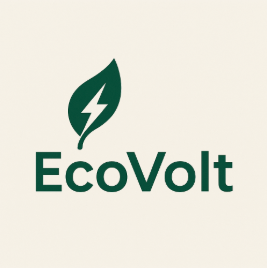</td>
		</tr>
		<tr>
			<td rowspan="2">Perfil</td>
			<td>Resumen</td>
			<td>Fabricante europeo de dispositivos IoT para automatización del hogar y monitoreo energético.</td>
			<td>Empresa estadounidense enfocada en soluciones accesibles de gestión energética doméstica.</td>
			<td>Plataforma SaaS para gestión energética institucional y corporativa</td>
			<td>Es una aplicación de escritorio que permite a empresas monitorear y optimizar su consumo energético</td>
		</tr>
		<tr>
			<td>Ventaja competitiva</td>
			<td>Gran compatibilidad con sistemas domóticos, tamaño reducido.</td>
			<td>Ecosistema todo en uno con aplicación centralizada, sensores a bajo costo</td>
			<td>Capacidades robustas de reporte, integración con sistemas ERP</td>
			<td>Compatible con múltiples dispositivos IoT del mercado. Interfaz dual para empresas y técnicos </td>
		</tr>
		<tr>
			<td rowspan="2">Perfil de Marketing</td>
			<td>Mercado objetivo</td>
			<td>Consumidores residenciales y electricistas profesionales</td>
			<td>Propietarios de viviendas, entusiastas de la energía solar y usuarios de vehículos eléctricos</td>
			<td>Organismos públicos, universidades, grandes corporaciones con múltiples instalaciones</td>
			<td>Empresas peruanas, técnicos eléctricos y ingenieros eléctricos</td>
		</tr>
		<tr>
			<td>Estrategias de marketing</td>
			<td>Alianzas con tiendas domótica, contenido técnico en foros y canales de YouTube</td>
			<td>Posicionamiento como marca eco-amigable y reseñas en YouTube</td>
			<td>Participación en conferencias de sostenibilidad, estudios de caso, venta consultiva directa</td>
			<td>Campañas en redes sociales con enfoque educativo y de ahorro de energético. Estrategia de contenido como tutoriales o webinars</td>
		</tr>
		<tr>
			<td rowspan="3">Perfil de Producto</td>
			<td>Productos y Servicios</td>
			<td>Interruptores inteligentes, medidores de energía, sensores de temperatura o luz</td>
			<td>Medidores de energía en panel eléctrico, enchufes inteligentes</td>
			<td>Plataforma cloud de gestión de energía, seguimiento de facturación</td>
			<td>Monitoreo en tiempo real y Control de dispositivos</p><p>Modo técnico para calibración y diagnóstico</td>
		</tr>
		<tr>
			<td>Precios y Costos</td>
			<td>Gama media, 1PM entre $15 a $25</td>
			<td>Emporia Vue 3 con 16 sensores $150</td>
			<td>Modelo por suscripción, costoso para pequeñas empresas</td>
			<td><p>Modelo Freemium para pequeñas empresas</p><p>Planes mensuales o anuales escalables según la cantidad de dispositivos</p></td>
		</tr>
		<tr>
			<td>Canales de distribución</td>
			<td>Tienda online, Amazon y distribuidores locales</td>
			<td>Amazon, web oficial y tiendas especializadas</td>
			<td>Ventas directas B2B, integradores energéticos</td>
			<td><p>Venta directa vía web</p><p>Distribución a través de electricistas aliados</p><p>Alianzas con distribuidores de dispositivos IoT</p></td>
		</tr>
		<tr>
			<td rowspan="4">Análisis SWOT</td>
			<td>Fortalezas</td>
			<td>
                <p>- Productos pequeños</p><p>- Integración sin nubes obligatorias</p>
            </td>
			<td>
                <p>- Integración sencilla</p><p>- Aplicación intuitiva</p>
            </td>
			<td>
                <p>- Altamente personalizable</p><p>- Enfoque institucional</p>
            </td>
			<td>
                <p>- Enfoque local y contextualizado para el mercado peruano</p><p>- Interfaz dual para empresas y técnicos</p><p>- Compatible con dispositivos IoT existentes</p>
            </td>
		</tr>
		<tr>
			<td>Debilidades</td>
			<td>
                <p>- Interfaz de usuario algo técnica</p><p>- Requiere conocimientos eléctricos</p>
            </td>
			<td>
                <p>- Limitado a uso residencial</p><p>- Poca expansión industrial</p>
            </td>
			<td>
                <p>- Costosa</p><p>- Completa para pequeñas empresas</p>
            </td>
			<td>
                <p>- Requiere alianzas iniciales con técnicos</p><p>- Al depender de hardware con terceros</p>
            </td>
		</tr>
		<tr>
			<td>Oportunidades</td>
			<td>
                <p>- Compatibilidad con más plataformas</p><p>- Expansión hacia sector comercial o industrial ligero</p>
            </td>
			<td>
                <p>- Crecimiento de energía solar doméstica</p><p>- Regulación energética en hogares</p>
            </td>
			<td>
                <p>- Expansión en LATAM</p><p>- Nuevas regulaciones ambientales obligatorios</p>
            </td>
			<td>
                <p>- Regulación energética</p><p>- Alianzas estratégicas con institutos técnicos</p>
            </td>
		</tr>
		<tr>
			<td>Amenazas</td>
			<td>
                <p>- Competencia creciente en domótica</p><p>- Problemas regulatorios según países</p>
            </td>
			<td>
                <p>- Nuevos competidores con más enfoque industrial</p><p>- Dependencia de plataformas móviles</p>
            </td>
			<td>
                <p>- Nuevas plataformas más accesibles</p><p>- Soluciones todo en uno IoT</p>
            </td>
			<td>
                <p>- Ingreso de competidores globales al mercado latinoamericano</p><p>- Barreras de confianza</p>
            </td>
		</tr>
	</tbody>
</table>

#### 2.1.2. Estrategias y tácticas frente a competidores

### 2.2. Entrevistas

#### 2.2.1. Diseño de entrevistas

##### Segmento 1:

###### Preguntas para las empresas:

1. ¿Cómo monitorean actualmente su consumo eléctrico?
2. ¿Tiene alguna solución para optimizar el uso de energía?
3. ¿Cuáles son los principales retos que enfrentan relacionados al consumo de elctricidad?
4. ¿Cómo identifican cuándo un equipo está consumiendo más de lo normal?
5. ¿Cómo es actualmente su relación con los electricistas o técnicos que les hacen mantenimiento?
6. ¿Qué tan importante sería poder comparar su consumo semanal/mensual?
7. ¿Qué información energética les gustaría recibir en un reporte ideal?
8. ¿Creen que el consumo eléctrico afecta sus costos de operación?

###### Preguntas para los electricistas:

1. ¿Qué herramientas usan actualmente para medir o diagnosticar consumo eléctrico?
2. ¿Usan o han instalado dispositivos IoT? ¿Cuáles?
3. ¿Qué problemas sueles/n tener durante la instalación o configuración?
4. ¿Te sería útil un “modo técnico” en una app, con datos específicos para mantenimiento o calibración?
5. ¿Qué tipo de reportes o diagnósticos suelen pedirte las empresas?
6. ¿Cuánto tiempo te tomaría preparar un reporte manualmente?
7. ¿Te gustaría que la aplicación permita generar informes listos para enviar?
8. ¿Qué otras funciones te gustaría que tenga una app que usas en tu día a día con dispositivos IoT?

#### 2.2.2. Registro de entrevistas

##### Entrevista #1

Nombre y apellido: Edgar Torres Mallma
---
Entrevista N°1:

**Entrevistado:** Sebastián Silva<br>
**Sexo:** Masculino<br>
**Edad:** 70 años<br>
**Domicilio:** Los Olivos <br>
**Inicio de la Entrevista:** 0:00<br>
**Duración de la Entrevista:** 6:15<br>


URL: https://youtu.be/EwcnpYQ2LJA

**Resumen de la Entrevista**: Edgar Torres Mallma, director de una empresa de fabricación de botellas y vasos, señaló que actualmente monitorean el consumo eléctrico por máquina mediante tableros individuales, pero carecen de una herramienta centralizada para visualizar el consumo total. Esto exige una supervisión constante para detectar anomalías.
 Destacó la importancia de mantener una comunicación fluida con producción y la necesidad de reportes periódicos (semanales o mensuales) que incluyan energía activa y reactiva, con el fin de identificar patrones de uso y optimizar el consumo. Reducir el exceso de consumo eléctrico es clave, ya que representa un gasto significativo para la empresa.


---

Entrevista N°2:

**Entrevistado:** Alejandro Alcala<br>
**Sexo:** Masculino<br>
**Edad:** 25 años<br>
**Domicilio:** Callao<br>
**Inicio de la Entrevista:** 0:00<br>
**Duración de la Entrevista:** 5:33<br>


URL: https://www.youtube.com/watch?v=2ovy4rYQDPg

**Resumen de la Entrevista**: Alejandro Alcalá, trabajador de una empresa del sector eléctrico, indicó que el monitoreo del consumo energético se realiza manualmente, registrando diariamente los datos de cada máquina desde tableros individuales. No cuentan con una solución automatizada ni centralizada que facilite el análisis o la toma de decisiones. Aunque han intentado operar en horarios de menor costo, no disponen de un sistema estructurado para optimizar el uso de energía. 
Un problema clave es la detección tardía de incrementos en el consumo, que solo se identifican al recibir la factura. También mencionó la falta de disponibilidad inmediata de técnicos para resolver fallas eléctricas. Considera crucial contar con reportes semanales y mensuales que incluyan comparativas, alertas por variaciones inusuales y recomendaciones prácticas. Subrayó que, aunque el impacto por factura no sea alto, el gasto acumulado anual es significativo.


---

Entrevista N°3:

**Entrevistado:** Jesus Gutierrez Pietro<br>
**Sexo:** Masculino<br>
**Edad:** 58 años<br>
**Domicilio:** San Martín de Porres<br>
**Inicio de la Entrevista:** 0:02<br>
**Duración de la Entrevista:** 20:56<br>

##### Entrevista #3

Nombre y apellido: Jesus Gutierrez Pietro


URL: https://www.youtube.com/watch?v=9Ox8EdYepqY

**Resumen de la Entrevista**: Jesús Gutiérrez, ingeniero electricista, explicó que realiza diagnósticos eléctricos utilizando instrumentos para medir el nivel de aislamiento y multímetros de redes que ofrecen datos como consumo, tensión y desfase. Señaló que las fallas más comunes están relacionadas con la red o la señal de internet, que debe ser estable. Considera útil contar con herramientas que notifiquen problemas en tiempo real.

 En cuanto a los reportes, mencionó que muchas empresas requieren documentos que cumplan con normativas para inspecciones (como las de INDECI), los cuales deben ser firmados por personal autorizado. Aunque los informes manuales pueden hacerse en un día, sugiere complementarlos con una cartilla de diagnóstico para identificar rápidamente fallas sin necesidad de revisiones presenciales constantes.


---

Entrevista N°4:

**Entrevistado:** Marcelo Valverde Carbajal<br>
**Sexo:** Masculino<br>
**Edad:** 20 años<br>
**Domicilio:** Comas<br>
**Inicio de la Entrevista:** 0:00<br>
**Duración de la Entrevista:** 5:18<br>


URL: https://www.youtube.com/watch?v=Ax82uPqDdtM

**Resumen de la Entrevista**: Marcelo Valverde, electricista joven con experiencia industrial y residencial, indicó que utiliza herramientas como el multímetro, pinza amperimétrica y, en casos complejos, analizadores de redes. Ha trabajado con tecnologías IoT como medidores inteligentes y sistemas de monitoreo remoto, pero señaló dificultades en la conexión Wi-Fi y en la usabilidad de las aplicaciones.
Sugiere que las apps incluyan un "modo técnico" con datos detallados como consumos en tiempo real y voltajes por fase. Las empresas le solicitan reportes que pueden tomar entre dos y cuatro horas si se hacen manualmente. Considera valioso que una app permita generar informes automáticos con gráficos, alertas configurables, historial de consumo, integración con Excel y gestión de múltiples sitios, con distintos niveles de acceso para técnicos y clientes.

---

Entrevista N°5:

**Entrevistado:** Higinio Fuertes Vilcapoma<br>
**Sexo:** Masculino<br>
**Edad:** 54 años<br>
**Domicilio:** Comas<br>
**Inicio de la Entrevista:** 0:00<br>
**Duración de la Entrevista:** 15:55<br>


URL: https://youtu.be/QiTkn4epHLs

**Resumen de la Entrevista**: Higinio Fuertes, ingeniero y empresario de ViplasticPerú, indicó que el monitoreo eléctrico se hace mensualmente mediante los recibos de la empresa Pluz. El principal problema es el control de la energía reactiva, cuya acumulación puede generar penalidades. Para ello, usan bancos de condensadores.
Los equipos de mayor consumo, como motores de 200 a 300 kW, representan un gran reto, especialmente durante el arranque. Cada máquina tiene su tabla de control, y el historial se actualiza semestralmente. Higinio considera ideal un sistema en tiempo real para detectar problemas con mayor eficiencia.
Le gustaría recibir informes diarios, especialmente para controlar el consumo en horas punta (6 p.m. a 10 p.m.), ya que el consumo eléctrico es uno de los mayores costos operativos. Cree fundamental adoptar nuevas tecnologías y sistemas de monitoreo diario para optimizar la toma de decisiones.


Entrevista N°6:

**Entrevistado:** Guillermo Montenegro Casas<br>
**Sexo:** Masculino<br>
**Edad:** 32 años<br>
**Domicilio:** Callao<br>
**Inicio de la Entrevista:** 0:00<br>
**Duración de la Entrevista:** 5:45<br>


URL: https://youtu.be/WCa7dELSskw

**Resumen de la Entrevista**: Guillermo Montenegro, electricista con experiencia en instalación y mantenimiento, usa herramientas como el multímetro digital, pinza amperimétrica y analizador de redes. Ha trabajado con dispositivos IoT, como medidores y sensores conectados por Wi-Fi, que permiten el monitoreo desde celular o PC.
Entre los problemas comunes, menciona dificultades con la conexión Wi-Fi, falta de contraseñas, y apps poco intuitivas. Propone que las aplicaciones cuenten con un "modo técnico" que muestre voltajes por fase, eventos históricos y patrones de consumo, lo cual facilitaría el mantenimiento.
Las empresas le solicitan reportes detallados con datos por zonas, equipos, sobrecargas o fallas, que pueden tardar entre una hora y media y una tarde entera si se hacen manualmente. Valora que una app permita generar informes en PDF con logotipo, gestionar múltiples ubicaciones, firmar digitalmente, y acceder al historial y registros de mantenimiento para aumentar su eficiencia.


#### 2.2.3. Análisis de entrevistas


***Segmento 1: Empresas consumidoras de energía***

- El 100% de las empresas entrevistadas (3 de 3) no utilizan una plataforma digital unificada para monitorear su consumo energético. En todos los casos, el control se realiza de forma manual o mediante tableros individuales instalados por máquina. 
- Dos de los entrevistados (66.7%) manifestaron que no cuentan con un sistema para detectar aumentos de consumo en tiempo real. Solo logran identificar excesos una vez recibida la factura eléctrica, lo cual impide tomar acciones correctivas oportunas.
- La totalidad de los entrevistados coincidió en la necesidad de contar con reportes periódicos. Uno de ellos indicó que un informe mensual ya no es suficiente, y que recibir datos diarios ayudaría a tomar decisiones más eficientes, sobre todo durante las horas de mayor demanda energética (6:00 p.m. – 10:00 p.m.).

- El 66.7% de los participantes resaltó que la energía reactiva representa un problema concreto, ya que un mal manejo puede derivar en penalidades económicas. En estos casos, han optado por instalar bancos de condensadores para controlar dicho componente, aunque recalcan la necesidad de mayor visibilidad.

- En cuanto a la relación con el personal técnico, el 100% mencionó que se realiza de forma directa, pero señalaron que sería valioso contar con herramientas que les permitan dar seguimiento continuo al estado de los equipos, sin depender exclusivamente del contacto presencial o de informes semestrales.

- Finalmente, el 100% afirmó que el consumo eléctrico es uno de los principales factores que impactan en los costos operativos de sus empresas, y que una mejora en la gestión energética permitiría optimizar recursos sin afectar la producción.


***Segmento 2: Electricistas y técnicos***

- Todos los entrevistados (3 de 3) indicaron que actualmente utilizan herramientas como multímetros digitales, pinzas amperimétricas y analizadores de redes para sus labores de diagnóstico y medición. Sin embargo, reconocen que estos métodos, aunque efectivos, implican tiempos prolongados para la generación de reportes completos.

- El 66.7% ha trabajado con dispositivos IoT como medidores inteligentes, contactores Wi-Fi y sensores conectados. No obstante, todos señalaron que enfrentan problemas recurrentes al momento de configurar estos equipos, especialmente por las limitaciones de conectividad Wi-Fi o la complejidad de las aplicaciones asociadas.

- El 100% de los entrevistados expresó que sería útil que las plataformas digitales incluyeran un “modo técnico”, orientado a profesionales del sector. Este debería ofrecer información avanzada como consumos en tiempo real, análisis trifásico, historial de eventos eléctricos y alarmas por fallas.

- Respecto a la elaboración de informes, todos indicaron que se trata de una tarea constante, solicitada por sus clientes empresariales. Dos de ellos afirmaron que preparar un reporte manual puede tomar entre dos y cuatro horas, dependiendo de la complejidad del sitio. Por eso, valoran la posibilidad de generar informes automáticos en formatos editables y exportables (PDF, Excel).


### 2.3. Needfinding

#### 2.3.1. User Personas

Basándonos en los datos recopilados a través de las entrevistas y el posterior análisis, hemos identificado los rasgos fundamentales de cada grupo objetivo estudiado. Esta información nos permitió crear User Personas detallados para cada segmento, con el objetivo de comprender a profundidad su contexto actual, metas principales, impulsos clave, puntos de dolor y características demográficas. Para el desarrollo de estos User Personas, empleamos la plataforma UXPressia en un entorno de trabajo colaborativo.

<p align="center">
    
</p>

<p align="center">
    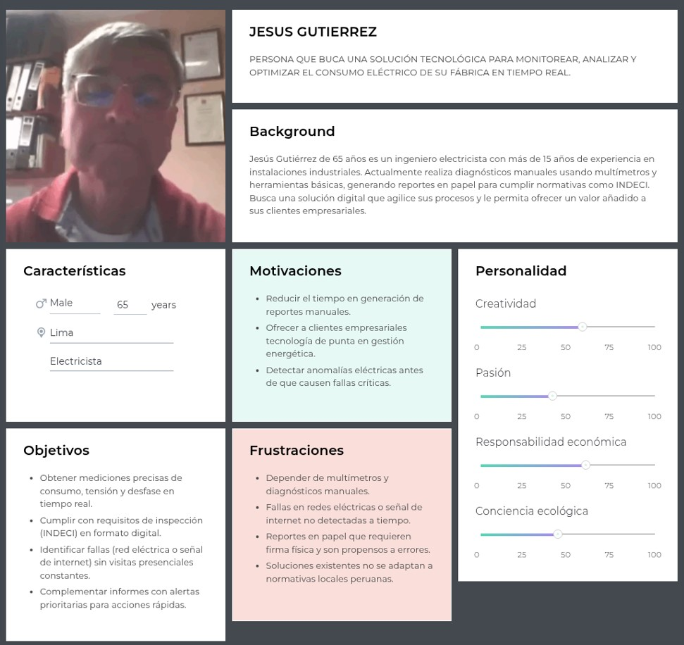
</p>

#### 2.3.2. User Task Matrix

<p align="center">
    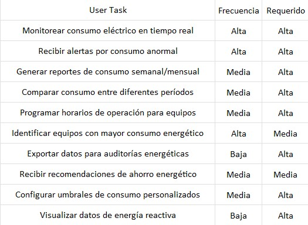
</p>

<p align="center">
    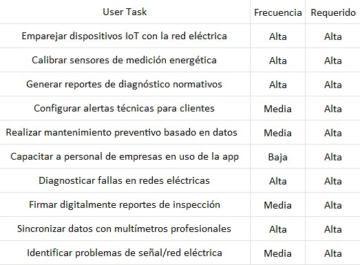
</p>

#### 2.3.3. User Journey Mapping

<p align="center">
    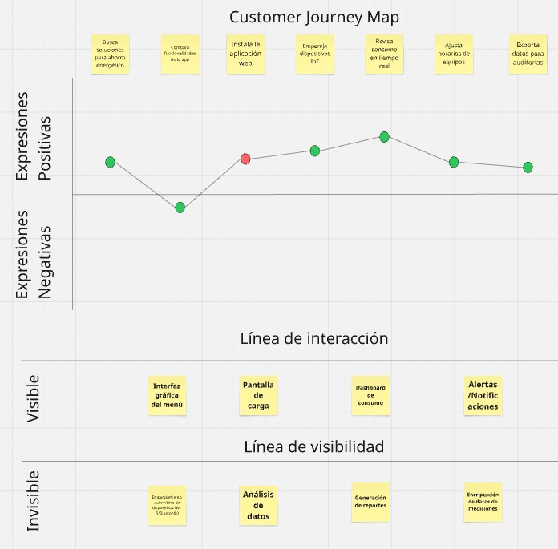
</p>

#### 2.3.4. Empathy Mapping

#### 2.3.4.1. Empathy Mapping Empresa consumidora

<p align="center">
    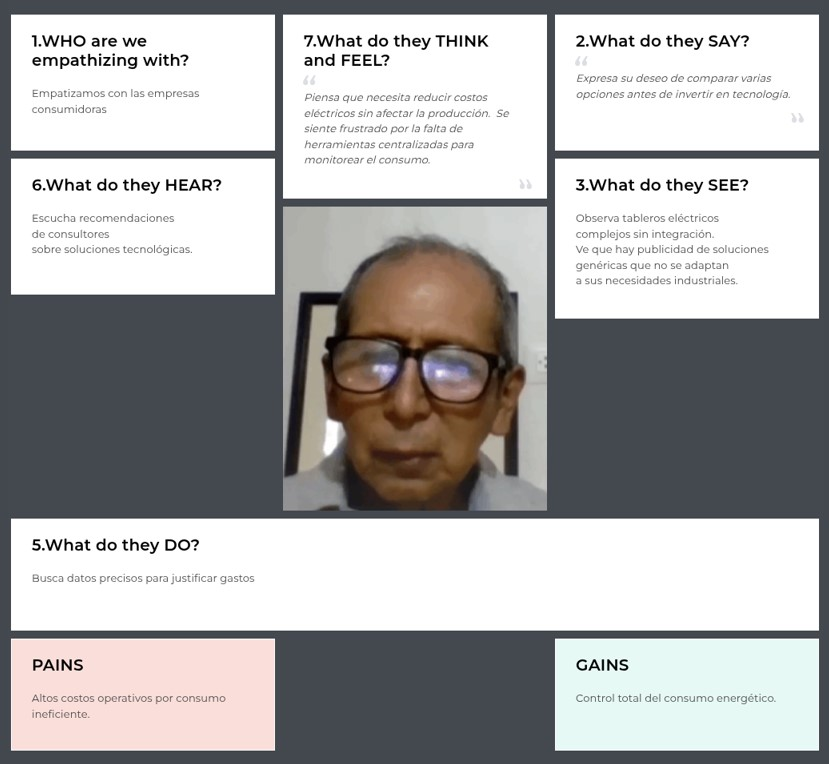
</p>

#### 2.3.4.2. Empathy Mapping Electricistas

<p align="center">
    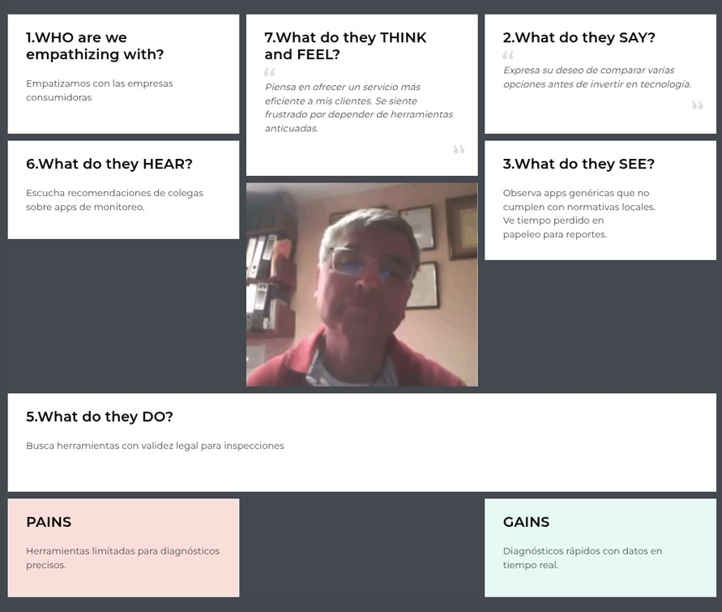
</p>

#### 2.3.5. As-is Scenario Mapping

#### 2.3.5.1. As-is Scenario Mapping Empresa consumidora

<p align="center">
    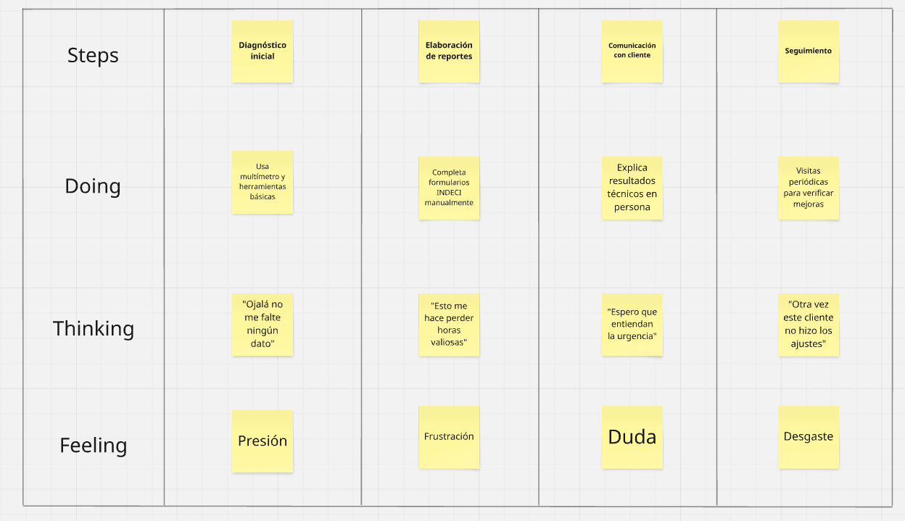
</p>

#### 2.3.5.2. As-is Scenario Mapping Electricistas

<p align="center">
    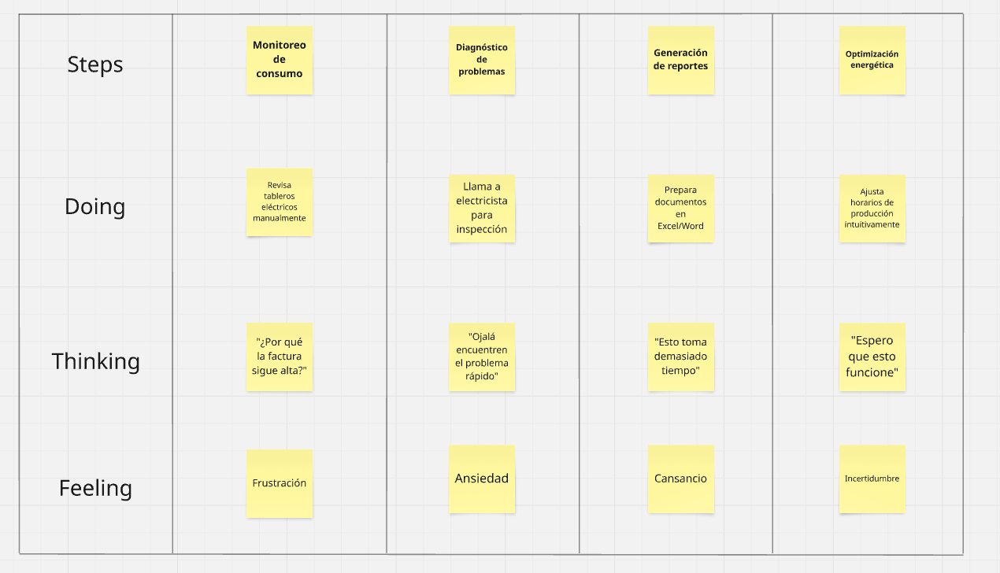
</p>

### 2.4. Ubiquitous Language


| **Término (Inglés)**       | **Término (Español)**       | **Descripción** |
|----------------------------|----------------------------|----------------|
| **Client Company**               | Empresa cliente                    | Organización registrada en la plataforma que requiere servicios eléctricos como instalaciones, mantenimiento o auditorías energéticas. |
| **Electrician**          | Electricista        | Profesional o técnico registrado en la plataforma que ofrece servicios eléctricos a empresas. |
| **Service Request**             | Solicitud de servicio                | Petición enviada por una empresa para requerir un servicio eléctrico específico. |
| **Work Order**       | Orden de trabajo           | Documento generado para coordinar y detallar el servicio eléctrico solicitado, incluyendo tareas, plazos y responsables. |
| **Recommended Technician**                  | Técnico recomendado | Electricista sugerido automáticamente por el sistema en función de la especialidad, disponibilidad y cercanía. |
| **Match**        | Coincidencia / Compatibilidad       | Nivel de afinidad entre una empresa y un electricista, considerando criterios como tipo de servicio, experiencia previa y ubicación. |
| **Availability**           | Disponibilidad             | Intervalo de tiempo en el que un electricista puede atender una solicitud de servicio. |
| **Profile**                | Perfil                     | Información personal, profesional y técnica relacionada con un usuario (empresa o electricista). |
| **Feedback**               | Retroalimentación          | 	Calificaciones y comentarios proporcionados por las empresas sobre los servicios recibidos. |
| **Service Package**           | Paquete de servicios          | Conjunto de tareas o intervenciones ofrecidas como un servicio completo (ej. instalación eléctrica integral, mantenimiento mensual). |
| **Local Supplier**          | Proveedor local               | Entidad o persona asociada al electricista que provee materiales o equipos eléctricos. |
| **Energy Demand**            | Demanda energética             | Requerimiento energético de una empresa, que puede influir en el tipo de servicio solicitado. |
| **Target Industry**        | Industria objetivo         | Sector económico al que pertenece la empresa cliente para una mejor personalización del servicio. |

<hr>

## Capítulo III: Requirements Specification

### 3.1. To-Be Scenario Mapping

#### 3.1.1. To-Be Scenario Mapping Turistas nacionales e internacionales

<p align="center">
    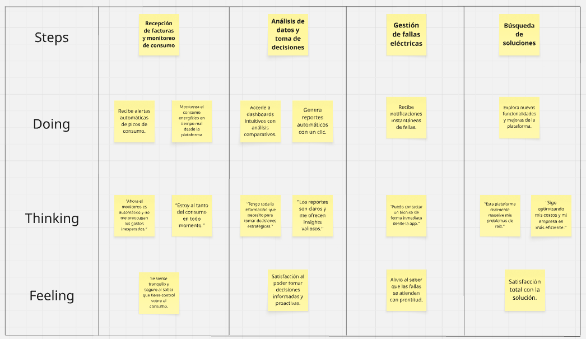
</p>

#### 3.1.2. To-Be Scenario Mapping Electricistas

<p align="center">
    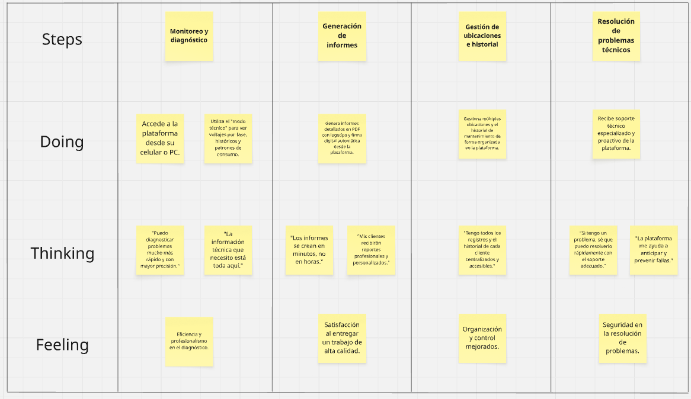
</p>

### 3.2. User Stories


|<p>**Epic / Story**</p><p>**ID**</p>|**Título**|**Descripción**|<p>**Criterios de**</p><p>**Aceptación**</p>|<p>**Relacionado**</p><p>**con (Epic ID)**</p>|
| :- | :- | :- | :- | :- |
|EP01|Gestión de usuarios y perfiles|Como usuario de la aplicación, quiero gestionar mi cuenta y perfil para acceder a funcionalidades personalizadas según mi rol.|-|-|
|EP02|Monitoreo y control de consumo|Como usuario empresarial, quiero monitorear y controlar el consumo energético de mis instalaciones para optimizar costos y eficiencia.|-|-|
|EP03|Herramientas para electricistas|Como electricista certificado, quiero herramientas especializadas para instalar, configurar y diagnosticar sistemas eléctricos de mis clientes.|-|-|
|US01|Registro empresas|Como gerente de planta, quiero registrar mi empresa para monitorear su consumo energético.|<p>Scenario 1: Registro exitoso</p><p>Dado que completo el formulario con RUC válido, cuando el administrador aprueba los datos, entonces recibo un email de confirmación.</p><p></p><p>Scenario 2: Datos fiscales incorrectos</p><p>Dado que ingreso un RUC inválido, cuando intento registrar mi empresa, entonces el sistema muestra "Verifique su RUC".</p>|EP01|
|US02|Registro electricistas|Como electricista, quiero registrarme con mi colegiatura para acceder al modo técnico.|<p>Scenario 1: Validación de colegiatura</p><p>Dado que subo mi certificado PDF, cuando el sistema detecta que es válido, entonces activa mi "Modo Técnico".</p><p></p><p>Scenario 2: Documento no legible</p><p>Dado que subo una imagen borrosa, cuando el sistema no puede validar, entonces sugiere "Suba un archivo más claro".</p>|EP01|
|US03|Inicio de sesión|Como usuario, quiero iniciar sesión con email y contraseña para acceder a mis datos.|<p>Scenario 1: Acceder inicio</p><p>Dado que me encuentro en la página inicial, cuando hago clic en "Acceder", entonces se abre un formulario donde puedes ingresar tu correo electrónico y tu contraseña.</p><p>Scenario 2: Credenciales correctas</p><p>Dado que ingreso mi email y contraseña válidos, cuando hago clic en "Ingresar", entonces accedo a mi dashboard.</p><p></p><p>Scenario 2: Contraseña incorrecta</p><p>Dado que ingreso una contraseña errónea 3 veces, cuando intento acceder, entonces el sistema bloquea mi cuenta temporalmente.</p>|EP01|
|US04|Recuperar contraseña|Como usuario, quiero restablecer mi contraseña si la olvido.|<p>Scenario 1: Solicitud exitosa</p><p>Dado que ingreso mi email registrado, cuando hago clic en "Recuperar", entonces recibo un enlace temporal en mi correo.</p><p></p><p>Scenario 2: Email no registrado</p><p>Dado que ingreso un email no existente, cuando intento recuperar contraseña, entonces el sistema muestra "Email no encontrado".</p>|EP01|
|US05|Perfil corporativo|Como empresa, quiero agregar datos de mi sector industrial para recibir métricas relevantes.|<p>Scenario 1: Actualización de sector</p><p>Dado que selecciono "Industria textil", cuando guardo los cambios, entonces el dashboard muestra benchmarks de ese sector.</p><p></p><p>Scenario 2: Sector no seleccionado</p><p>Dado que no elijo un sector, cuando guardo el perfil, entonces el sistema asigna "Otros" por defecto.</p>|EP01|
|US06|Permisos por roles|Como administrador, quiero asignar roles a mi equipo.|<p>Scenario 1: Asignación de rol</p><p>Dado que asigno "Solo lectura" a María, cuando ella inicia sesión, entonces no puede editar configuraciones.</p><p></p><p>Scenario 2: Intento de acceso denegado</p><p>Dado que un usuario sin permisos intenta modificar equipos, cuando confirma la acción, entonces el sistema muestra "Acceso restringido".</p>|EP01|
|US07|Notificaciones|Como usuario, quiero recibir alertas sobre actualizaciones importantes.|<p>Scenario 1: Alerta de actualización</p><p>Dado que hay una nueva versión, cuando el sistema detecta mi app desactualizada, entonces recibo una notificación push.</p><p></p><p>Scenario 2: Notificación silenciada</p><p>Dado que desactivo notificaciones, cuando hay una actualización, entonces no recibo alertas.</p>|EP01|
|US08|Integración SSO|Como empresa, quiero iniciar sesión con Google Workspace para simplificar el acceso.|<p>Scenario 1: Login con Google</p><p>Dado que selecciono "Ingresar con Google", cuando autentico mi cuenta, entonces accedo sin contraseña.</p><p></p><p>Scenario 2: Cuenta no corporativa</p><p>Dado que uso un email personal, cuando intento ingresar, entonces el sistema muestra "Use su cuenta corporativa".</p>|EP01|
|US09|Eliminar cuenta|Como usuario, quiero borrar mi cuenta permanentemente.|<p>Scenario 1: Eliminación confirmada</p><p>Dado que solicito borrar mi cuenta, cuando confirmo con mi contraseña, entonces todos mis datos se eliminan en 72h.</p><p></p><p>Scenario 2: Cancelación de eliminación</p><p>Dado que inicio el proceso, cuando cancelo antes de confirmar, entonces mi cuenta permanece activa.</p>|EP01|
|US10|Múltiples sucursales|Como cadena comercial, quiero agregar todas mis tiendas en un solo dashboard.|<p>Scenario 1: Registro de sucursal</p><p>Dado que ingreso datos de mi tienda "Lima Centro", cuando guardo, entonces aparece en el dashboard filtrable.</p><p></p><p>Scenario 2: Sucursal duplicada</p><p>Dado que registro una ubicación ya existente, cuando intento guardar, entonces el sistema muestra "Sucursal ya registrada".</p>|EP01|
|US11|Dashboard en tiempo real|Como gerente, quiero ver gráficos actualizados cada 5 minutos.|<p>Scenario 1: Visualización de datos</p><p>Dado que los sensores están activos, cuando abro la app, entonces veo gráficos actualizados cada 5 minutos.</p><p></p><p>Scenario 2: Sin conexión a sensores</p><p>Dado que hay falla en la red, cuando abro el dashboard, entonces muestra "Datos no disponibles".</p>|EP02|
|US12|Alertas personalizadas|Como técnico, quiero configurar umbrales para recibir alertas.|<p>Scenario 1: Alerta por exceso de consumo</p><p>Dado que seteo 100kW como límite, cuando se supera, then recibo un SMS con detalles.</p><p></p><p>Scenario 2: Umbral inválido</p><p>Dado que ingreso "0kW" como límite, cuando intento guardar, entonces el sistema muestra "Valor debe ser mayor a 1kW".</p>|EP02|
|US13|Histórico comparativo|Como analista, quiero comparar consumo mensual/anual.|<p>Scenario 1: Comparación anual</p><p>Dado que selecciono "2023 vs 2024", cuando aplico filtros, entonces veo porcentajes de cambio por mes.</p><p></p><p>Scenario 2: Sin datos históricos</p><p>Dado que elijo un período sin registros, cuando genero el reporte, entonces muestra "No hay datos para comparar".</p>|EP02|
|US14|Programación de equipos|Como operador, quiero programar horarios de máquinas.|<p>Scenario 1: Apagado automático</p><p>Dado que programo apagado a las 8PM, cuando llega la hora, entonces el sistema envía la señal.</p><p></p><p>Scenario 2: Horario no laboral</p><p>Dado que programo encendido a las 3AM, cuando confirmo, entonces el sistema sugiere "¿Está seguro?".</p>|EP02|
|US15|Energía reactiva|Como especialista, quiero monitorear energía reactiva para evitar multas.|<p>Scenario 1: Corrección sugerida</p><p>Dado que el factor es 0.85, cuando activo el módulo, entonces la app recomienda "Instalar bancos de capacitores".</p><p></p><p>Scenario 2: Valores normales</p><p>Dado que el factor es 0.95, cuando reviso el dashboard, entonces muestra "Dentro del rango óptimo".</p>|EP02|
|US16|Exportar datos|Como auditor, quiero exportar reportes en CSV/PDF.|<p>Scenario 1: Exportar a PDF</p><p>Dado que selecciono "Exportar", cuando elijo PDF, entonces el archivo se descarga con gráficos.</p><p></p><p>Scenario 2: Sin datos para exportar</p><p>Dado que no hay registros, cuando intento exportar, entonces muestra "Seleccione un período con datos".</p>|EP02|
|US17|Integración facturación|Como contador, quiero vincular datos con mi software de facturas.|<p>Scenario 1: Vinculación con SAP</p><p>Dado que conecto la API, cuando hay un pico de consumo, entonces SAP actualiza los costos proyectados.</p><p></p><p>Scenario 2: Error de conexión</p><p>Dado que SAP está offline, cuando el sistema intenta sincronizar, entonces notifica "Reintentar más tarde".</p>|EP02|
|US18|Recomendaciones automáticas|Como usuario, quiero recibir sugerencias de ahorro.|<p>Scenario 1: Sugerencia de ahorro</p><p>Dado que el sistema detecta ineficiencias, cuando analiza patrones, entonces propone "Reducir uso en horario punta".</p><p></p><p>Scenario 2: Sin recomendaciones</p><p>Dado que el consumo es óptimo, cuando reviso sugerencias, entonces muestra "No se detectaron ineficiencias".</p><p></p>|EP02|
|US19|Mantenimiento predictivo|Como mantenedor, quiero recibir alertas antes de fallas.|<p>Scenario 1: Alerta de vibración</p><p>Dado que un motor supera 5mm/s de vibración, cuando el sistema lo detecta, entonces programa revisión para las 24h siguientes.</p><p></p><p>Scenario 2: Falso positivo</p><p>Dado que la vibración es temporal, cuando se normaliza en 5 minutos, entonces cancela la alerta.</p>|EP02|
|US20|Mapas térmicos|Como ingeniero, quiero ver calorías de consumo por áreas.|<p>Scenario 1: Identificar zonas críticas</p><p>Dado que activo la vista térmica, cuando analizo la planta, entonces las áreas rojas muestran sobreconsumo.</p><p></p><p>Scenario 2: Sin datos térmicos</p><p>Dado que los sensores están apagados, cuando abro el mapa, entonces muestra "Active los sensores primero".</p>|EP02|
|US21|Emparejar dispositivos|Como electricista, quiero conectar sensores IoT escaneando QR.|<p>Scenario 1: Conexión exitosa</p><p>Dado que escaneo el QR del sensor, cuando la app lo reconoce, entonces lo agrega al plano eléctrico.</p><p></p><p>Scenario 2: Error de emparejamiento</p><p>Dado que el sensor no responde, cuando intento conectarlo 3 veces, entonces sugiere "Reinicie el dispositivo".</p>|EP03|
|US22|Calibración remota|Como técnico, quiero ajustar sensores desde mi celular.|<p>Scenario 1: Ajuste de parámetros</p><p>Dado que detecto un desfase del 5%, cuando modifico la sensibilidad, entonces los valores se actualizan en tiempo real.</p><p></p><p>Scenario 2: Fuera de rango</p><p>Dado que ingreso un valor fuera de límites, cuando intento guardar, entonces muestra "Rango permitido: 1-100%".</p>|EP03|
|US23|Reportes INDECI|Como proveedor, quiero generar documentos pre-formateados.|<p>Scenario 1: Generar PDF</p><p>Dado que completo el diagnóstico, cuando selecciono "INDECI", entonces descarga un PDF con formato oficial.</p><p></p><p>Scenario 2: Campos incompletos</p><p>Dado que falta información, cuando intento generar el reporte, entonces resalta los campos obligatorios.</p>|EP03|
|US24|Diagnóstico de fallas|Como especialista, quiero ver análisis automáticos de problemas.|<p>Scenario 1: Cortocircuito detectado</p><p>Dado que hay un corto en el circuito B, cuando reviso la app, entonces identifica la ubicación exacta.</p><p></p><p>Scenario 2: Falla intermitente</p><p>Dado que el problema desaparece, cuando el sistema lo registra, entonces sugiere "Monitorear por 24h".</p>|EP03|
|US25|Historial de clientes|Como freelance, quiero acceder a registros anteriores.|<p>Scenario 1: Acceso a registros</p><p>Dado que selecciono "Cliente X", cuando busco en historial, entonces muestra todas las inspecciones ordenadas por fecha.</p><p></p><p>Scenario 2: Cliente nuevo</p><p>Dado que no hay historial, cuando ingreso a la ficha, entonces muestra "Sin inspecciones previas".</p>|EP03|
|US26|Firma digital|Como electricista, quiero firmar reportes desde la app.|<p>Scenario 1: Reporte firmado</p><p>Dado que finalizo un reporte, cuando uso mi e-firma, entonces el PDF muestra "Validado por [Nombre]".</p><p></p><p>Scenario 2: Firma no registrada</p><p>Dado que no tengo e-firma configurada, cuando intento firmar, entonces redirige a "Configurar firma".</p>|EP03|
|US27|Chat con clientes|Como técnico, quiero comunicarme dentro de la plataforma.|<p>Scenario 1: Mensaje enviado</p><p>Dado que escribo "¿El problema persiste?", cuando hago clic en "Enviar", entonces el cliente recibe una notificación.</p><p></p><p>Scenario 2: Archivo adjunto</p><p>Dado que subo una foto del problema, cuando envío el mensaje, entonces el cliente ve la imagen en el chat.</p>|EP03|
|US28|Plantillas personalizadas|Como usuario avanzado, quiero crear mis propios formatos de reporte.|<p>Scenario 1: Crear plantilla</p><p>Dado que diseño un formato, cuando lo guardo como "Mi Plantilla", entonces aparece en "Mis Templates".</p><p></p><p>Scenario 2: Nombre duplicado</p><p>Dado que uso un nombre ya existente, cuando intento guardar, entonces sugiere "Elija otro nombre".</p>|EP03|
|US29|Guías visuales de instalación|Como electricista, quiero acceder a guías visuales paso a paso para instalar sensores correctamente y reducir errores.|<p>Scenario 1: Acceso a diagramas interactivos</p><p>Dado que selecciono un sensor específico, cuando abro "Guía de Instalación", entonces veo un diagrama 2D con pasos numerados y zonas de colocación destacadas.</p><p></p><p>Scenario 2: Descarga de manuales</p><p>Dado que necesito offline, cuando hago clic en "Descargar PDF", entonces obtengo un archivo con especificaciones técnicas y buenas prácticas.</p>|EP03|
|US30|Soporte técnico prioritario|Como profesional, quiero acceso a soporte 24/7.|<p>Scenario 1: Emergencia reportada</p><p>Dado que presiono el botón rojo, cuando describo el problema, entonces recibo una llamada en menos de 5min.</p><p></p><p>Scenario 2: Consulta no urgente</p><p>Dado que uso el chat normal, cuando envío una pregunta, entonces recibo respuesta en 1h.</p>|EP03|
|US31|Navegación por la landing Page|Como usuario, quiero navegar fácilmente por la landing page para entender las funcionalidades clave de EcoVolt.|<p>Scenario 1: Acceso a secciones</p><p>Dado que el usuario se encuentra en la página de inicio, cuando selecciona un elemento del menú, entonces es dirigido a la sección correspondiente dentro de la misma página.</p><p></p><p>Scenario 2: Demo interactivo</p><p>Dado que veo el video demo, cuando paso el cursor, entonces muestra tooltips explicativos.</p>|EP01|
|US32|Ver información del proyecto|Como usuario potencial, quiero conocer en qué consiste EcoVolt para evaluar si cubre mis necesidades.|<p>Scenario 1: Beneficios clave</p><p>Dado que leo "Cómo funciona", cuando reviso los íconos, entonces identifico 3 ventajas principales.</p><p></p><p>Scenario 2: Tecnología usada</p><p>Dado que busco "Infraestructura", cuando veo los logos, entonces confirmo integración con AWS IoT.</p>|EP01|
|US33|Conocer la misión|Como inversionista, quiero entender la misión de EcoVolt para evaluar su impacto potencial.|<p>Scenario 1: Impacto ambiental</p><p>Dado que accedo a "Propósito", cuando leo la sección, entonces veo "Reducir 30% desperdicio energético".</p><p></p><p>Scenario 2: Compromiso social</p><p>Dado que reviso "Valores", cuando busco iniciativas, entonces encuentro "Capacitación a comunidades".</p>|EP01|
|US34|Recomendaciones de usuarios|Como empresa indecisa, quiero leer testimonios verificados de otros clientes para tomar una decisión informada.|<p>Scenario 1: Testimonio verificado</p><p>Dado que veo un comentario de "Tiendas EFE", cuando reviso el sello, entonces confío en su autenticidad.</p><p></p><p>Scenario 2: Filtro por sector</p><p>Dado que selecciono "Manufactura", cuando aplico el filtro, entonces solo muestran casos de ese rubro.</p>|EP02|

<hr>

### 3.3. Impact Mapping

<p align="center">
    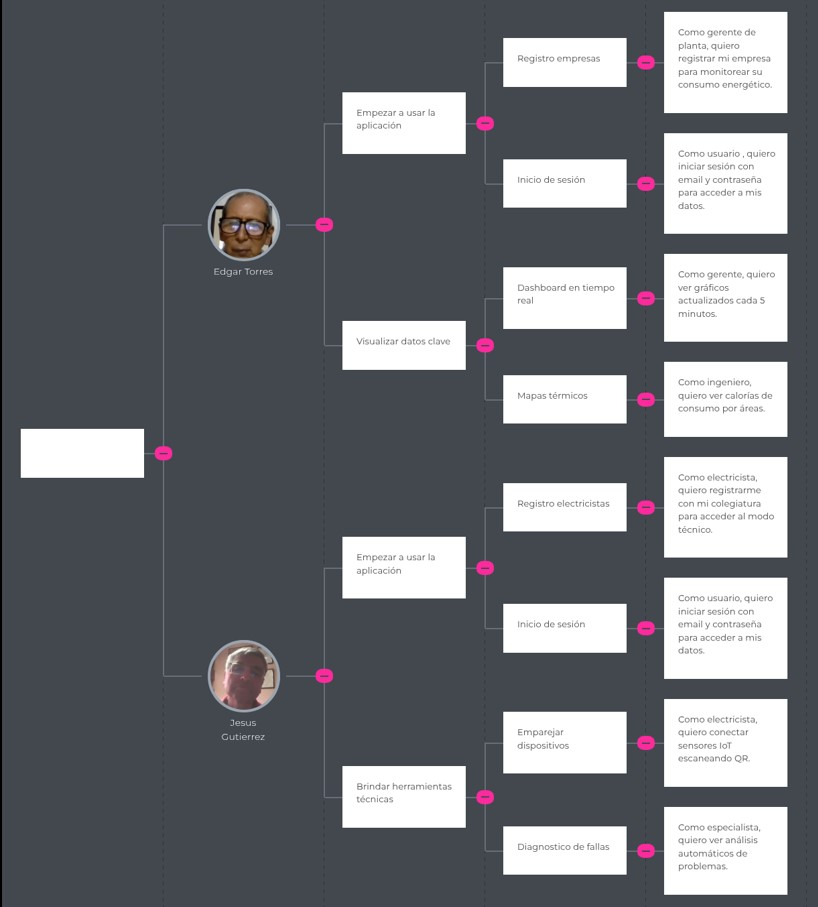
</p>

### 3.4. Product Backlog


|# Orden|User Story Id|Título|Descripción|Story Points (1 / 2 / 3 / 5 / 8)|
| :- | :- | :- | :- | :- |
|1|US01|Registro empresas|Como gerente de planta, quiero registrar mi empresa para monitorear su consumo energético.|5|
|2|US02|Registro electricistas|Como electricista, quiero registrarme con mi colegiatura para acceder al modo técnico.|3|
|3|US03|Inicio de sesión|Como usuario, quiero iniciar sesión con email y contraseña para acceder a mis datos.|2|
|4|US04|Recuperar contraseña|Como usuario, quiero restablecer mi contraseña si la olvido.|1|
|5|US05|Perfil corporativo|Como empresa, quiero agregar datos de mi sector industrial para recibir métricas relevantes.|2|
|6|US06|Permisos por roles|Como administrador, quiero asignar roles a mi equipo.|5|
|7|US07|Notificaciones|Como usuario, quiero recibir alertas sobre actualizaciones importantes.|1|
|8|US08|Integración SSO|Como empresa, quiero iniciar sesión con Google Workspace para simplificar el acceso.|8|
|9|US09|Eliminar cuenta|Como usuario, quiero borrar mi cuenta permanentemente.|2|
|10|US10|Múltiples sucursales|Como cadena comercial, quiero agregar todas mis tiendas en un solo dashboard.|5|
|11|US11|Dashboard en tiempo real|Como gerente, quiero ver gráficos actualizados cada 5 minutos.|8|
|12|US12|Alertas personalizadas|Como técnico, quiero configurar umbrales para recibir alertas.|3|
|13|US13|Histórico comparativo|Como analista, quiero comparar consumo mensual/anual.|3|
|14|US14|Programación de equipos|Como operador, quiero programar horarios de máquinas.|5|
|15|US15|Energía reactiva|Como especialista, quiero monitorear energía reactiva para evitar multas.|5|
|16|US16|Exportar datos|Como auditor, quiero exportar reportes en CSV/PDF.|2|
|17|US17|Integración facturación|Como contador, quiero vincular datos con mi software de facturas.|8|
|18|US18|Recomendaciones automáticas|Como usuario, quiero recibir sugerencias de ahorro.|3|
|19|US19|Mantenimiento predictivo|Como mantenedor, quiero recibir alertas antes de fallas.|5|
|20|US20|Mapas térmicos|Como ingeniero, quiero ver calorías de consumo por áreas.|3|
|21|US21|Emparejar dispositivos|Como electricista, quiero conectar sensores IoT escaneando QR.|3|
|22|US22|Calibración remota|Como técnico, quiero ajustar sensores desde mi celular.|5|
|23|US23|Reportes INDECI|Como proveedor, quiero generar documentos pre-formateados.|3|
|24|US24|Diagnóstico de fallas|Como especialista, quiero ver análisis automáticos de problemas.|5|
|25|US25|Historial de clientes|Como freelance, quiero acceder a registros anteriores.|2|
|26|US26|Firma digital|Como electricista, quiero firmar reportes desde la app.|3|
|27|US27|Chat con clientes|Como técnico, quiero comunicarme dentro de la plataforma.|5|
|28|US28|Plantillas personalizadas|Como usuario avanzado, quiero crear mis propios formatos de reporte.|3|
|29|US29|Guías visuales de instalación|Como electricista, quiero acceder a guías visuales paso a paso para instalar sensores correctamente y reducir errores.|5|
|30|US30|Soporte técnico prioritario|Como profesional, quiero acceso a soporte 24/7.|5|
|31|US31|Navegación por la landing Page|Como usuario, quiero navegar fácilmente por la landing page para entender las funcionalidades clave de EcoVolt.|3|
|32|US32|Ver información del proyecto|Como usuario potencial, quiero conocer en qué consiste EcoVolt para evaluar si cubre mis necesidades.|2|
|33|US33|Conocer la misión|Como inversionista, quiero entender la misión de EcoVolt para evaluar su impacto potencial.|1|
|34|US34|Recomendaciones de usuarios|Como empresa indecisa, quiero leer testimonios verificados de otros clientes para tomar una decisión informada.|5|


<hr>

## Capítulo IV: Product Design

### 4.1. Style Guidelines

**Branding**:

Nuestro proyecto se llama EcoVolt, el cual busca mostrar la idea principal del producto, el cual es el ahorro de electricidad. Esto se muestra en la combinación de palabras Eco, prefijo de la palabra ecológico, y Volt, que se refiere a la unidad que se usa para la electricidad en inglés. El logo muestra un símbolo de una hoja y un rayo que envuelve la idea de electricidad ecológica.

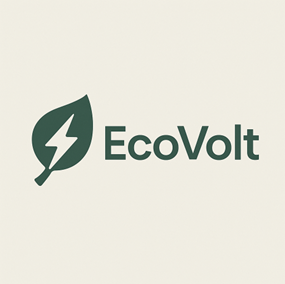

**Typography**:

La tipografía elegida es “OpenSans”, pues es un tipo de letra clara, concisa y formal, que busca brindar una experiencia agradable y con una lectura fácil y llamativa.

**Colors**:

La paleta de colores usadas está principalmente integrada por los colores verde, crema y negro, que buscan transmitir la idea de una página seria y al mismo tiempo moderna y llamativa.


**Spacing**:

El spacing utilizado es el 8x, para de esta manera tener una alineación constante y adecuada para la lectura de los usuarios

**Tono de comunicación y lenguaje aplicado**:

EcoVolt tiene un tono respetuoso, formal, sereno y serio, debido a que está enfocada principalmente a empresas y profesionales que buscan un servicio competente, lo suficientemente confiable y que se adapte a ese entorno


#### 4.1.2. Web Style Guidelines

**1.	Diseño**: EL diseño en el que se basa el sitio web es claro, sencillo y llamativo para resaltar en todos los usuarios

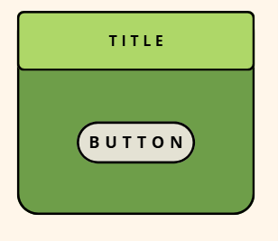

**2.	Botones**: Los botones son intuitivos y fáciles de comprender para seleccionar funciones

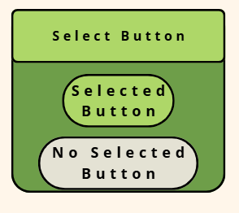

**3.	Logo**: El logo es fresco y refleja la idea principal del producto


### 4.2. Information Architecture

#### 4.2.1. Organization Systems

Para la landing page de EcoVolt, se usará una organización de forma jerárquica, en la que se ordenará la información en distintas secciones de una forma clara, ordenada e intuitiva para nuestros segmentos objetivo, por lo que tanto las empresas como los electricistas tendrán acceso a este, como :

**Board sobre consumo de energía**: Permite al usuario observar un historial de consumo de energía, además de generar alertas ante excesos.

**Monitoreo y Diagnóstico en tiempo real (IoT)**: Usando un modelo IoT, permite hacer un diagnóstico sobre el consumo eléctrico a tiempo real y muestra posibles anomalías

**Sistema de Alertas y Seguimiento**: Se encarga de la organización y mantenimiento de los artefactos, con recordatorios automáticos, además de poder agregar otros eventos por los usuarios como fechas de auditorías.

**Comparación entre distintos artefactos**: Permite comparar el gasto eléctrico de dos artefactos distintos pero que pertenecen al mismo usuario.


#### 4.2.2. Labeling Systems

Las etiquetas en la landing page son simples y fáciles de entender para no generar confusión en los usuarios, cuentan con información y títulos claros que ayudan a encontrar cada funcion por sí mismos. Esto debido a que se omite tecnicismos y muchas palabras para optar por la simpleza.

**Board**: Esta sección muestra el historial de consumo de energía.

**Monitoreo**: Esta sección hace un diagnóstico sobre el consumo eléctrico a tiempo real.

**Seguimiento**: Esta sección hace la organización y mantenimiento de los artefactos. Se pueden agregar otros eventos.

**Artefactos**: Esta sección permite comparar el gasto eléctrico de dos artefactos distintos del mismo usuario.


#### 4.2.3. SEO Tags and Meta Tags

Se utilizaron diversas meta tags que mejoran la visibilidad del sitio web en los motores de búsqueda. 

**1. Landing Page**:

**• Title**: EcoVolt: Plataforma para la gestión y ahorro de energía

**•Meta Description**:EcoVolt es una plataforma web diseñada para la gestión y el ahorro de energía usando distintas funciones y enfocándose en las empresas y electricistas.

**•Keywords**:Ahorro de energía, gestión de recursos, 
administración de artefactos, productividad de empresas

**•Author**: EcoVolt Team

**2. Board**:

**•Title**: Historial de Consumo

**•Meta Description**: Muestra el historial de consumo de energía y genera alertas ante ello

**•Keywords**: Consumo de energía, historial, gestión de energía, alertas

**•Author**: EcoVolt Team

**3. Monitoreo**:

**•Title**: Diagnóstico de Consumo

**•Meta Description**: Genera un diagnóstico a tiempo real del consumo de energía y muestra posibles anomalías

**•Keywords**: anomalías, tiempo real, tecnología IoT

**•Author**: EcoVolt Team

**4. Seguimiento**:

**•Title**: Mantenimiento de Artefactos

**•Meta Description**: Se encarga de la organización y mantenimiento de los artefactos

**•Keywords**: gestión de alertas, futuros eventos, auditorías

**•Author**: EcoVolt Team

**5. Artefactos**:

**•Title**: Comparación de Artefactos

**•Meta Description**: Se encarga de comparar el gasto eléctrico de artefactos distintos de un mismo usuario

**•Keywords**: comparación, gestión de artefactos, relación gasto-ganancia

**•Author**: EcoVolt Team


#### 4.2.4. Searching Systems

La aplicación cuenta con una barra de búsqueda para que los usuarios puedan ingresar a la información que buscan.. Se optó por un sistema de búsqueda sencillo y eficaz, para que el usuario no se pierda entre tantas opciones y encuentre sus búsquedas rápido.


#### 4.2.5. Navigation Systems

El sistema principal de navegación es intuitivo y claro. Este se muestra principalmente en una barra de búsqueda que cuenta con todas las funciones de la aplicación, con las que podremos interactuar y nos dirigirá a cada función buscada.

### 4.3. Landing Page UI Design

#### 4.3.1. Landing Page Wireframe


#### 4.3.2. Landing Page Mock-up

### 4.4. Web Applications UX/UI Design

#### 4.4.1. Web Applications Wireframes.

#### 4.4.2. Web Applications Wireflow Diagrams

#### 4.4.3. Web Applications Mock-ups

#### 4.4.4. Web Applications User Flow Diagrams

### 4.5. Web Applications Prototyping

### 4.6. Domain-Driven Software Architecture

#### 4.6.1. Software Architecture Context Diagrams


#### 4.6.2. Software Architecture Container Diagrams

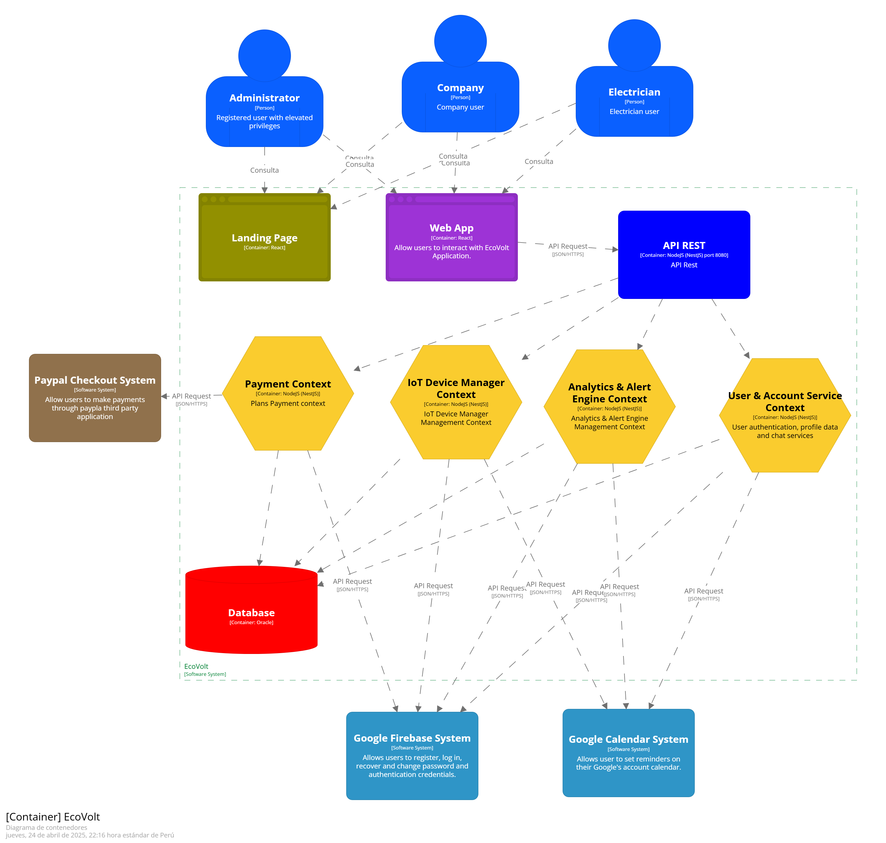

#### 4.6.3. Software Architecture Components Diagrams

**Bounded context User & Account Service**


**Bounded context Payment Services**


**Bounded context IoT Device Manager**


**Bounded context Analytics & Alert Engine**


### 4.7. Software Object-Oriented Design

#### 4.7.1. Class Diagrams


#### 4.7.2. Class Dictionary

| **Clase**       | **Nombre de Atributo** | **Descripción**                             | **Tipo de Dato** |
|-----------------|------------------------|---------------------------------------------|------------------|
| User            | id                     | Identificador único                         | UUID             |
| User            | email                  | Correo electrónico del usuario              | String           |
| User            | password_hash          | Contraseña encriptada                       | String           |
| User            | role                   | Rol del usuario (admin, company, technician)| UserRole         |
| User            | createdAt              | Fecha de creación                           | Date             |
| User            | login                  | Verifica las credenciales de acceso         | Boolean          |
| User            | updateProfile          | Permite actualizar datos del perfil         | void             |
| Companies       | name                   | Nombre de la empresa                        | String           |
| Companies       | ruc                    | RUC o identificación tributaria             | String           |
| Companies       | address                | Dirección física                            | String           |
| Companies       | userId                 | Usuario asociado                            | UUID             |
| Technician      | fullName               | Nombre completo                             | String           |
| Technician      | certifications         | Certificaciones técnicas                    | List             |
| Technician      | userId                 | Usuario al que pertenece                    | UUID             |
| Device          | id                     | Identificador del dispositivo               | UUID             |
| Device          | serialNumber           | Número de serie único                       | String           |
| Device          | location               | Ubicación del dispositivo                   | String           |
| Device          | status                 | Estado del dispositivo                      | DeviceStatus     |
| Device          | installedAt            | Fecha de instalación                        | DateTime         |
| Device          | companyId              | Empresa a la que pertenece                  | UUID             |
| Device          | amosendData            | Envía datos al servidor                     | void             |
| Device          | restart                | Reinicia el dispositivo                     | Boolean          |
| ConsumptionData | timestamp              | Fecha y hora del dato                       | DateTime         |
| ConsumptionData | voltage                | Voltaje                                     | Float            |
| ConsumptionData | current                | Corriente                                   | Float            |
| ConsumptionData | power                  | Potencia                                    | Float            |
| ConsumptionData | frequency              | Frecuencia                                  | Float            |
| ConsumptionData | deviceId               | Dispositivo que generó el dato              | UUID             |
| Alert           | id                     | Identificador único                         | UUID             |
| Alert           | type                   | Tipo de alerta                              | AlertType        |
| Alert           | description            | Descripción de la alerta                    | String           |
| Alert           | triggeredAt            | Momento en que se generó                    | DateTime         |
| Alert           | resolved               | Estado de resolución                        | Boolean          |
| Alert           | deviceId               | Dispositivo relacionado                     | UUID             |
| Alert           | markResolved           | Marca la alerta como resuelta               | void             |
| Invoices        | amount                 | Monto facturado                             | Float            |
| Invoices        | issuedAt               | Fecha de emisión                            | DateTime         |
| Invoices        | paid                   | Estado de pago                              | Boolean          |
| Invoices        | pdfUrl                 | Enlace al documento                         | String           |
| Invoices        | subscriptionId         | Relación con la suscripción correspondiente | UUID             |
| Subscription    | planType               | Tipo de plan                                | String           |
| Subscription    | status                 | Estado                                      | String           |
| Subscription    | startedAt              | Fecha de inicio                             | DateTime         |
| Subscription    | endsAt                 | Fecha de finalización                       | DateTime         |
| Subscription    | paymentProviderId      | ID de pago externo                          | String           |
| Subscription    | userId                 | Usuario suscrito                            | UUID             |
| Report          | fileUrl                | Enlace al archivo exportado                 | String           |
| Report          | generatedAt            | Fecha de generación                         | DateTime         |
| Report          | type                   | Tipo de reporte                             | ReportType       |
| Report          | companyId              | Empresa que solicitó el reporte             | UUID             |


### 4.8. Database Design

#### 4.8.1. Database Diagram


<hr>

## Capítulo V: Product Implementation, Validation & Deployment

### 5.1. Software Configuration Management.

Con el objetivo de garantizar la consistencia, trazabilidad y calidad del producto digital EcoVolt a lo largo de todo su ciclo de vida, el equipo ha establecido una estrategia de gestión de configuración de software. Esta estrategia abarca la configuración de los entornos de desarrollo, la administración del código fuente, las normas de codificación y la preparación para el despliegue de los productos. Todo el enfoque está alineado con buenas prácticas de ingeniería de software y principios de metodologías ágiles.

#### 5.1.1. Software Development Environment Configuration.

| Categoría | Herramienta | Propósito | Tipo de acceso/enlace |
|:----:|:----:|:----:|:----:|
| Project Management | Trello | Gestión del backlog y tareas del equipo mediante tableros Kanban. | https://trello.com |
| Requirements Management | UXPressia | Creación y documentación de User Personas y customer journeys. | https://uxpressia.com |
| Product UX/UI Design | Figma | Creación de wireframes y mockups de la interfaz de usuario. | https://figma.com |
| Modelado de Software | Visual Paradigm | Modelado de arquitectura de software: diagramas de contexto, Bounded Contexts, etc. | https://visual-paradigm.com |
| Frontend Development | WebStorm | Editor de código para el desarrollo de la Landing Page y Frontend (Vue) | https://www.jetbrains.com/es-es/webstorm/ |
| Backend Development | Rider | Entorno de desarrollo para el backend en C# con .NET. | https://www.jetbrains.com/es-es/rider/ |
| Version Control | GitHub | Repositorio de control de versiones para todos los productos digitales. | https://github.com |
| Software Documentation | Markdown | Redacción de documentación técnica del proyecto. | Compatible con GitHub / editores de texto |

#### 5.1.2. Source Code Management

El equipo de EcoVolt emplea Git como herramienta de control de versiones y GitHub como plataforma para alojar y colaborar en el desarrollo de los distintos productos digitales que integran la solución. Esta estrategia permite llevar un control eficiente de los cambios en el código fuente, fomentar la colaboración entre los integrantes del equipo y mantener un registro claro de las decisiones tomadas a lo largo del proceso de desarrollo.

A continuación, se detallan los repositorios utilizados para la implementación del código fuente:

<div align="center">

| Producto Digital | URL del Repositorio | 
|:----------------:|:-------------------:|
| Landing Page | [https://github.com/G-Aplicaciones-Web/landing-page](https://github.com/G-Aplicaciones-Web/landing-page) | 
| Web Services (Backend API) | [https://github.com/G-Aplicaciones-Web/backend](https://github.com/G-Aplicaciones-Web/backend)|
| Frontend Web Application | [https://github.com/G-Aplicaciones-Web/frontend](https://github.com/G-Aplicaciones-Web/frontend) |

</div>

**Modelos de Ramificación**

El equipo decidió aplicar diferentes esquemas de ramificación dependiendo del tipo de repositorio, con el objetivo de adaptarse a las particularidades de colaboración y gestión de versiones que cada uno requiere:

- **Repositorio de Documentación General del Proyecto (docs):**

    Para gestionar el repositorio destinado a la documentación (incluyendo el archivo README.md y las secciones del informe final), se optó por utilizar el modelo GitHub Flow. Este enfoque, enfocado en la integración continua y la simplicidad, ha permitido:

    - Crear ramas específicas para cada capítulo, asignadas a los respectivos responsables.
    - Abrir pull requests para revisión antes de fusionar contenido con la rama principal.
    - Intercambiar comentarios y sugerencias a través de los commits y PRs, favoreciendo la mejora continua del contenido.
    - Asegurar una integración progresiva, estructurada y libre de conflictos.
    - **Convención para nombres de ramas:**  Se utiliza el formato `cap[numero]` (por ejemplo, `cap4`), lo cual permite identificar fácilmente a qué sección corresponde.  
    - **Mensajes de commits:**  Se emplea la convención **Conventional Commits**, garantizando claridad en el historial de cambios y facilitando la generación automática de registros de versiones (changelogs).

- **Repositorios con Código Fuente (Landing Page, Frontend, Backend):**

    Para estos repositorios, se implementará GitFlow, un modelo de ramificación más organizado que facilita la separación clara de las etapas de desarrollo, pruebas, liberación y mantenimiento. La elección de GitFlow se debe a que GitHub Flow requiere de pruebas automatizadas para validar los cambios antes de fusionarlos con la rama principal, y dado que en este curso no se contempla la integración continua ni un pipeline de pruebas automatizadas, GitFlow es una opción más adecuada para asegurar la estabilidad del código sin depender de estas herramientas externas.

    **La estructura de ramas en GitFlow será:**

    - _Main_: Contiene el código en estado estable y listo para producción.
    - _Develop_: Rama de integración para desarrollo activo.
    - _Feature branches_: Para nuevas funcionalidades.
        - Convención: `feature/nombre-descriptivo`  
        - Ejemplo: `feature/US05-business`
    - _Release branches_: Para preparar versiones antes de pasar a producción.
        - Convención: `release/X.Y.Z`  
        - Ejemplo: `release/1.0.0`
    - _Hotfix branches_: Para correcciones urgentes.
        - Convención: `hotfix/X.Y.Z`  
        - Ejemplo: `hotfix/1.0.2`     

    **Versionado Semántico (Semantic Versioning)**

    - Se utiliza Semantic Versioning 2.0.0, con el esquema MAJOR.MINOR.PATCH:

        - **MAJOR:** Cambios incompatibles.
        - **MINOR:** Funcionalidades nuevas retrocompatibles.
        - **PATCH:** Correcciones retrocompatibles.

        **Ejemplos de versiones:**  
        `v1.0.0`, `v1.1.0`, `v1.1.1`.

    **Convenciones para Commits**

    El equipo adopta el estándar de Conventional Commits para los mensajes de commit, lo que garantiza un historial claro y facilita la creación automática de changelogs.

    `<type>[optional scope]: <description>`

    Tipos comunes:

    - `feat`: Nueva funcionalidad.
    - `fix`: Corrección de errores.
    - `docs`: Cambios en documentación.
    - `style`: Cambios de formato sin impacto funcional.
    - `refactor`: Reestructuración del código.
    - `test`: Relacionados con pruebas.
    - `chore`: Tareas de mantenimiento.

    Ejemplo:
    ```plaintext
    feat(auth): implement login via OAuth
    fix(api): handle null user tokens

#### 5.1.3. Source Code Style Guide & Conventions

#### 5.1.4. Software Deployment Configuration

### 5.2. Landing Page, Services & Applications Implementation

#### 5.2.1. Sprint 1

##### 5.2.1.1. Sprint Planning 1

|**Sprint #**|` `Sprint 1|
| :- | :- |
|` `**Date**|2025-04-25|
|**Time**|` `12:30 PM|
|**Location**|` `Virtual - Meet|
|**Prepared By**|Mathias Aspajo|
|` `**Attendees (to planning meeting)**|Anyelo Alejos, Mathias Aspajo, Alejandro Mendoza, Jack Roque, Alejandro Torres|
|` `**Sprint n - 1 Review Summary**|Este es el primer Sprint, por lo que este campo no aplica|
|` `**Sprint n - 1 Retrospective Summary**|Este es el primer Sprint, por lo que este campo no aplica|
|**Sprint 1 Goal**|Durante este sprint, nos centraremos en la creación de la landing page de nuestra aplicación, ya que la consideramos fundamental para brindar una presentación llamativa y efectiva del producto a los usuarios potenciales. El éxito de esta tarea se medirá al alcanzar un número de visitas que hemos definido como objetivo previamente.|
|` `**Sprint 1 Velocity**|Nuestro equipo puede aceptar hasta 25 story points|
|` `**Sum of Story Points**|La suma de Story Points atendidos es de 22 story points|

##### 5.2.1.2. Aspect Leaders and Collaborators

##### 5.2.1.3. Sprint Backlog 1

Durante la primera iteración del desarrollo, se construyeron los elementos fundamentales de la página principal, incluyendo los componentes de la interfaz y el sistema de navegación.


|Sprint #|Sprint 1|||||||
| :- | :- | :- | :- | :- | :- | :- | :- |
|User Story|Work-Item / Task|||||||
|Id|Title|Id|Title|Description|<p>Estimation</p><p>(Hours)</p>|Assigned To|<p>Status</p><p>(To-do /</p><p>InProcess /</p><p>ToReview /</p><p>Done)</p>|
|` `US-01|Registro empresas|T01|Desarrollar un sistema de registro de empresas.|La página web debe incluir una funcionalidad que permita a las empresas registrarse o crear una cuenta.|1|Jack Roque|Done|
|` `US-02|Registro electricistas|T02|Desarrollar un sistema de registro de electricistas.|La página web debe incluir una funcionalidad que permita a los electricistas registrarse o crear una cuenta.|1|Jack Roque|Done|
|` `US-03|Inicio de sesión|T03|Desarrollo del módulo de inicio de sesión|Es necesario desarrollar un sistema que permita a los usuarios ya registrados ingresar sus credenciales para acceder a su perfil personal.|1|Mathias Aspajo|Done|
|` `US-31|Navegación por la landing page|T04|Construcción de la plataforma web|Se debe desarrollar la estructura base del sitio web, garantizando su correcta navegación y funcionamiento, como punto de partida para implementar la landing page.|0\.5|Alejandro Torres|Done|
|` `US-32|Ver información del proyecto|T05|Presentación del trabajo|Incluir una sección dedicada a mostrar información del proyecto|0\.5|Anyelo Alejos|Done|
|` `US-33|Conocer la misión|T06|Información de la misión de la Startup|Agregar un apartado que exponga claramente la misión de la startup.|0\.5|Jack Roque, Alejandro Mendoza|Done|
|` `US-34|Recomendaciones de usuarios|T07|Presentar recomendaciones de otros usuarios|Incorporar un apartado dentro de la landing page que permita a los usuarios ver recomendaciones de otros usuarios.|2|Jack Roque|Done|

##### 5.2.1.4. Development Evidence for Sprint Review

En esta sección, se describe el enfoque utilizado para crear y mantener actualizada la landing page de manera continua.

|**Repository**|**Branch**|**Commit ID**|**Commit Message**|<p>**Commit Message**</p><p>` `**Body**</p>|**Commited on (Date)**|
| :- | :- | :- | :- | :- | :- |
|G-Aplicaciones-Web/landing-page|develop|1d90b11|feat: added index.html and manifest.json||24/04/2025|
|G-Aplicaciones-Web/landing-page|develop|1d50ca0|feat: add landing page structure and styles||24/04/2025|
|G-Aplicaciones-Web/landing-page|develop|4623b36|feat add login and new asset images||24/04/2025|

##### 5.2.1.5. Execution Evidence for Sprint Review

|Epic / Story ID|Título|Criterios de Aceptación|
| :- | :- | :- |
|` `US03|Inicio de sesión|Dado que me encuentro en la página inicial, cuando hago clic en "Acceder", entonces se abre un formulario donde puedes ingresar tu correo electrónico y tu contraseña.|
|` `US31|Navegación por el landing page|Dado que el usuario se encuentra en la página de inicio, cuando selecciona un elemento del menú, entonces es dirigido a la sección correspondiente dentro de la misma página.|
|` `US32|Ver información del proyecto|Dado que leo "Cómo funciona", cuando reviso los íconos, entonces identifico 4 ventajas principales.|
|` `US34|Contactar al equipo de soporte|Dado que completo el formulario, cuando hago clic en "Enviar", entonces recibo un email de confirmación.|

Demo del Landing Page:

##### 5.2.1.6. Services Documentation Evidence for Sprint Review

Durante este Sprint, el enfoque se centró únicamente en la creación del frontend estático (Landing Page) del proyecto TravelMatch. Por ello, no se abordaron endpoints ni funcionalidades vinculadas a servicios web o APIs RESTful.

La elaboración de la documentación de Web Services mediante OpenAPI/Swagger se planifica para próximos Sprints, cuando comience el desarrollo del backend del sistema.

##### 5.2.1.7. Software Deployment Evidence for Sprint Review

En este Sprint, se realizó el despliegue inicial de la landing page del proyecto EcoVolt, marcando el comienzo del proceso de publicación gradual de los componentes del sistema. Esta acción tuvo como propósito principal validar visualmente los avances en diseño e interacción, tanto con el cliente como con el equipo docente.

**Actividades Realizadas**

- Se configuró el repositorio en GitHub y se estableció una estructura base de carpetas para el proyecto.
- Se implementó el flujo de trabajo utilizando Git Flow, gestionando los cambios en la rama develop.
- Se realizó una fusión de develop hacia la rama main, siguiendo las convenciones establecidas en la sección 5.1.2.
- Se habilitó GitHub Pages como plataforma de despliegue estático, vinculando su contenido a la rama main.
- La landing page fue publicada correctamente y quedó disponible a través de una URL pública.

**URL de la landing page desplegada:** https://g-aplicaciones-web.github.io/landing-page/

**Evidencias visuales**

- Configuración del repositorio GitHub y estructura inicial de carpetas.

    - Se creó un repositorio destinado a la landing page dentro de la organización y se configuró con visibilidad pública
    <p align="center">
        
    </p>

    - Una vez dentro del repositorio, copiamos la URL HTTPS y procedimos a clonarlo en nuestro entorno local utilizando el comando `git clone`. Luego, organizamos una estructura de carpetas en nuestra máquina con una disposición similar a la siguiente.:
    <p align="center">
        
    </p>

- Se implementó el flujo de trabajo Git Flow, manteniendo el desarrollo activo en la rama `develop`.
    - Inicialmente, desde la consola, se realizó un push a la rama remota `main` utilizando el comando `git push origin main`, acompañado de un mensaje de commit descriptivo.
    <p align="center">
        
    </p>

    - Posteriormente, se creó la rama local `develop` con el comando `git checkout -b develop`, la cual fue subida al repositorio remoto mediante `git push origin develop`. Las ramas `feature/*` se generaron de forma similar, asegurándose siempre de partir desde `develop`. Para ello, se utilizó previamente el comando `git checkout develop` para confirmar que se trabajaba sobre la rama correcta. Este proceso derivó en:
    <p align="center">
        
    </p>

- La integración de cambios mediante un merge desde `develop` hacia `main`, cumpliendo con las normas descritas en la sección 5.1.2.
    - Antes de fusionar las ramas, se creó un pull request en GitHub para revisar los cambios, garantizar que no existieran conflictos y validar que el código respetara los estándares acordados.        
    - Se efectuaron pruebas manuales con la extensión Live Server, lo que permitió verificar la funcionalidad de la landing page antes de proceder con la fusión.    

- Luego, se activó GitHub Pages como herramienta de despliegue estático, apuntando al contenido de la rama `main`.
    - Desde la sección "Settings" > "Pages" del repositorio, se eligió la rama `main` como fuente para la publicación.    
    - Finalmente, se comprobó que la URL generada por GitHub Pages estuviera activa y desplegara correctamente la landing page, logrando así una publicación exitosa accesible desde una dirección pública.
    <p align="center">
        
    </p>

- La landing page fue publicada correctamente y se encuentra disponible a través de una dirección URL accesible públicamente.

<p align="center">
        
</p>

<p align="center">
        
</p>

<p align="center">
        
</p>

<p align="center">
        
</p>

##### 5.2.1.8. Team Collaboration Insights during Sprint

Durante este Sprint, el equipo trabajó de manera colaborativa en la construcción de la landing page de EcoVolt, aplicando buenas prácticas en el uso de control de versiones con Git, organizando el flujo de trabajo bajo la metodología Git Flow y asignando tareas conforme a los roles definidos desde el inicio del proyecto, tanto en desarrollo como en diseño.

**Estrategia de colaboración empleada:**

- Se utilizaron ramas específicas (feature/, develop, main) para mantener un desarrollo ordenado y estructurado de las funcionalidades.

- Se aplicaron convenciones de commits siguiendo el estándar Conventional Commits, lo que permitió una mejor trazabilidad de los cambios realizados.

- Los pull requests fueron revisados por otros integrantes del equipo antes de ser integrados a la rama develop, asegurando calidad y coherencia en el código.

- Se realizaron reuniones breves (dailys o sesiones semanales de seguimiento) que permitieron monitorear el progreso y resolver bloqueos de forma oportuna.

- A continuación, se presenta la evidencia del avance individual de cada miembro del equipo:

    - Anyelo Alejos: Commits relacionados a hojas de estilo 
    <p align="center">
            
    </p>

    - Mathias Aspajo: Commits relacionados a la vista del login y su hoja de estilo
    <p align="center">
            
    </p>

    - Jack Roque: Commits relacionados a hojas de estilo y assets
    <p align="center">
            
    </p>

    - Alejandro Mendoza: Commits relacionados  a hojas de estilo
    <p align="center">
            
    </p>   

     - Alejandro Torres: Commits relacionados al index principal
    <p align="center">
            
    </p>  

<hr>


### 5.2.2. Sprint 2

#### 5.2.2.1. Sprint Planning 1

<table>
  <tr>
    <th> Sprint # </th>
    <th> Sprint 2 </th>
  </tr>
  <tr>
    <td style="font-weight: bold;" colspan="2"> Sprint Planning Background </td>
  </tr>
  <tr>
    <td style="font-weight: bold;"> Date </td>
    <td> 12/05/2025 </td>
  </tr>
  <tr>
    <td style="font-weight: bold;"> Time </td>
    <td> 16:00 horas (GMT-5) </td>
  </tr>
  <tr>
    <td style="font-weight: bold;"> Location </td>
    <td> Virtual (Zoom) </td>
  </tr>
  <tr>
    <td style="font-weight: bold;"> Prepared By </td>
    <td> Aspajo Alvarez, Mathias </td>
  </tr>
  <tr>
    <td style="font-weight: bold;"> Attendees (to planning meeting) </td>
    <td>
      Alejos Jesus, Anyelo<br>
      Mendoza Vergara, Alejandro<br>
      Aspajo Alvarez, Mathias<br>
      Roque Tello, Jack<br>
      Torres Alva, Alejandro	
    </td>
  </tr>
  <tr>
    <td style="font-weight: bold;"> Sprint 2 Review Summary </td>
    <td> Durante este ciclo de trabajo, nos concentramos en la construcción del front-end y la implementación inicial de la aplicación web de EcoVolt. Logramos completar las funcionalidades principales de la landing page, brindando a los usuarios la capacidad de explorar y conocer nuestro servicio. El equipo alcanzó satisfactoriamente los objetivos de entrega mientras consolidaba las bases de la interfaz gráfica. </td>
  </tr>
  <tr>
    <td style="font-weight: bold;"> Sprint 2 Retrospective Summary </td>
    <td> Aunque el sprint fue productivo, identificamos oportunidades para optimizar nuestro flujo de trabajo. Los principales aprendizajes incluyen la necesidad de ajustar la duración de las reuniones sincrónicas, oportunidad para mejorar la asignación de tareas según habilidades e importancia de una planificación individual más detallada</td>
  </tr>
  <tr>
    <td style="font-weight: bold;" colspan="2"> Sprint Goal & User Stories </td>
  </tr>
  <tr>
    <td style="font-weight: bold;"> Sprint 2 Goal </td>
    <td> Nuestro enfoque principal fue implementar una interfaz intuitiva que permita a los usuarios descubrir las características de EcoVolt, desarrollar una landing page funcional que comunique efectivamente los beneficios del servicio y establecer las bases para futuras iteraciones del producto</td>
  </tr>
  <tr>
    <td style="font-weight: bold;"> Sprint 2 Velocity </td>
    <td> <strong>10</strong><br> Basándonos en la complejidad técnica y los recursos disponibles, asignamos 10 Story Points para este sprint. Esta estimación considera el desarrollo de componentes UI esenciales, integración con sistemas mock y pruebas de usabilidad básicas</td>
  </tr>
  <tr>
    <td style="font-weight: bold;"> Sum of Story Points </td>
    <td> 10 </td>
  </tr>
</table>

## Conclusiones

- _Trabajo en equipo coordinado:_
    La implementación de metodologías como GitHub Flow y GitFlow permitió una cooperación estructurada entre los integrantes del equipo. Cada miembro asumió un rol específico, lo que facilitó tanto el desarrollo de la landing page como la incorporación de funcionalidades esenciales.

- _Desarrollo de una landing page funcional:_
    En el primer Sprint se logró construir una landing page completamente operativa, adaptable a distintos dispositivos y alineada con los propósitos del proyecto. Esta versión incluye navegación principal, formularios de contacto, interfaces de registro e inicio de sesión, así como un diseño visual coherente con la identidad de EcoVolt.

- _Aplicación de buenas prácticas en el desarrollo:_
    Se siguieron estándares de codificación, control de versiones mediante Git y convenciones claras para los commits. Gracias a esto, se obtuvo un código limpio, modular y fácil de escalar. Asimismo, el diseño responsivo garantiza una experiencia satisfactoria en diferentes plataformas.

- _Lanzamiento exitoso del sitio web:_
   El despliegue de la landing page a través de GitHub Pages permitió comprobar visualmente el avance del proyecto y sentó una base sólida para futuras mejoras. Este proceso también reflejó la capacidad del equipo para manejar de manera integral el desarrollo y la publicación del sitio.

- _Diseño orientado al usuario:_
   La organización del contenido y el diseño visual fueron creados teniendo como prioridad las necesidades del usuario. Se buscó maximizar la claridad, la facilidad de navegación y la accesibilidad, sentando así las bases para una experiencia positiva del usuario final.

- _Aprendizajes del proceso:_
   A lo largo del Sprint se detectaron oportunidades de mejora, especialmente en la asignación de tareas y la administración del tiempo. Estos aprendizajes serán considerados en las próximas etapas para mejorar la eficiencia y asegurar el cumplimiento de los objetivos establecidos.
<hr>

## Bibliografía

<hr>

## Anexos
