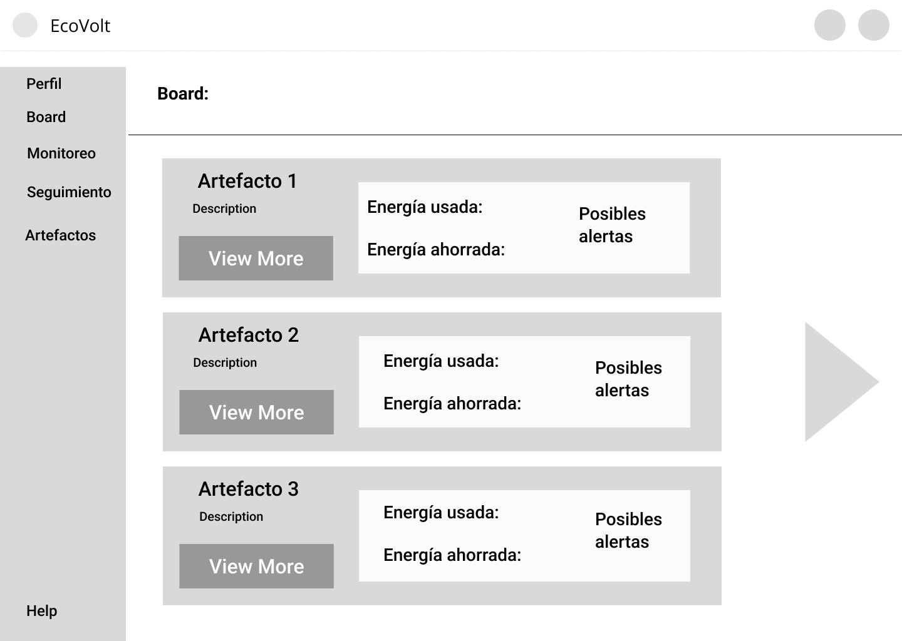

    

<h1 align="center">
    Universidad Peruana de Ciencias Aplicadas
</h1>

<h3 align="center">
    Carrera: Ingeniería de Software
       
    Curso: 1ASI0730 - Aplicaciones Web
       
    Sección: 4328
       
    Profesor: Angel Augusto Velasquez Nuñez
       
    Ciclo: 2025-01 
       
    Informe de Trabajo Final
       
    Startup: LosRofi
       
    Producto: EcoVolt
</h3>

| 
Alumno
 | 
Código
 |
|:-------------------------------------:|:-------------------------------------:|
|        Aspajo Alvarez, Mathias        |              u202317584               |
|         Alejos Jesus, Anyelo          |              u20231d149               |
|        Mendoza Vergara, Alejandro     |              u202312343               |
|         Roque Tello, Jack             |              u20221C448               |
|        Torres Alva, Alejandro         |              u202022018               |

 Abril 2025 

## Registro de Versiones del Informe

| Versión | Fecha | 
Autor(es) 
 | 
Descripción de la modificación
 |
|:-------:|:-----:|:-----------------------------------------:|-------------------------------------------------------------|
| TB1 | 24/04/2025 | - Aspajo Alvarez, Mathias - Alejos Jesus, Anyelo - Mendoza Vergara, Alejandro - Roque Tello, Jack - Torres Alva, Alejandro | Para esta entrega se han desarrollado los siguientes capítulos:  - Carátula - Registro de Versiones del Informe - Project Report Collaboration Insights - Contenido - Student Outcome - Capítulo I: Introducción - Capítulo II: Requirements Elicitation & Analysis - Capítulo III: Requirements Specification - Capítulo IV: Product Design - Capítulo V: Product Implementation, Validation & Deployment - 5.1. Software Configuration Management - 5.1.1. Software Development Environment Configuration - 5.1.2. Source Code Management - 5.1.3. Source Code Style Guide & Conventions - 5.1.4. Software Deployment Configuration - 5.2. Landing Page, Services & Applications Implementation - 5.2.1. Sprint 1 - 5.2.1.1. Sprint Planning 1 - 5.2.1.2. Aspect Leaders and Collaborators - 5.2.1.3. Sprint Backlog 1 - 5.2.1.4. Development Evidence for Sprint Review - 5.2.1.5. Execution Evidence for Sprint Review - 5.2.1.6. Services Documentation Evidence for Sprint Review - 5.2.1.7. Software Deployment Evidence for Sprint Review - 5.2.1.8. Team Collaboration Insights during Sprint - Avance de Conclusiones, Bibliografía y Anexos |

## Project Report Collaboration Insights  

Nuestro Project Report se encuentra en el siguiente repositorio de GitHub: 

🔗[https://github.com/G-Aplicaciones-Web/docs](https://github.com/G-Aplicaciones-Web/docs).

- **Flujo de trabajo adoptado**

    En nuestro trabajo colaborativo, hemos implementado GitHub Flow como metodología de desarrollo, seleccionada por su sencillez, capacidad de crecimiento y enfoque en la integración continua. Este enfoque nos ha permitido:

    - Trabajar en ramas independientes según las tareas asignadas a cada miembro del equipo
    - Revisar cambios mediante pull requests antes de fusionarlos con la rama principal
    - Gestionar feedback a través de comentarios en commits y PRs
    - Mantener una integración controlada del contenido, evitando conflictos en el documento final

    Además, hemos establecido una estructura de ramas utilizando el siguiente esquema: cap[número del capitulo],  para identificar rápidamente qué sección del proyecto se está modificando en cada rama. Del mismo modo, los mensajes de commit son descriptivos y estructurados, lo que mejora la trazabilidad y comprensión del historial de cambios.

### Colaboración por Entrega

- **TB1:**
    Para la primera entrega del proyecto (TB1), cada miembro del equipo contribuyó activamente en la redacción de las secciones asignadas. La coordinación se llevó a cabo mediante un enfoque flexible que combinó trabajo asíncrono a través de GitHub con reuniones virtuales periódicas para alinear estilos de redacción, criterios de contenido y estructura del documento.

    - Asignación de secciones por miembro:
        - Aspajo Alvarez, Mathias (AdeXzz): Capitulo 2 (repartido), Capitulo 3, Capitulo 4 (repartido)
        - Roque Tello, Jack	(UPC-Skylar): Capitulo 1 (repartido)
        - Alejos Jesus, Anyelo (Everkoe): Capitulo 1, Capitulo 4 (repartido)
        - Mendoza Vergara, Alejandro	(AlexBoo1): Capitulo 2 (repartido)
        - Torres Alva, Alejandro (Alemjas): Capitulo 4 (repartido)
        - Todos: Capitulo 5
    
    - En las siguientes imágenes se documenta el proceso colaborativo:
        - Miembros del equipo en el repositorio:
        

            
        

        - Creación de ramas por cada capítulo:
        

            
        

        - Commits realizados en las ramas individuales:       
        

            
        

        

            
        

        

            
        

        

            
        

        

            
        

        - Pull Requests y merges a la rama principal (master):
        

            
        

        - Analítica del repositorio con participación de todos los miembros:
        

            
        
  

## Tabla de Contenidos

[Registro de Versiones del Informe](#registro-de-versiones-del-informe)

[Project Report Collaboration Insights](#project-report-collaboration-insights)

[Tabla de Contenidos](#tabla-de-contenidos)

[Student Outcome](#student-outcome)

[Capítulo I: Introducción](#capítulo-i-introducción)
  - [1.1. Startup Profile](#11-startup-profile)
    - [1.1.1. Descripción de la Startup](#111-descripción-de-la-startup)
    - [1.1.2. Perfiles de Integrantes del Equipo](#112-perfiles-de-integrantes-del-equipo)
  - [1.2. Solution Profile](#12-solution-profile)
    - [1.2.1. Antecedentes y Problemática](#121-antecedentes-y-problemática)
    - [1.2.2. Lean UX Process](#122-lean-ux-process)
      - [1.2.2.1. Lean UX Problem Statements](#1221-lean-ux-problem-statements)
      - [1.2.2.2. Lean UX Assumptions](#1222-lean-ux-assumptions)
      - [1.2.2.3. Lean UX Hypothesis Statements](#1223-lean-ux-hypothesis-statements)
      - [1.2.2.4. Lean UX Canvas](#1224-lean-ux-canvas)
  - [1.3. Segmentos Objetivos](#13-segmentos-objetivos)

[Capítulo II: Requirements Elicitation & Analysis](#capítulo-ii-requirements-elicitation--analysis)
  - [2.1. Competidores](#21-competidores)
    - [2.1.1. Análisis competitivo](#211-análisis-competitivo)
    - [2.1.2. Estrategias y tácticas frente a competidores](#212-estrategias-y-tácticas-frente-a-competidores)
  - [2.2. Entrevistas](#22-entrevistas)
    - [2.2.1. Diseño de entrevistas](#221-diseño-de-entrevistas)
    - [2.2.2. Registro de entrevistas](#222-registro-de-entrevistas)
    - [2.2.3. Análisis de entrevistas](#223-análisis-de-entrevistas)
  - [2.3. Needfinding](#23-needfinding)
    - [2.3.1. User Personas](#231-user-personas)
    - [2.3.2. User Task Matrix](#232-user-task-matrix)
    - [2.3.3. User Journey Mapping](#233-user-journey-mapping)
    - [2.3.4. Empathy Mapping](#234-empathy-mapping)
        - [2.3.4.1. Empathy Mapping Turistas nacionales e internacionales](#2341-empathy-mapping-turistas-nacionales-e-internacionales)
        - [2.3.4.2. Empathy Mapping Agencias de turismo locales](#2342-empathy-mapping-agencias-de-turismo-locales)
        - [2.3.4.3. Empathy Mapping Viajeros por trabajo](#2343-empathy-mapping-viajeros-por-trabajo)
    - [2.3.5. As-is Scenario Mapping](#235-as-is-scenario-mapping)
        - [2.3.5.1. As-is Scenario Mapping Turistas nacionales e internacionales](#2351-as-is-scenario-mapping-turistas-nacionales-e-internacionales)
        - [2.3.5.2. As-is Scenario Mapping Agencias de turismo locales](#2352-as-is-scenario-mapping-agencias-de-turismo-locales)
        - [2.3.5.3. As-is Scenario Mapping Viajeros por trabajo](#2353-as-is-scenario-mapping-viajeros-por-trabajo)
  - [2.4. Ubiquitous Language](#24-ubiquitous-language)

[Capítulo III: Requirements Specification](#capítulo-iii-requirements-specification)
  - [3.1. To-Be Scenario Mapping](#31-to-be-scenario-mapping)
    - [3.1.1. To-Be Scenario Mapping Turistas nacionales e internacionales](#311-to-Be-scenario-mapping-turistas-nacionales-e-internacionales)
    - [3.1.2. To-Be Scenario Mapping Agencias de turismo locales](#312-to-Be-scenario-mapping-agencias-de-turismo-locales)
    - [3.1.3. To-Be Scenario Mapping Viajeros por trabajo](#313-to-Be-scenario-mapping-viajeros-por-trabajo)
  - [3.2. User Stories](#32-user-stories)
  - [3.3. Impact Mapping](#33-impact-mapping)
  - [3.4. Product Backlog](#34-product-backlog)

[Capítulo IV: Product Design](#capítulo-iv-product-design)
  - [4.1. Style Guidelines](#41-style-guidelines)
    - [4.1.1. General Style Guidelines](#411-general-style-guidelines)
    - [4.1.2. Web Style Guidelines](#412-web-style-guidelines)
  - [4.2. Information Architecture](#42-information-architecture)
    - [4.2.1. Organization Systems](#421-organization-systems)
    - [4.2.2. Labeling Systems](#422-labeling-systems)
    - [4.2.3. SEO Tags and Meta Tags](#423-seo-tags-and-meta-tags)
    - [4.2.4. Searching Systems](#424-searching-systems)
    - [4.2.5. Navigation Systems](#425-navigation-systems)
  - [4.3. Landing Page UI Design](#43-landing-page-ui-design)
    - [4.3.1. Landing Page Wireframe](#431-landing-page-wireframe)
    - [4.3.2. Landing Page Mock-up](#432-landing-page-mock-up)
  - [4.4. Web Applications UX/UI Design](#44-web-applications-uxui-design)
    - [4.4.1. Web Applications Wireframes](#441-web-applications-wireframes)
    - [4.4.2. Web Applications Wireflow Diagrams](#442-web-applications-wireflow-diagrams)
    - [4.4.3. Web Applications Mock-ups](#443-web-applications-mock-ups)
    - [4.4.4. Web Applications User Flow Diagrams](#444-web-applications-user-flow-diagrams)
  - [4.5. Web Applications Prototyping](#45-web-applications-prototyping)
  - [4.6. Domain-Driven Software Architecture](#46-domain-driven-software-architecture)
    - [4.6.1. Software Architecture Context Diagrams](#461-software-architecture-context-diagrams)
    - [4.6.2. Software Architecture Container Diagrams](#462-software-architecture-container-diagrams)
    - [4.6.3. Software Architecture Components Diagrams](#463-software-architecture-components-diagrams)
  - [4.7. Software Object-Oriented Design](#47-software-object-oriented-design)
    - [4.7.1. Class Diagrams](#471-class-diagrams)
    - [4.7.2. Class Dictionary](#472-class-dictionary)
  - [4.8. Database Design](#48-database-design)
    - [4.8.1. Database Diagram](#481-database-diagram)

[Capítulo V: Product Implementation, Validation & Deployment](#capítulo-v-product-implementation-validation--deployment)
  - [5.1. Software Configuration Management](#51-software-configuration-management)
    - [5.1.1. Software Development Environment Configuration](#511-software-development-environment-configuration)
    - [5.1.2. Source Code Management](#512-source-code-management)
    - [5.1.3. Source Code Style Guide & Conventions](#513-source-code-style-guide-conventions)
    - [5.1.4. Software Deployment Configuration](#514-software-deployment-configuration)
  - [5.2. Landing Page, Services & Applications Implementation](#52-landing-page-services--applications-implementation)
    - [5.2.1. Sprint 1](#521-sprint-1)
      - [5.2.1.1. Sprint Planning 1](#5211-sprint-planning-1)
      - [5.2.1.2. Aspect Leaders and Collaborators](#5212-aspect-leaders-and-collaborators)
      - [5.2.1.3. Sprint Backlog 1](#5213-sprint-backlog-1)
      - [5.2.1.4. Development Evidence for Sprint Review](#5214-development-evidence-for-sprint-review)
      - [5.2.1.5. Execution Evidence for Sprint Review](#5215-execution-evidence-for-sprint-review)
      - [5.2.1.6. Services Documentation Evidence for Sprint Review](#5216-services-documentation-evidence-for-sprint-review)
      - [5.2.1.7. Software Deployment Evidence for Sprint Review](#5217-software-deployment-evidence-for-sprint-review)
      - [5.2.1.8. Team Collaboration Insights during Sprint](#5218-team-collaboration-insights-during-sprint)

[Conclusiones](#conclusiones)

[Bibliografía](#bibliografía)

[Anexos](#anexos)

## Student Outcome

El curso contribuye al cumplimiento del Student Outcome ABET:

**ABET – EAC - Student Outcome 5**

Criterio: Trabaja efectivamente en un equipo cuyos miembros juntos proporcionan liderazgo; crea un entorno colaborativo e inclusivo y establece metas, planifica tareas y cumple objetivos. 
En el siguiente cuadro se describe las acciones realizadas y enunciados de conclusiones por parte del grupo,
que permiten sustentar el haber alcanzado el logro del ABET – EAC - Student Outcome 5.

| 
Criterio específico
 | 
Acciones Realizadas
 | 
Conclusiones
 |
|:-------------------:|-------------------|:------------:|
|Trabaja en equipo para proporcionar liderazgo en forma conjunta| Mathias Aspajo | Se concluye |
|Crea un entorno colaborativo e inclusivo, establece metas, planifica tareas y cumple objetivos| Mathias Aspajo | Se concluye |
|Trabaja en equipo para proporcionar liderazgo en forma conjunta| Anyelo Alejos | Se concluye |
|Crea un entorno colaborativo e inclusivo, establece metas, planifica tareas y cumple objetivos| Anyelo Alejos | Se concluye |
|Trabaja en equipo para proporcionar liderazgo en forma conjunta| Alejandro Mendoza | Se concluye |
|Crea un entorno colaborativo e inclusivo, establece metas, planifica tareas y cumple objetivos| Alejandro Mendoza | Se concluye |
|Trabaja en equipo para proporcionar liderazgo en forma conjunta| Jack Roque | Se concluye |
|Crea un entorno colaborativo e inclusivo, establece metas, planifica tareas y cumple objetivos| Jack Roque | Se concluye |
|Trabaja en equipo para proporcionar liderazgo en forma conjunta| Alejandro Torres | Se concluye |
|Crea un entorno colaborativo e inclusivo, establece metas, planifica tareas y cumple objetivos| Alejandro Torres | Se concluye |

## Capítulo I: Introducción 

### 1.1. Startup Profile

#### 1.1.1. Descripción de la Startup

#### 1.1.2. Perfiles de Integrantes del Equipo

#### 1.2. Solution Profile

#### 1.2.1. Antecedentes y problemática

#### 1.2.2. Lean UX Process

#### 1.2.2.1. Lean UX Problem Statements

#### 1.2.2.2. Lean UX Assumptions

#### 1.2.2.3. Lean UX Hypothesis Statements

#### 1.2.2.4. Lean UX Canvas

### 1.3. Segmentos Objetivos

## Capítulo II: Requirements Elicitation & Analysis

### 2.1. Competidores

#### 2.1.1. Análisis competitivo

#### 2.1.2. Estrategias y tácticas frente a competidores

### 2.2. Entrevistas

#### 2.2.1. Diseño de entrevistas

#### 2.2.2. Registro de entrevistas

#### 2.2.3. Análisis de entrevistas

### 2.3. Needfinding

#### 2.3.1. User Personas

#### 2.3.2. User Task Matrix

#### 2.3.3. User Journey Mapping

#### 2.3.4. Empathy Mapping

#### 2.3.4.1. Empathy Mapping Turistas nacionales e internacionales

#### 2.3.4.2. Empathy Mapping Agencias de turismo locales

#### 2.3.4.3. Empathy Mapping Viajeros por trabajo

#### 2.3.5. As-is Scenario Mapping

#### 2.3.5.1. As-is Scenario Mapping Turistas nacionales e internacionales

#### 2.3.5.2. As-is Scenario Mapping Agencias de turismo locales

#### 2.3.5.3. As-is Scenario Mapping Viajeros por trabajo

### 2.4. Ubiquitous Language

## Capítulo III: Requirements Specification

### 3.1. To-Be Scenario Mapping

#### 3.1.1. To-Be Scenario Mapping Turistas nacionales e internacionales

#### 3.1.2. To-Be Scenario Mapping Agencias de turismo locales

#### 3.1.3. To-Be Scenario Mapping Viajeros por trabajo

### 3.2. User Stories

### 3.3. Impact Mapping

### 3.4. Product Backlog

## Capítulo IV: Product Design

### 4.1. Style Guidelines

#### 4.1.1. General Style Guidelines

**Branding**:

Nuestro proyecto se llama EcoVolt, el cual busca mostrar la idea principal del producto, el cual es el ahorro de electricidad. Esto se muestra en la combinación de palabras Eco, prefijo de la palabra ecológico, y Volt, que se refiere a la unidad que se usa para la electricidad en inglés. El logo muestra un símbolo de una hoja y un rayo que envuelve la idea de electricidad ecológica.

**Typography**:

La tipografía elegida es “OpenSans”, pues es un tipo de letra clara, concisa y formal, que busca brindar una experiencia agradable y con una lectura fácil y llamativa.

**Colors**:

La paleta de colores usadas está principalmente integrada por los colores verde, crema y negro, que buscan transmitir la idea de una página seria y al mismo tiempo moderna y llamativa.

**Spacing**:

El spacing utilizado es el 8x, para de esta manera tener una alineación constante y adecuada para la lectura de los usuarios

**Tono de comunicación y lenguaje aplicado**:

EcoVolt tiene un tono respetuoso, formal, sereno y serio, debido a que está enfocada principalmente a empresas y profesionales que buscan un servicio competente, lo suficientemente confiable y que se adapte a ese entorno

#### 4.1.2. Web Style Guidelines

**1.	Diseño**: EL diseño en el que se basa el sitio web es claro, sencillo y llamativo para resaltar en todos los usuarios

**2.	Botones**: Los botones son intuitivos y fáciles de comprender para seleccionar funciones

**3.	Logo**: El logo es fresco y refleja la idea principal del producto

### 4.2. Information Architecture

#### 4.2.1. Organization Systems

Para la landing page de EcoVolt, se usará una organización de forma jerárquica, en la que se ordenará la información en distintas secciones de una forma clara, ordenada e intuitiva para nuestros segmentos objetivo, por lo que tanto las empresas como los electricistas tendrán acceso a este, como :

**Board sobre consumo de energía**: Permite al usuario observar un historial de consumo de energía, además de generar alertas ante excesos.

**Monitoreo y Diagnóstico en tiempo real (IoT)**: Usando un modelo IoT, permite hacer un diagnóstico sobre el consumo eléctrico a tiempo real y muestra posibles anomalías

**Sistema de Alertas y Seguimiento**: Se encarga de la organización y mantenimiento de los artefactos, con recordatorios automáticos, además de poder agregar otros eventos por los usuarios como fechas de auditorías.

**Comparación entre distintos artefactos**: Permite comparar el gasto eléctrico de dos artefactos distintos pero que pertenecen al mismo usuario.

#### 4.2.2. Labeling Systems

Las etiquetas en la landing page son simples y fáciles de entender para no generar confusión en los usuarios, cuentan con información y títulos claros que ayudan a encontrar cada funcion por sí mismos. Esto debido a que se omite tecnicismos y muchas palabras para optar por la simpleza.

**Board**: Esta sección muestra el historial de consumo de energía.

**Monitoreo**: Esta sección hace un diagnóstico sobre el consumo eléctrico a tiempo real.

**Seguimiento**: Esta sección hace la organización y mantenimiento de los artefactos. Se pueden agregar otros eventos.

**Artefactos**: Esta sección permite comparar el gasto eléctrico de dos artefactos distintos del mismo usuario.

#### 4.2.3. SEO Tags and Meta Tags

Se utilizaron diversas meta tags que mejoran la visibilidad del sitio web en los motores de búsqueda. 

**1. Landing Page**:

**• Title**: EcoVolt: Plataforma para la gestión y ahorro de energía

**•Meta Description**:EcoVolt es una plataforma web diseñada para la gestión y el ahorro de energía usando distintas funciones y enfocándose en las empresas y electricistas.

**•Keywords**:Ahorro de energía, gestión de recursos, 
administración de artefactos, productividad de empresas

**•Author**: EcoVolt Team

**2. Board**:

**•Title**: Historial de Consumo

**•Meta Description**: Muestra el historial de consumo de energía y genera alertas ante ello

**•Keywords**: Consumo de energía, historial, gestión de energía, alertas

**•Author**: EcoVolt Team

**3. Monitoreo**:

**•Title**: Diagnóstico de Consumo

**•Meta Description**: Genera un diagnóstico a tiempo real del consumo de energía y muestra posibles anomalías

**•Keywords**: anomalías, tiempo real, tecnología IoT

**•Author**: EcoVolt Team

**4. Seguimiento**:

**•Title**: Mantenimiento de Artefactos

**•Meta Description**: Se encarga de la organización y mantenimiento de los artefactos

**•Keywords**: gestión de alertas, futuros eventos, auditorías

**•Author**: EcoVolt Team

**5. Artefactos**:

**•Title**: Comparación de Artefactos

**•Meta Description**: Se encarga de comparar el gasto eléctrico de artefactos distintos de un mismo usuario

**•Keywords**: comparación, gestión de artefactos, relación gasto-ganancia

**•Author**: EcoVolt Team

#### 4.2.4. Searching Systems

La aplicación cuenta con una barra de búsqueda para que los usuarios puedan ingresar a la información que buscan.. Se optó por un sistema de búsqueda sencillo y eficaz, para que el usuario no se pierda entre tantas opciones y encuentre sus búsquedas rápido.

#### 4.2.5. Navigation Systems

El sistema principal de navegación es intuitivo y claro. Este se muestra principalmente en una barra de búsqueda que cuenta con todas las funciones de la aplicación, con las que podremos interactuar y nos dirigirá a cada función buscada.

### 4.3. Landing Page UI Design

#### 4.3.1. Landing Page Wireframe

### 4.3.2. Landing Page Mock-up

### 4.4. Web Applications UX/UI Design

#### 4.4.1. Web Applications Wireframes.

#### 4.4.2. Web Applications Wireflow Diagrams

#### 4.4.3. Web Applications Mock-ups

#### 4.4.4. Web Applications User Flow Diagrams

### 4.5. Web Applications Prototyping

En esta sección se realiza una muestra de una navegación interactiva de la aplicación web, dando a conocer cómo es su funcionamiento

Url del vídeo: https://drive.google.com/file/d/1Q6ayIjy0mkNyJbGn1AF7HG8hGP4nTBx5/view?usp=sharing

### 4.6. Domain-Driven Software Architecture

#### 4.6.1. Software Architecture Context Diagrams

#### 4.6.2. Software Architecture Container Diagrams

#### 4.6.3. Software Architecture Components Diagrams

### 4.7. Software Object-Oriented Design

#### 4.7.1. Class Diagrams

#### 4.7.2. Class Dictionary

### 4.8. Database Design

#### 4.8.1. Database Diagram

## Capítulo V: Product Implementation, Validation & Deployment

### 5.1. Software Configuration Management.

#### 5.1.1. Software Development Environment Configuration.

#### 5.1.2. Source Code Management

#### 5.1.3. Source Code Style Guide & Conventions

#### 5.1.4. Software Deployment Configuration

### 5.2. Landing Page, Services & Applications Implementation

#### 5.2.1. Sprint 1

##### 5.2.1.1. Sprint Planning 1

##### 5.2.1.2. Aspect Leaders and Collaborators

##### 5.2.1.3. Sprint Backlog 1

##### 5.2.1.4. Development Evidence for Sprint Review

##### 5.2.1.5. Execution Evidence for Sprint Review

##### 5.2.1.6. Services Documentation Evidence for Sprint Review

##### 5.2.1.7. Software Deployment Evidence for Sprint Review

##### 5.2.1.8. Team Collaboration Insights during Sprint

## Conclusiones

## Bibliografía

## Anexos
