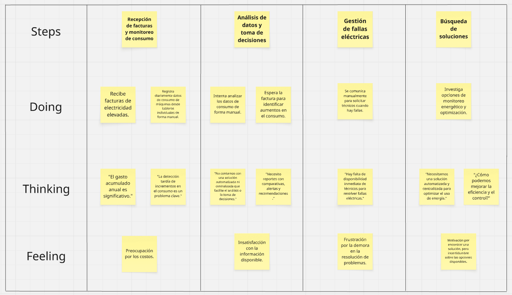

    

<h1 align="center">
Universidad Peruana de Ciencias Aplicadas
        </h1>

<h3 align="center">
Carrera: Ingeniería de Software
           
Curso: 1ASI0730 - Aplicaciones Web
       
Sección: 4328
       
Profesor: Angel Augusto Velasquez Nuñez
       
Ciclo: 2025-01
       
Informe de Trabajo Final
       
Startup: LosRofi
           
Producto: EcoVolt
        </h3>

| 
Alumno
 | 
Código
 |
|:-------------------------------------:|:-------------------------------------:|
|        Aspajo Alvarez, Mathias        |              u202317584               |
|         Alejos Jesus, Anyelo          |              u20231d149               |
|        Mendoza Vergara, Alejandro     |              u202312343               |
|         Roque Tello, Jack             |              u20221C448               |
|        Torres Alva, Alejandro         |              u202022018               |

 Abril 2025 

## Registro de Versiones del Informe

| Versión | Fecha | 
Autor(es) 
 | 
Descripción de la modificación
 |
|:-------:|:-----:|:-----------------------------------------:|-------------------------------------------------------------|
| TB1 | 24/04/2025 | - Aspajo Alvarez, Mathias - Alejos Jesus, Anyelo - Mendoza Vergara, Alejandro - Roque Tello, Jack - Torres Alva, Alejandro | Para esta entrega se han desarrollado los siguientes capítulos:  - Carátula - Registro de Versiones del Informe - Project Report Collaboration Insights - Contenido - Student Outcome - Capítulo I: Introducción - Capítulo II: Requirements Elicitation & Analysis - Capítulo III: Requirements Specification - Capítulo IV: Product Design - Capítulo V: Product Implementation, Validation & Deployment - 5.1. Software Configuration Management - 5.1.1. Software Development Environment Configuration - 5.1.2. Source Code Management - 5.1.3. Source Code Style Guide & Conventions - 5.1.4. Software Deployment Configuration - 5.2. Landing Page, Services & Applications Implementation - 5.2.1. Sprint 1 - 5.2.1.1. Sprint Planning 1 - 5.2.1.2. Aspect Leaders and Collaborators - 5.2.1.3. Sprint Backlog 1 - 5.2.1.4. Development Evidence for Sprint Review - 5.2.1.5. Execution Evidence for Sprint Review - 5.2.1.6. Services Documentation Evidence for Sprint Review - 5.2.1.7. Software Deployment Evidence for Sprint Review - 5.2.1.8. Team Collaboration Insights during Sprint - Avance de Conclusiones, Bibliografía y Anexos |

## Project Report Collaboration Insights

Nuestro Project Report se encuentra en el siguiente repositorio de GitHub:

🔗[https://github.com/G-Aplicaciones-Web/docs](https://github.com/G-Aplicaciones-Web/docs).

- **Flujo de trabajo adoptado**

En nuestro trabajo colaborativo, hemos implementado GitHub Flow como metodología de desarrollo, seleccionada por su sencillez, capacidad de crecimiento y enfoque en la integración continua. Este enfoque nos ha permitido:

- Trabajar en ramas independientes según las tareas asignadas a cada miembro del equipo
- Revisar cambios mediante pull requests antes de fusionarlos con la rama principal - Gestionar feedback a través de comentarios en commits y PRs
- Mantener una integración controlada del contenido, evitando conflictos en el documento final

Además, hemos establecido una estructura de ramas utilizando el siguiente esquema: cap[número del capitulo],  para identificar rápidamente qué sección del proyecto se está modificando en cada rama. Del mismo modo, los mensajes de commit son descriptivos y estructurados, lo que mejora la trazabilidad y comprensión del historial de cambios.

### Colaboración por Entrega

- **TB1:**
  Para la primera entrega del proyecto (TB1), cada miembro del equipo contribuyó activamente en la redacción de las secciones asignadas. La coordinación se llevó a cabo mediante un enfoque flexible que combinó trabajo asíncrono a través de GitHub con reuniones virtuales periódicas para alinear estilos de redacción, criterios de contenido y estructura del documento.

    - Asignación de secciones por miembro:
        - Aspajo Alvarez, Mathias (AdeXzz): Capitulo 2 (repartido), Capitulo 3, Capitulo 4 (repartido)
        - Roque Tello, Jack	(UPC-Skylar): Capitulo 1 (repartido)
        - Alejos Jesus, Anyelo (Everkoe): Capitulo 1, Capitulo 4 (repartido)
        - Mendoza Vergara, Alejandro	(AlexBoo1): Capitulo 2 (repartido)
        - Torres Alva, Alejandro (Alemjas): Capitulo 4 (repartido)
        - Todos: Capitulo 5

        - En las siguientes imágenes se documenta el proceso colaborativo:
        - Miembros del equipo en el repositorio:
        

            
        

        - Creación de ramas por cada capítulo:
        

            
        

        - Commits realizados en las ramas individuales:
        

            
        

        

            
        

        

            
        

        

            
        

        

            
        

        - Pull Requests y merges a la rama principal (master):
        

            
        

        - Analítica del repositorio con participación de todos los miembros:
        

            
        

## Tabla de Contenidos

[Registro de Versiones del Informe](#registro-de-versiones-del-informe)

[Project Report Collaboration Insights](#project-report-collaboration-insights)

[Tabla de Contenidos](#tabla-de-contenidos)

[Student Outcome](#student-outcome)

[Capítulo I: Introducción](#capítulo-i-introducción)
- [1.1. Startup Profile](#11-startup-profile)
- [1.1.1. Descripción de la Startup](#111-descripción-de-la-startup)
- [1.1.2. Perfiles de Integrantes del Equipo](#112-perfiles-de-integrantes-del-equipo)
- [1.2. Solution Profile](#12-solution-profile)
- [1.2.1. Antecedentes y Problemática](#121-antecedentes-y-problemática)
- [1.2.2. Lean UX Process](#122-lean-ux-process)
- [1.2.2.1. Lean UX Problem Statements](#1221-lean-ux-problem-statements)
- [1.2.2.2. Lean UX Assumptions](#1222-lean-ux-assumptions)
- [1.2.2.3. Lean UX Hypothesis Statements](#1223-lean-ux-hypothesis-statements)
- [1.2.2.4. Lean UX Canvas](#1224-lean-ux-canvas)
- [1.3. Segmentos Objetivos](#13-segmentos-objetivos)

[Capítulo II: Requirements Elicitation & Analysis](#capítulo-ii-requirements-elicitation--analysis)
- [2.1. Competidores](#21-competidores)
- [2.1.1. Análisis competitivo](#211-análisis-competitivo)
- [2.1.2. Estrategias y tácticas frente a competidores](#212-estrategias-y-tácticas-frente-a-competidores)
- [2.2. Entrevistas](#22-entrevistas)
- [2.2.1. Diseño de entrevistas](#221-diseño-de-entrevistas)
- [2.2.2. Registro de entrevistas](#222-registro-de-entrevistas)
- [2.2.3. Análisis de entrevistas](#223-análisis-de-entrevistas)
- [2.3. Needfinding](#23-needfinding)
- [2.3.1. User Personas](#231-user-personas)
- [2.3.2. User Task Matrix](#232-user-task-matrix)
- [2.3.3. User Journey Mapping](#233-user-journey-mapping)
- [2.3.4. Empathy Mapping](#234-empathy-mapping)
- [2.3.4.1. Empathy Mapping Empresa consumidora](#2341-empathy-mapping-empresa-consumidora)
- [2.3.4.2. Empathy Mapping Electricistas](#2342-empathy-mapping-electricistas)
- [2.3.5. As-is Scenario Mapping](#235-as-is-scenario-mapping)
- [2.3.5.1. As-is Scenario Mapping Empresa consumidora](#2351-as-is-scenario-mapping-empresa-consumidora)
- [2.3.5.2. As-is Scenario Mapping Electricistas](#2352-as-is-scenario-mapping-electricistas) 
- [2.4. Ubiquitous Language](#24-ubiquitous-language)

[Capítulo III: Requirements Specification](#capítulo-iii-requirements-specification)
- [3.1. To-Be Scenario Mapping](#31-to-be-scenario-mapping)
- [3.1.1. To-Be Scenario Mapping Empresa consumidora](#311-to-be-scenario-mapping-empresa-consumidora)
- [3.1.2. To-Be Scenario Mapping Electricistas](#312-to-be-scenario-mapping-electricistas)
- [3.2. User Stories](#32-user-stories)
- [3.3. Impact Mapping](#33-impact-mapping)
- [3.4. Product Backlog](#34-product-backlog)

[Capítulo IV: Product Design](#capítulo-iv-product-design)
- [4.1. Style Guidelines](#41-style-guidelines)
- [4.1.1. General Style Guidelines](#411-general-style-guidelines)
- [4.1.2. Web Style Guidelines](#412-web-style-guidelines)
- [4.2. Information Architecture](#42-information-architecture)
- [4.2.1. Organization Systems](#421-organization-systems)
- [4.2.2. Labeling Systems](#422-labeling-systems)
- [4.2.3. SEO Tags and Meta Tags](#423-seo-tags-and-meta-tags)
- [4.2.4. Searching Systems](#424-searching-systems)
- [4.2.5. Navigation Systems](#425-navigation-systems)
- [4.3. Landing Page UI Design](#43-landing-page-ui-design)
- [4.3.1. Landing Page Wireframe](#431-landing-page-wireframe)
- [4.3.2. Landing Page Mock-up](#432-landing-page-mock-up)
- [4.4. Web Applications UX/UI Design](#44-web-applications-uxui-design)
- [4.4.1. Web Applications Wireframes](#441-web-applications-wireframes)
- [4.4.2. Web Applications Wireflow Diagrams](#442-web-applications-wireflow-diagrams)
- [4.4.3. Web Applications Mock-ups](#443-web-applications-mock-ups)
- [4.4.4. Web Applications User Flow Diagrams](#444-web-applications-user-flow-diagrams)
- [4.5. Web Applications Prototyping](#45-web-applications-prototyping)
- [4.6. Domain-Driven Software Architecture](#46-domain-driven-software-architecture)
- [4.6.1. Software Architecture Context Diagrams](#461-software-architecture-context-diagrams)
- [4.6.2. Software Architecture Container Diagrams](#462-software-architecture-container-diagrams)
- [4.6.3. Software Architecture Components Diagrams](#463-software-architecture-components-diagrams)
- [4.7. Software Object-Oriented Design](#47-software-object-oriented-design)
- [4.7.1. Class Diagrams](#471-class-diagrams)
- [4.7.2. Class Dictionary](#472-class-dictionary)
- [4.8. Database Design](#48-database-design)
- [4.8.1. Database Diagram](#481-database-diagram)

[Capítulo V: Product Implementation, Validation & Deployment](#capítulo-v-product-implementation-validation--deployment)
- [5.1. Software Configuration Management](#51-software-configuration-management)
- [5.1.1. Software Development Environment Configuration](#511-software-development-environment-configuration)
- [5.1.2. Source Code Management](#512-source-code-management)
- [5.1.3. Source Code Style Guide & Conventions](#513-source-code-style-guide-conventions)
- [5.1.4. Software Deployment Configuration](#514-software-deployment-configuration)
- [5.2. Landing Page, Services & Applications Implementation](#52-landing-page-services--applications-implementation)
- [5.2.1. Sprint 1](#521-sprint-1)
- [5.2.1.1. Sprint Planning 1](#5211-sprint-planning-1)
- [5.2.1.2. Aspect Leaders and Collaborators](#5212-aspect-leaders-and-collaborators)
- [5.2.1.3. Sprint Backlog 1](#5213-sprint-backlog-1)
- [5.2.1.4. Development Evidence for Sprint Review](#5214-development-evidence-for-sprint-review)
- [5.2.1.5. Execution Evidence for Sprint Review](#5215-execution-evidence-for-sprint-review)
- [5.2.1.6. Services Documentation Evidence for Sprint Review](#5216-services-documentation-evidence-for-sprint-review)
- [5.2.1.7. Software Deployment Evidence for Sprint Review](#5217-software-deployment-evidence-for-sprint-review)
- [5.2.1.8. Team Collaboration Insights during Sprint](#5218-team-collaboration-insights-during-sprint)

[Conclusiones](#conclusiones)

[Bibliografía](#bibliografía)

[Anexos](#anexos)

## Student Outcome

El curso contribuye al cumplimiento del Student Outcome ABET:

**ABET – EAC - Student Outcome 5**

Criterio: Trabaja efectivamente en un equipo cuyos miembros juntos proporcionan liderazgo; crea un entorno colaborativo e inclusivo y establece metas, planifica tareas y cumple objetivos.
En el siguiente cuadro se describe las acciones realizadas y enunciados de conclusiones por parte del grupo,
que permiten sustentar el haber alcanzado el logro del ABET – EAC - Student Outcome 5.

| 
Criterio específico
 | 
Acciones Realizadas
 | 
Conclusiones
 |
|:-------------------:|-------------------|------------|
|Trabaja en equipo para proporcionar liderazgo en forma conjunta| **- Mathias Aspajo**   **TB1:** En esta entrega me encargué de comunicarle a mi equipo cuál sería la metodología de trabajo. Además, participé activamente en la revisión retroactiva de los avances de mis compañeros. También apoyé en la preparación del material de presentación para nuestras reuniones internas.  **TP:**   **TB2:**   **TF:**     **- Anyelo  Alejos**   **TB1:**   **TP:**   **TB2:**   **TF:**     **- Alejandro Mendoza**   **TB1:**   **TP:**   **TB2:**   **TF:**     **- Jack Roque**   **TB1:**   **TP:**   **TB2:**   **TF:**     **- Alejandro Torres**   **TB1:**   **TP:**   **TB2:**   **TF:**    | **TB1:** Todos los integrantes cumplieron con sus responsabilidades asignadas, manteniendo una comunicación constante y efectiva, lo que reforzó la confianza entre ellos. Esto contribuyó significativamente a fortalecer el trabajo en equipo, un aspecto esencial en proyectos colaborativos. |
|Crea un entorno colaborativo e inclusivo, establece metas, planifica tareas y cumple objetivos| **- Mathias Aspajo**   **TB1:** Colabore con la elaboración de las pautas y alineamientos que nuestro equipo seguiría durante el proceso de desarrollo de software. Asimismo, me encargue de elaborar el Capitulo 2 y 3.  **TP:**   **TB2:**   **TF:**     **- Anyelo Alejos**   **TB1:**   **TP:**   **TB2:**   **TF:**     **- Alejandro Mendoza**   **TB1:**   **TP:**   **TB2:**   **TF:**     **- Jack Roque**   **TB1:**   **TP:**   **TB2:**   **TF:**     **- Alejandro Torres**   **TB1:**   **TP:**   **TB2:**   **TF:**     | **TB1:** Cada miembro participó en sus actividades asignadas, manteniendo una comunicación activa y eficaz que fortaleció la confianza mutua. Esto mejoró el trabajo en equipo, un valor crucial para proyectos colaborativos |

## Capítulo I: Introducción

### 1.1. Startup Profile

#### 1.1.1. Descripción de la Startup

#### 1.1.2. Perfiles de Integrantes del Equipo

- Mathias Aspajo Alvarez - u202317584 (Ingeniería de Software)

    

Mi nombre es Mathias Aspajo, tengo 19 años y actualmente me encuentro en el 5to ciclo de la carrera de Ing. de Software, me considero una persona responsable y colaborativa con cualquier trabajo que tenga. Pienso dar lo mejor de mí para desarrollar un buen proyecto.

- Jack Roque Tello - u20221C448 (Ingeniería de Software)

    

Soy estudiante de Ingeniería de Software, actualmente cursando el quinto ciclo de la carrera en la UPC. Cuento con experiencia en lenguajes como JavaScript, C++, Java y Ruby, además de una sólida base en algoritmos, estructuras de datos y desarrollo web. Me considero una persona proactiva, responsable y con habilidades interpersonales que me permiten trabajar en equipo de forma efectiva. Estoy muy entusiasmado por formar parte de este proyecto, el cual representa una oportunidad única para aplicar mis conocimientos y seguir creciendo profesionalmente. Me comprometo a dar lo mejor de mí en cada etapa, aportando con mi capacidad técnica, pensamiento crítico y comunicación constante para lograr un ambiente colaborativo, motivado y enfocado en cumplir los objetivos que nos hemos propuesto como equipo. Estoy convencido de que, con esfuerzo y trabajo en conjunto, lograremos construir un producto de alto impacto social y tecnológico. 

- Alejandro Mendoza Vergara - u202312343 (Ingeniería de Software)

    

Mi nombre es Alejandro Mendoza y soy estudiante de la carrera de Ingeniería de Software. Estoy interesado en seguir aprendiendo sobre diferentes lenguajes de programación y en la creación de distintas aplicaciones web y móviles, por lo que intento dar todo de mí para tener buenos resultados.

- Alejandro Torres Alva - u202022018 (Ingeniería de Software)

    

Mi nombre es Alejandro Torres Alva, soy estudiante de la carrera de Ingeniería de Software en la Universidad Peruana de Ciencias Aplicadas. Me considero una persona que apoya en todo lo que pueda al trabajo. Tengo conocimientos en C++, Python y PHP.

- Anyelo Bill Alejos Jesus - u20231d149 (Ingeniería de Software)

    

Mi nombre es Anyelo Alejos, tengo 20 años, soy estudiante de la carrera de ingeniería de software actualmente estoy cursando en el 5to ciclo de la carrera, tengo conocimientos en c++, python y me considero una persona responsable y proactiva para dar lo mejor de mi en el proyecto que se realizará.

#### 1.2. Solution Profile

#### 1.2.1. Antecedentes y problemática

#### 1.2.2. Lean UX Process

#### 1.2.2.1. Lean UX Problem Statements

#### 1.2.2.2. Lean UX Assumptions

#### 1.2.2.3. Lean UX Hypothesis Statements

#### 1.2.2.4. Lean UX Canvas

### 1.3. Segmentos Objetivos

## Capítulo II: Requirements Elicitation & Analysis

### 2.1. Competidores

Considerando las características de nuestra web que es una solución para las empresas en
su monitoreo y optimización del consumo eléctrico mediante el uso dispositivos IoT inteligentes.
Consideramos que estas aplicaciones similares en el mercado podrían ser nuestros competidores:

- **Shelly:**
Shelly es una marca especializada en dispositivos IoT para automatización y monitoreo energético que ofrece soluciones como medidores de energía Wi-Fi, interruptores inteligentes y sensores que permitan controlar y supervisar el consumo eléctrico en tiempo real. Sus productos son conocidos por su facilidad de instalación y compatibilidad con diversas plataformas de automatización del hogar.

- **Emporia Energy:**
Emporia Energy proporciona soluciones integradas para la gestión energética en los hogares. Su plataforma incluye monitoreos de energía, cargadores para vehículos eléctricos, enchufes inteligentes y baterías domésticas. Estos dispositivos permiten a los usuarios optimizar el uso de energía y así reducir los costos.

- **EnergyCAP:**
EnergyCAP es una plataforma líder en gestión de energía y sostenibilidad para organizaciones. Ofrece herramientas para el seguimiento, análisis y reporte de datos energéticos, facilitando la identificación de ineficiencias y la implementación de proyectos de conversación de energía.

#### 2.1.1. Análisis competitivo

<table border="1" style="text-align: center;">
	<tbody>
		<tr>
			<td colspan="6">Análisis de competidores</td>
		</tr>
		<tr>
			<td colspan="2"></td>
			<td>Shelly  </td>
			<td>Emporia Energy </td>
			<td>EnergyCAP </td>
			<td>EcoVolt </td>
		</tr>
		<tr>
			<td rowspan="2">Perfil</td>
			<td>Resumen</td>
			<td>Fabricante europeo de dispositivos IoT para automatización del hogar y monitoreo energético.</td>
			<td>Empresa estadounidense enfocada en soluciones accesibles de gestión energética doméstica.</td>
			<td>Plataforma SaaS para gestión energética institucional y corporativa</td>
			<td>Es una aplicación de escritorio que permite a empresas monitorear y optimizar su consumo energético</td>
		</tr>
		<tr>
			<td>Ventaja competitiva</td>
			<td>Gran compatibilidad con sistemas domóticos, tamaño reducido.</td>
			<td>Ecosistema todo en uno con aplicación centralizada, sensores a bajo costo</td>
			<td>Capacidades robustas de reporte, integración con sistemas ERP</td>
			<td>Compatible con múltiples dispositivos IoT del mercado. Interfaz dual para empresas y técnicos </td>
		</tr>
		<tr>
			<td rowspan="2">Perfil de Marketing</td>
			<td>Mercado objetivo</td>
			<td>Consumidores residenciales y electricistas profesionales</td>
			<td>Propietarios de viviendas, entusiastas de la energía solar y usuarios de vehículos eléctricos</td>
			<td>Organismos públicos, universidades, grandes corporaciones con múltiples instalaciones</td>
			<td>Empresas peruanas, técnicos eléctricos y ingenieros eléctricos</td>
		</tr>
		<tr>
			<td>Estrategias de marketing</td>
			<td>Alianzas con tiendas domótica, contenido técnico en foros y canales de YouTube</td>
			<td>Posicionamiento como marca eco-amigable y reseñas en YouTube</td>
			<td>Participación en conferencias de sostenibilidad, estudios de caso, venta consultiva directa</td>
			<td>Campañas en redes sociales con enfoque educativo y de ahorro de energético. Estrategia de contenido como tutoriales o webinars</td>
		</tr>
		<tr>
			<td rowspan="3">Perfil de Producto</td>
			<td>Productos y Servicios</td>
			<td>Interruptores inteligentes, medidores de energía, sensores de temperatura o luz</td>
			<td>Medidores de energía en panel eléctrico, enchufes inteligentes</td>
			<td>Plataforma cloud de gestión de energía, seguimiento de facturación</td>
			<td>Monitoreo en tiempo real y Control de dispositivos

Modo técnico para calibración y diagnóstico</td>
		</tr>
		<tr>
			<td>Precios y Costos</td>
			<td>Gama media, 1PM entre $15 a $25</td>
			<td>Emporia Vue 3 con 16 sensores $150</td>
			<td>Modelo por suscripción, costoso para pequeñas empresas</td>
			<td>
Modelo Freemium para pequeñas empresas

Planes mensuales o anuales escalables según la cantidad de dispositivos
</td>
		</tr>
		<tr>
			<td>Canales de distribución</td>
			<td>Tienda online, Amazon y distribuidores locales</td>
			<td>Amazon, web oficial y tiendas especializadas</td>
			<td>Ventas directas B2B, integradores energéticos</td>
			<td>
Venta directa vía web

Distribución a través de electricistas aliados

Alianzas con distribuidores de dispositivos IoT
</td>
		</tr>
		<tr>
			<td rowspan="4">Análisis SWOT</td>
			<td>Fortalezas</td>
			<td>
                
- Productos pequeños

- Integración sin nubes obligatorias

            </td>
			<td>
                
- Integración sencilla

- Aplicación intuitiva

            </td>
			<td>
                
- Altamente personalizable

- Enfoque institucional

            </td>
			<td>
                
- Enfoque local y contextualizado para el mercado peruano

- Interfaz dual para empresas y técnicos

- Compatible con dispositivos IoT existentes

            </td>
		</tr>
		<tr>
			<td>Debilidades</td>
			<td>
                
- Interfaz de usuario algo técnica

- Requiere conocimientos eléctricos

            </td>
			<td>
                
- Limitado a uso residencial

- Poca expansión industrial

            </td>
			<td>
                
- Costosa

- Completa para pequeñas empresas

            </td>
			<td>
                
- Requiere alianzas iniciales con técnicos

- Al depender de hardware con terceros

            </td>
		</tr>
		<tr>
			<td>Oportunidades</td>
			<td>
                
- Compatibilidad con más plataformas

- Expansión hacia sector comercial o industrial ligero

            </td>
			<td>
                
- Crecimiento de energía solar doméstica

- Regulación energética en hogares

            </td>
			<td>
                
- Expansión en LATAM

- Nuevas regulaciones ambientales obligatorios

            </td>
			<td>
                
- Regulación energética

- Alianzas estratégicas con institutos técnicos

            </td>
		</tr>
		<tr>
			<td>Amenazas</td>
			<td>
                
- Competencia creciente en domótica

- Problemas regulatorios según países

            </td>
			<td>
                
- Nuevos competidores con más enfoque industrial

- Dependencia de plataformas móviles

            </td>
			<td>
                
- Nuevas plataformas más accesibles

- Soluciones todo en uno IoT

            </td>
			<td>
                
- Ingreso de competidores globales al mercado latinoamericano

- Barreras de confianza

            </td>
		</tr>
	</tbody>
</table>

#### 2.1.2. Estrategias y tácticas frente a competidores

### 2.2. Entrevistas

#### 2.2.1. Diseño de entrevistas

#### 2.2.2. Registro de entrevistas

#### 2.2.3. Análisis de entrevistas

### 2.3. Needfinding

#### 2.3.1. User Personas

Basándonos en los datos recopilados a través de las entrevistas y el posterior análisis, hemos identificado los rasgos fundamentales de cada grupo objetivo estudiado. Esta información nos permitió crear User Personas detallados para cada segmento, con el objetivo de comprender a profundidad su contexto actual, metas principales, impulsos clave, puntos de dolor y características demográficas. Para el desarrollo de estos User Personas, empleamos la plataforma UXPressia en un entorno de trabajo colaborativo.

    

    

#### 2.3.2. User Task Matrix

    

    

#### 2.3.3. User Journey Mapping

    

#### 2.3.4. Empathy Mapping

#### 2.3.4.1. Empathy Mapping Empresa consumidora

    

#### 2.3.4.2. Empathy Mapping Electricistas

    

#### 2.3.5. As-is Scenario Mapping

#### 2.3.5.1. As-is Scenario Mapping Empresa consumidora

    

#### 2.3.5.2. As-is Scenario Mapping Electricistas

    

### 2.4. Ubiquitous Language

| **Término (Inglés)**       | **Término (Español)**       | **Descripción** |
|----------------------------|----------------------------|----------------|
| **Client Company**               | Empresa cliente                    | Organización registrada en la plataforma que requiere servicios eléctricos como instalaciones, mantenimiento o auditorías energéticas. |
| **Electrician**          | Electricista        | Profesional o técnico registrado en la plataforma que ofrece servicios eléctricos a empresas. |
| **Service Request**             | Solicitud de servicio                | Petición enviada por una empresa para requerir un servicio eléctrico específico. |
| **Work Order**       | Orden de trabajo           | Documento generado para coordinar y detallar el servicio eléctrico solicitado, incluyendo tareas, plazos y responsables. |
| **Recommended Technician**                  | Técnico recomendado | Electricista sugerido automáticamente por el sistema en función de la especialidad, disponibilidad y cercanía. |
| **Match**        | Coincidencia / Compatibilidad       | Nivel de afinidad entre una empresa y un electricista, considerando criterios como tipo de servicio, experiencia previa y ubicación. |
| **Availability**           | Disponibilidad             | Intervalo de tiempo en el que un electricista puede atender una solicitud de servicio. |
| **Profile**                | Perfil                     | Información personal, profesional y técnica relacionada con un usuario (empresa o electricista). |
| **Feedback**               | Retroalimentación          | 	Calificaciones y comentarios proporcionados por las empresas sobre los servicios recibidos. |
| **Service Package**           | Paquete de servicios          | Conjunto de tareas o intervenciones ofrecidas como un servicio completo (ej. instalación eléctrica integral, mantenimiento mensual). |
| **Local Supplier**          | Proveedor local               | Entidad o persona asociada al electricista que provee materiales o equipos eléctricos. |
| **Energy Demand**            | Demanda energética             | Requerimiento energético de una empresa, que puede influir en el tipo de servicio solicitado. |
| **Target Industry**        | Industria objetivo         | Sector económico al que pertenece la empresa cliente para una mejor personalización del servicio. |

## Capítulo III: Requirements Specification

### 3.1. To-Be Scenario Mapping

#### 3.1.1. To-Be Scenario Mapping Turistas nacionales e internacionales

    

#### 3.1.2. To-Be Scenario Mapping Electricistas

    

### 3.2. User Stories

|
**Epic / Story**

**ID**
|**Título**|**Descripción**|
**Criterios de**

**Aceptación**
|
**Relacionado**

**con (Epic ID)**
|
| :- | :- | :- | :- | :- |
|EP01|Gestión de usuarios y perfiles|Como usuario de la aplicación, quiero gestionar mi cuenta y perfil para acceder a funcionalidades personalizadas según mi rol.|-|-|
|EP02|Monitoreo y control de consumo|Como usuario empresarial, quiero monitorear y controlar el consumo energético de mis instalaciones para optimizar costos y eficiencia.|-|-|
|EP03|Herramientas para electricistas|Como electricista certificado, quiero herramientas especializadas para instalar, configurar y diagnosticar sistemas eléctricos de mis clientes.|-|-|
|US01|Registro empresas|Como gerente de planta, quiero registrar mi empresa para monitorear su consumo energético.|
Scenario 1: Registro exitoso

Dado que completo el formulario con RUC válido, cuando el administrador aprueba los datos, entonces recibo un email de confirmación.

Scenario 2: Datos fiscales incorrectos

Dado que ingreso un RUC inválido, cuando intento registrar mi empresa, entonces el sistema muestra "Verifique su RUC".
|EP01|
|US02|Registro electricistas|Como electricista, quiero registrarme con mi colegiatura para acceder al modo técnico.|
Scenario 1: Validación de colegiatura

Dado que subo mi certificado PDF, cuando el sistema detecta que es válido, entonces activa mi "Modo Técnico".

Scenario 2: Documento no legible

Dado que subo una imagen borrosa, cuando el sistema no puede validar, entonces sugiere "Suba un archivo más claro".
|EP01|
|US03|Inicio de sesión|Como usuario, quiero iniciar sesión con email y contraseña para acceder a mis datos.|
Scenario 1: Credenciales correctas

Dado que ingreso mi email y contraseña válidos, cuando hago clic en "Ingresar", entonces accedo a mi dashboard.

Scenario 2: Contraseña incorrecta

Dado que ingreso una contraseña errónea 3 veces, cuando intento acceder, entonces el sistema bloquea mi cuenta temporalmente.
|EP01|
|US04|Recuperar contraseña|Como usuario, quiero restablecer mi contraseña si la olvido.|
Scenario 1: Solicitud exitosa

Dado que ingreso mi email registrado, cuando hago clic en "Recuperar", entonces recibo un enlace temporal en mi correo.

Scenario 2: Email no registrado

Dado que ingreso un email no existente, cuando intento recuperar contraseña, entonces el sistema muestra "Email no encontrado".
|EP01|
|US05|Perfil corporativo|Como empresa, quiero agregar datos de mi sector industrial para recibir métricas relevantes.|
Scenario 1: Actualización de sector

Dado que selecciono "Industria textil", cuando guardo los cambios, entonces el dashboard muestra benchmarks de ese sector.

Scenario 2: Sector no seleccionado

Dado que no elijo un sector, cuando guardo el perfil, entonces el sistema asigna "Otros" por defecto.
|EP01|
|US06|Permisos por roles|Como administrador, quiero asignar roles a mi equipo.|
Scenario 1: Asignación de rol

Dado que asigno "Solo lectura" a María, cuando ella inicia sesión, entonces no puede editar configuraciones.

Scenario 2: Intento de acceso denegado

Dado que un usuario sin permisos intenta modificar equipos, cuando confirma la acción, entonces el sistema muestra "Acceso restringido".
|EP01|
|US07|Notificaciones|Como usuario, quiero recibir alertas sobre actualizaciones importantes.|
Scenario 1: Alerta de actualización

Dado que hay una nueva versión, cuando el sistema detecta mi app desactualizada, entonces recibo una notificación push.

Scenario 2: Notificación silenciada

Dado que desactivo notificaciones, cuando hay una actualización, entonces no recibo alertas.
|EP01|
|US08|Integración SSO|Como empresa, quiero iniciar sesión con Google Workspace para simplificar el acceso.|
Scenario 1: Login con Google

Dado que selecciono "Ingresar con Google", cuando autentico mi cuenta, entonces accedo sin contraseña.

Scenario 2: Cuenta no corporativa

Dado que uso un email personal, cuando intento ingresar, entonces el sistema muestra "Use su cuenta corporativa".
|EP01|
|US09|Eliminar cuenta|Como usuario, quiero borrar mi cuenta permanentemente.|
Scenario 1: Eliminación confirmada

Dado que solicito borrar mi cuenta, cuando confirmo con mi contraseña, entonces todos mis datos se eliminan en 72h.

Scenario 2: Cancelación de eliminación

Dado que inicio el proceso, cuando cancelo antes de confirmar, entonces mi cuenta permanece activa.
|EP01|
|US10|Múltiples sucursales|Como cadena comercial, quiero agregar todas mis tiendas en un solo dashboard.|
Scenario 1: Registro de sucursal

Dado que ingreso datos de mi tienda "Lima Centro", cuando guardo, entonces aparece en el dashboard filtrable.

Scenario 2: Sucursal duplicada

Dado que registro una ubicación ya existente, cuando intento guardar, entonces el sistema muestra "Sucursal ya registrada".
|EP01|
|US11|Dashboard en tiempo real|Como gerente, quiero ver gráficos actualizados cada 5 minutos.|
Scenario 1: Visualización de datos

Dado que los sensores están activos, cuando abro la app, entonces veo gráficos actualizados cada 5 minutos.

Scenario 2: Sin conexión a sensores

Dado que hay falla en la red, cuando abro el dashboard, entonces muestra "Datos no disponibles".
|EP02|
|US12|Alertas personalizadas|Como técnico, quiero configurar umbrales para recibir alertas.|
Scenario 1: Alerta por exceso de consumo

Dado que seteo 100kW como límite, cuando se supera, then recibo un SMS con detalles.

Scenario 2: Umbral inválido

Dado que ingreso "0kW" como límite, cuando intento guardar, entonces el sistema muestra "Valor debe ser mayor a 1kW".
|EP02|
|US13|Histórico comparativo|Como analista, quiero comparar consumo mensual/anual.|
Scenario 1: Comparación anual

Dado que selecciono "2023 vs 2024", cuando aplico filtros, entonces veo porcentajes de cambio por mes.

Scenario 2: Sin datos históricos

Dado que elijo un período sin registros, cuando genero el reporte, entonces muestra "No hay datos para comparar".
|EP02|
|US14|Programación de equipos|Como operador, quiero programar horarios de máquinas.|
Scenario 1: Apagado automático

Dado que programo apagado a las 8PM, cuando llega la hora, entonces el sistema envía la señal.

Scenario 2: Horario no laboral

Dado que programo encendido a las 3AM, cuando confirmo, entonces el sistema sugiere "¬øEstá seguro?".
|EP02|
|US15|Energía reactiva|Como especialista, quiero monitorear energía reactiva para evitar multas.|
Scenario 1: Corrección sugerida

Dado que el factor es 0.85, cuando activo el módulo, entonces la app recomienda "Instalar bancos de capacitores".

Scenario 2: Valores normales

Dado que el factor es 0.95, cuando reviso el dashboard, entonces muestra "Dentro del rango óptimo".
|EP02|
|US16|Exportar datos|Como auditor, quiero exportar reportes en CSV/PDF.|
Scenario 1: Exportar a PDF

Dado que selecciono "Exportar", cuando elijo PDF, entonces el archivo se descarga con gráficos.

Scenario 2: Sin datos para exportar

Dado que no hay registros, cuando intento exportar, entonces muestra "Seleccione un período con datos".
|EP02|
|US17|Integración facturación|Como contador, quiero vincular datos con mi software de facturas.|
Scenario 1: Vinculación con SAP

Dado que conecto la API, cuando hay un pico de consumo, entonces SAP actualiza los costos proyectados.

Scenario 2: Error de conexión

Dado que SAP está offline, cuando el sistema intenta sincronizar, entonces notifica "Reintentar más tarde".
|EP02|
|US18|Recomendaciones automáticas|Como usuario, quiero recibir sugerencias de ahorro.|
Scenario 1: Sugerencia de ahorro

Dado que el sistema detecta ineficiencias, cuando analiza patrones, entonces propone "Reducir uso en horario punta".

Scenario 2: Sin recomendaciones

Dado que el consumo es óptimo, cuando reviso sugerencias, entonces muestra "No se detectaron ineficiencias".

|EP02|
|US19|Mantenimiento predictivo|Como mantenedor, quiero recibir alertas antes de fallas.|
Scenario 1: Alerta de vibración

Dado que un motor supera 5mm/s de vibración, cuando el sistema lo detecta, entonces programa revisión para las 24h siguientes.

Scenario 2: Falso positivo

Dado que la vibración es temporal, cuando se normaliza en 5 minutos, entonces cancela la alerta.
|EP02|
|US20|Mapas térmicos|Como ingeniero, quiero ver calorías de consumo por áreas.|
Scenario 1: Identificar zonas críticas

Dado que activo la vista térmica, cuando analizo la planta, entonces las áreas rojas muestran sobreconsumo.

Scenario 2: Sin datos térmicos

Dado que los sensores están apagados, cuando abro el mapa, entonces muestra "Active los sensores primero".
|EP02|
|US21|Emparejar dispositivos|Como electricista, quiero conectar sensores IoT escaneando QR.|
Scenario 1: Conexión exitosa

Dado que escaneo el QR del sensor, cuando la app lo reconoce, entonces lo agrega al plano eléctrico.

Scenario 2: Error de emparejamiento

Dado que el sensor no responde, cuando intento conectarlo 3 veces, entonces sugiere "Reinicie el dispositivo".
|EP03|
|US22|Calibración remota|Como técnico, quiero ajustar sensores desde mi celular.|
Scenario 1: Ajuste de parámetros

Dado que detecto un desfase del 5%, cuando modifico la sensibilidad, entonces los valores se actualizan en tiempo real.

Scenario 2: Fuera de rango

Dado que ingreso un valor fuera de límites, cuando intento guardar, entonces muestra "Rango permitido: 1-100%".
|EP03|
|US23|Reportes INDECI|Como proveedor, quiero generar documentos pre-formateados.|
Scenario 1: Generar PDF

Dado que completo el diagnóstico, cuando selecciono "INDECI", entonces descarga un PDF con formato oficial.

Scenario 2: Campos incompletos

Dado que falta información, cuando intento generar el reporte, entonces resalta los campos obligatorios.
|EP03|
|US24|Diagnóstico de fallas|Como especialista, quiero ver análisis automáticos de problemas.|
Scenario 1: Cortocircuito detectado

Dado que hay un corto en el circuito B, cuando reviso la app, entonces identifica la ubicación exacta.

Scenario 2: Falla intermitente

Dado que el problema desaparece, cuando el sistema lo registra, entonces sugiere "Monitorear por 24h".
|EP03|
|US25|Historial de clientes|Como freelance, quiero acceder a registros anteriores.|
Scenario 1: Acceso a registros

Dado que selecciono "Cliente X", cuando busco en historial, entonces muestra todas las inspecciones ordenadas por fecha.

Scenario 2: Cliente nuevo

Dado que no hay historial, cuando ingreso a la ficha, entonces muestra "Sin inspecciones previas".
|EP03|
|US26|Firma digital|Como electricista, quiero firmar reportes desde la app.|
Scenario 1: Reporte firmado

Dado que finalizo un reporte, cuando uso mi e-firma, entonces el PDF muestra "Validado por [Nombre]".

Scenario 2: Firma no registrada

Dado que no tengo e-firma configurada, cuando intento firmar, entonces redirige a "Configurar firma".
|EP03|
|US27|Chat con clientes|Como técnico, quiero comunicarme dentro de la plataforma.|
Scenario 1: Mensaje enviado

Dado que escribo "¿El problema persiste?", cuando hago clic en "Enviar", entonces el cliente recibe una notificación.

Scenario 2: Archivo adjunto

Dado que subo una foto del problema, cuando envío el mensaje, entonces el cliente ve la imagen en el chat.
|EP03|
|US28|Plantillas personalizadas|Como usuario avanzado, quiero crear mis propios formatos de reporte.|
Scenario 1: Crear plantilla

Dado que diseño un formato, cuando lo guardo como "Mi Plantilla", entonces aparece en "Mis Templates".

Scenario 2: Nombre duplicado

Dado que uso un nombre ya existente, cuando intento guardar, entonces sugiere "Elija otro nombre".
|EP03|
|US29|Guías visuales de instalación|Como electricista, quiero acceder a guías visuales paso a paso para instalar sensores correctamente y reducir errores.|
Scenario 1: Acceso a diagramas interactivos

Dado que selecciono un sensor específico, cuando abro "Guía de Instalación", entonces veo un diagrama 2D con pasos numerados y zonas de colocación destacadas.

Scenario 2: Descarga de manuales

Dado que necesito offline, cuando hago clic en "Descargar PDF", entonces obtengo un archivo con especificaciones técnicas y buenas prácticas.
|EP03|
|US30|Soporte técnico prioritario|Como profesional, quiero acceso a soporte 24/7.|
Scenario 1: Emergencia reportada

Dado que presiono el botón rojo, cuando describo el problema, entonces recibo una llamada en menos de 5min.

Scenario 2: Consulta no urgente

Dado que uso el chat normal, cuando envío una pregunta, entonces recibo respuesta en 1h.
|EP03|
|US31|Navegación por la landing Page|Como usuario, quiero navegar fácilmente por la landing page para entender las funcionalidades clave de EcoVolt.|
Scenario 1: Acceso a secciones

Dado que hago clic en "Para Empresas", cuando la página carga, entonces muestra testimonios de clientes.

Scenario 2: Demo interactivo

Dado que veo el video demo, cuando paso el cursor, entonces muestra tooltips explicativos.
|EP01|
|US32|Ver información del proyecto|Como usuario potencial, quiero conocer en qué consiste EcoVolt para evaluar si cubre mis necesidades.|
Scenario 1: Beneficios clave

Dado que leo "Cómo funciona", cuando reviso los íconos, entonces identifico 3 ventajas principales.

Scenario 2: Tecnología usada

Dado que busco "Infraestructura", cuando veo los logos, entonces confirmo integración con AWS IoT.
|EP01|
|US33|Conocer la misión|Como inversionista, quiero entender la misión de EcoVolt para evaluar su impacto potencial.|
Scenario 1: Impacto ambiental

Dado que accedo a "Propósito", cuando leo la sección, entonces veo "Reducir 30% desperdicio energético".

Scenario 2: Compromiso social

Dado que reviso "Valores", cuando busco iniciativas, entonces encuentro "Capacitación a comunidades".
|EP01|
|US34|Recomendaciones de usuarios|Como empresa indecisa, quiero leer testimonios verificados de otros clientes para tomar una decisión informada.|
Scenario 1: Testimonio verificado

Dado que veo un comentario de "Tiendas EFE", cuando reviso el sello, entonces confío en su autenticidad.

Scenario 2: Filtro por sector

Dado que selecciono "Manufactura", cuando aplico el filtro, entonces solo muestran casos de ese rubro.
|EP02|

### 3.3. Impact Mapping

    

### 3.4. Product Backlog

|# Orden|User Story Id|Título|Descripción|Story Points (1 / 2 / 3 / 5 / 8)|
| :- | :- | :- | :- | :- |
|1|US01|Registro empresas|Como gerente de planta, quiero registrar mi empresa para monitorear su consumo energético.|5|
|2|US02|Registro electricistas|Como electricista, quiero registrarme con mi colegiatura para acceder al modo técnico.|3|
|3|US03|Inicio de sesión|Como usuario, quiero iniciar sesión con email y contraseña para acceder a mis datos.|2|
|4|US04|Recuperar contraseña|Como usuario, quiero restablecer mi contraseña si la olvido.|1|
|5|US05|Perfil corporativo|Como empresa, quiero agregar datos de mi sector industrial para recibir métricas relevantes.|2|
|6|US06|Permisos por roles|Como administrador, quiero asignar roles a mi equipo.|5|
|7|US07|Notificaciones|Como usuario, quiero recibir alertas sobre actualizaciones importantes.|1|
|8|US08|Integración SSO|Como empresa, quiero iniciar sesión con Google Workspace para simplificar el acceso.|8|
|9|US09|Eliminar cuenta|Como usuario, quiero borrar mi cuenta permanentemente.|2|
|10|US10|Múltiples sucursales|Como cadena comercial, quiero agregar todas mis tiendas en un solo dashboard.|5|
|11|US11|Dashboard en tiempo real|Como gerente, quiero ver gráficos actualizados cada 5 minutos.|8|
|12|US12|Alertas personalizadas|Como técnico, quiero configurar umbrales para recibir alertas.|3|
|13|US13|Histórico comparativo|Como analista, quiero comparar consumo mensual/anual.|3|
|14|US14|Programación de equipos|Como operador, quiero programar horarios de máquinas.|5|
|15|US15|Energía reactiva|Como especialista, quiero monitorear energía reactiva para evitar multas.|5|
|16|US16|Exportar datos|Como auditor, quiero exportar reportes en CSV/PDF.|2|
|17|US17|Integración facturación|Como contador, quiero vincular datos con mi software de facturas.|8|
|18|US18|Recomendaciones automáticas|Como usuario, quiero recibir sugerencias de ahorro.|3|
|19|US19|Mantenimiento predictivo|Como mantenedor, quiero recibir alertas antes de fallas.|5|
|20|US20|Mapas térmicos|Como ingeniero, quiero ver calorías de consumo por áreas.|3|
|21|US21|Emparejar dispositivos|Como electricista, quiero conectar sensores IoT escaneando QR.|3|
|22|US22|Calibración remota|Como técnico, quiero ajustar sensores desde mi celular.|5|
|23|US23|Reportes INDECI|Como proveedor, quiero generar documentos pre-formateados.|3|
|24|US24|Diagnóstico de fallas|Como especialista, quiero ver análisis automáticos de problemas.|5|
|25|US25|Historial de clientes|Como freelance, quiero acceder a registros anteriores.|2|
|26|US26|Firma digital|Como electricista, quiero firmar reportes desde la app.|3|
|27|US27|Chat con clientes|Como técnico, quiero comunicarme dentro de la plataforma.|5|
|28|US28|Plantillas personalizadas|Como usuario avanzado, quiero crear mis propios formatos de reporte.|3|
|29|US29|Guías visuales de instalación|Como electricista, quiero acceder a guías visuales paso a paso para instalar sensores correctamente y reducir errores.|5|
|30|US30|Soporte técnico prioritario|Como profesional, quiero acceso a soporte 24/7.|5|
|31|US31|Navegación por la landing Page|Como usuario, quiero navegar fácilmente por la landing page para entender las funcionalidades clave de EcoVolt.|3|
|32|US32|Ver información del proyecto|Como usuario potencial, quiero conocer en qué consiste EcoVolt para evaluar si cubre mis necesidades.|2|
|33|US33|Conocer la misión|Como inversionista, quiero entender la misión de EcoVolt para evaluar su impacto potencial.|1|
|34|US34|Recomendaciones de usuarios|Como empresa indecisa, quiero leer testimonios verificados de otros clientes para tomar una decisión informada.|5|

## Capítulo IV: Product Design

### 4.1. Style Guidelines

#### 4.1.1. General Style Guidelines

#### 4.1.2. Web Style Guidelines

### 4.2. Information Architecture

#### 4.2.1. Organization Systems

#### 4.2.2. Labeling Systems

#### 4.2.3. SEO Tags and Meta Tags

#### 4.2.4. Searching Systems

#### 4.2.5. Navigation Systems

### 4.3. Landing Page UI Design

#### 4.3.1. Landing Page Wireframe

#### 4.3.2. Landing Page Mock-up

### 4.4. Web Applications UX/UI Design

#### 4.4.1. Web Applications Wireframes.

#### 4.4.2. Web Applications Wireflow Diagrams

#### 4.4.3. Web Applications Mock-ups

#### 4.4.4. Web Applications User Flow Diagrams

### 4.5. Web Applications Prototyping

### 4.6. Domain-Driven Software Architecture

#### 4.6.1. Software Architecture Context Diagrams

#### 4.6.2. Software Architecture Container Diagrams

#### 4.6.3. Software Architecture Components Diagrams

### 4.7. Software Object-Oriented Design

#### 4.7.1. Class Diagrams

#### 4.7.2. Class Dictionary

### 4.8. Database Design

#### 4.8.1. Database Diagram

## Capítulo V: Product Implementation, Validation & Deployment

### 5.1. Software Configuration Management.

#### 5.1.1. Software Development Environment Configuration.

#### 5.1.2. Source Code Management

#### 5.1.3. Source Code Style Guide & Conventions

#### 5.1.4. Software Deployment Configuration

### 5.2. Landing Page, Services & Applications Implementation

#### 5.2.1. Sprint 1

##### 5.2.1.1. Sprint Planning 1

##### 5.2.1.2. Aspect Leaders and Collaborators

##### 5.2.1.3. Sprint Backlog 1

##### 5.2.1.4. Development Evidence for Sprint Review

##### 5.2.1.5. Execution Evidence for Sprint Review

##### 5.2.1.6. Services Documentation Evidence for Sprint Review

##### 5.2.1.7. Software Deployment Evidence for Sprint Review

##### 5.2.1.8. Team Collaboration Insights during Sprint

## Conclusiones

## Bibliografía

## Anexos
